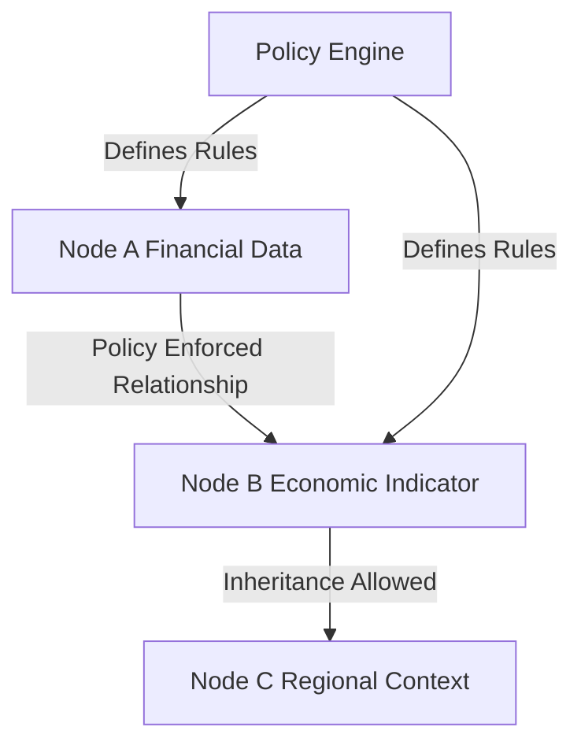

It looks like GitHub's Mermaid parser is having trouble with parentheses in node labels as well. Let’s simplify the labels by avoiding both curly braces and parentheses. Here are the updated diagrams:

### Diagram 2: Policy-Driven AI

### Diagram 6: Multi-Domain Architecture

These changes should resolve the parsing issues, as the node labels are now simplified to text without any special characters. Let me know if you need further assistance!
