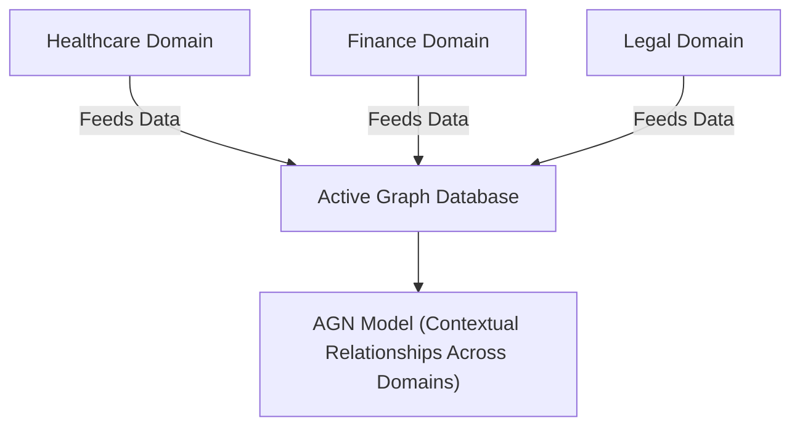

The issue seems to be with the curly braces `{}` in the node label for `AGN_Model`. Mermaid does not support these characters directly. Let’s update the diagram to resolve this:

**Fixes applied:**
1. Removed the semicolon after `graph TD;` as it is not needed.
2. Wrapped all node labels in `"` to avoid issues with special characters.
3. Replaced curly braces `{}` with parentheses `()` in the label of `AGN_Model`.

This version should now render without errors. Let me know if you need further assistance!
