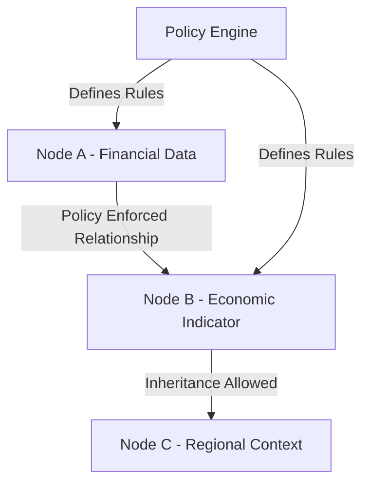
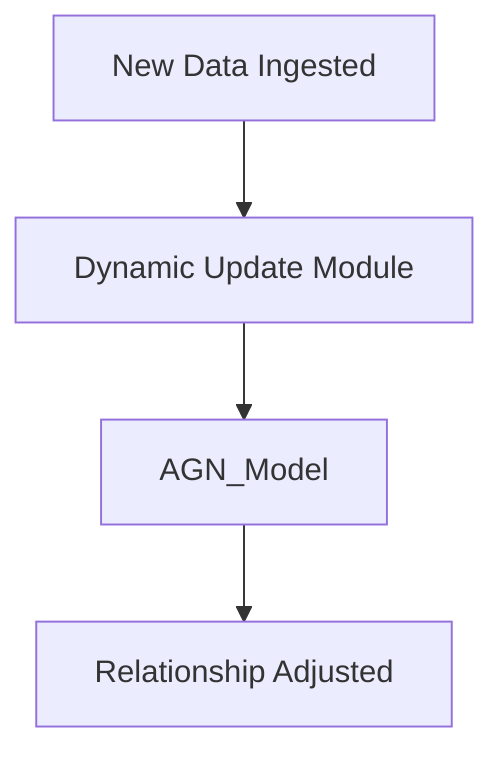
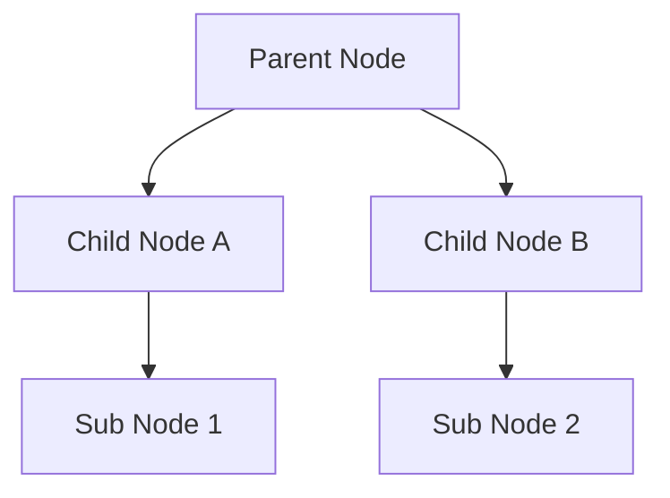
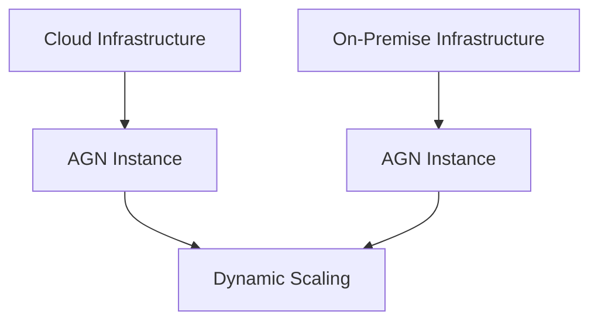

Here you go! The **Core Features and Innovations** section for your whitepaper, detailing the unique elements that make AGNs and AGDBs powerful tools in enterprise AI:

---

### **Core Features and Innovations of AGNs and AGDBs**

#### **1. Active Graph Networks (AGNs) and Active Graph Databases (AGDBs)**

AGNs and AGDBs work hand-in-hand to form a cohesive, dynamic framework for AI-driven solutions. This pairing provides an unparalleled ability to contextualize and adapt data across various domains in real-time. The core innovation lies in how AGNs leverage AGDBs for efficient data storage, retrieval, and context-based relationship mapping, creating a self-sustaining ecosystem for AI that drives meaningful and practical decision-making.

- **AGNs** provide the neural intelligence and adaptive capabilities to process and analyze data relationships dynamically.
- **AGDBs** offer an underlying graph database structure that ensures data is stored efficiently, contextual relationships are maintained, and hierarchical insights are made accessible for both querying and reasoning purposes.

#### **2. Policy-Driven AI**

One of the cornerstone innovations of AGNs is **Policy-Driven AI**. This feature allows for data interactions and relationships to be governed by predefined rules, similar to how IT systems manage access and privileges through access control lists (ACLs). Policies in AGNs define:

- **How nodes interact**: Policies determine whether nodes can form relationships and how these relationships impact the broader network.
- **Inheritance of characteristics**: Policies enable nodes to inherit properties or context from related nodes, much like object-oriented programming classes inherit traits.
- **Information flow**: Policies dictate the flow of information through the network, controlling visibility, relevance, and weightage assigned to each relationship.

By using a policy-based framework, AGNs ensure that the AI model remains scalable and adaptable, while providing greater control over how data relationships evolve.



*Diagram 1: The Policy Engine enforces rules for relationships between nodes, allowing AGNs to create contextual, dynamic connections.*

#### **3. Multi-Domain Architecture**

AGNs are built to operate across multiple domains seamlessly. **Multi-Domain Architecture** enables the aggregation and contextualization of information from various sectors—such as healthcare, finance, and legal systems—without the need for reconfiguration or retraining. Each domain’s unique data points can coexist within AGNs, allowing for:

- **Cross-Domain Insights**: The ability to form meaningful relationships between seemingly disparate datasets (e.g., connecting healthcare records with legal documents).
- **Adaptive Flexibility**: AGNs can adapt the relevance of specific nodes based on domain-specific policies, allowing dynamic and real-time adjustments.

```mermaid
graph TD;
    Healthcare[Healthcare Domain] -->|Feeds Data| AGDB;
    Finance[Finance Domain] -->|Feeds Data| AGDB;
    Legal[Legal Domain] -->|Feeds Data| AGDB;
    AGDB --> AGN_Model[AGN Model {Contextual Relationships Across Domains}];
```

*Diagram 2: Multiple domains feed data into the AGDB, which is then processed by the AGN model to create meaningful cross-domain insights.*

#### **4. Real-Time Learning and Adaptation**

Unlike conventional AI models that require extensive retraining when datasets evolve, AGNs support **Real-Time Learning and Adaptation**. This capability enables the system to:

- **Update Relationships Dynamically**: Relationships between nodes can change based on new data. For instance, in a trading scenario, a significant price movement might adjust the relationships between market sentiment, historical price data, and current trades.
- **Policy Updates Without Downtime**: Policies can be adjusted or updated in real-time without taking the model offline, making AGNs ideal for applications that cannot afford downtime, such as financial trading or healthcare emergency systems.



*Diagram 3: The Dynamic Update Module allows new data to adjust relationships within the AGN model in real-time, ensuring continuous learning.*

#### **5. Hierarchical Data Mapping in AGDB**

The **Active Graph Database (AGDB)** provides a hierarchical data structure to support efficient storage and retrieval. Hierarchical data mapping ensures that data can be accessed based on logical relationships, and information can be retrieved efficiently at any level of the hierarchy.

- **Node Relationships**: Nodes are mapped hierarchically within the AGDB to reflect their contextual significance. 
- **Efficient Indexing**: Hierarchical mapping supports efficient indexing and querying, particularly for large datasets.



*Diagram 4: AGDB uses hierarchical relationships to efficiently organize and map data, supporting rapid data retrieval and contextual understanding.*

#### **6. Scalability and Efficiency**

AGNs and AGDBs are designed to operate on **minimal computational resources**, including standard CPUs, while providing the option for GPU acceleration when needed. This scalability ensures that AGNs can:

- **Deploy on Various Infrastructures**: Operate on cloud environments, hybrid systems, or even on-premise setups with minimal hardware requirements.
- **Scale Dynamically**: Leverage cloud scalability features to dynamically adjust resources based on data load, ensuring optimal performance.



*Diagram 5: AGNs are designed for scalability, capable of operating in cloud, on-premise, or hybrid environments with dynamic scaling.*

#### **7. Practical Financial Application: Adaptive Trading Bots**

AGNs have shown promising results in practical applications, such as **adaptive trading bots** in financial markets. These trading bots:

- **Leverage AGDB for Market Insights**: Use historical market data, technical indicators, and real-time sentiment analysis to dynamically adjust trading strategies.
- **Real-Time Policy Adjustments**: Policies can adjust based on market conditions without the need for retraining, making the trading bot highly adaptable.

```mermaid
graph TD;
    BTC_Data[BTC Data {Price, Volume}] --> Technical_Indicator[RSI, MACD];
    Sentiment_Metrics[Sentiment Metrics {Fear and Greed Index}] --> AGN_Model;
    AGN_Model --> Trade_Decision[Trade Decision];
    Technical_Indicator --> Trade_Decision;
```

*Diagram 6: Financial metrics feed into the AGN model, which dynamically adapts trading strategies based on real-time data and predefined policies.*

---

These **Core Features and Innovations** differentiate AGNs from traditional AI models, providing a structured, scalable, and adaptive framework for multi-domain problem-solving. Let me know if this aligns with your vision or if you would like to explore any specific feature in more detail!
