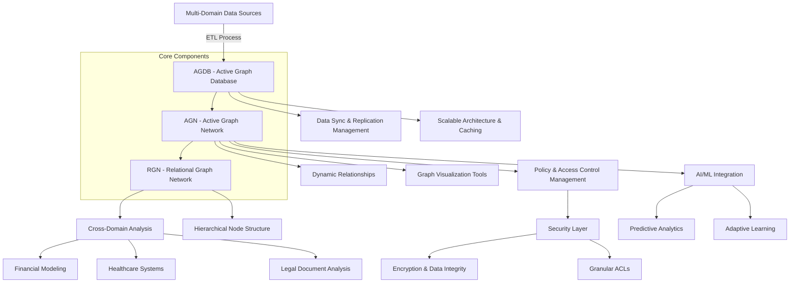
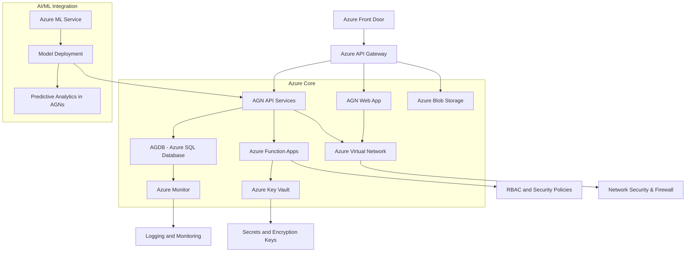

It looks like there was an issue with the Mermaid diagram syntax. I've corrected the code to ensure it renders properly. Here are the revised versions:

### 1. **Mermaid Diagram for AGN, AGDB, and RGN Framework Components**

### 2. **Mermaid Diagram for Leveraging Azure Services to Host AGN, AGDB, and RGNs**

These versions should render properly when pasted into a Mermaid editor or compatible platform. Let me know if you need further adjustments or additions!
