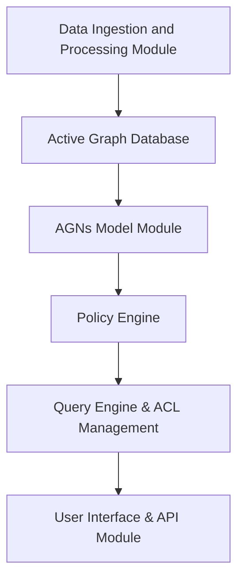

It seems like there are a couple of issues with the syntax, particularly with how edges and nodes are represented. Let’s correct the diagram:

**Fixes applied:**
1. Removed the semicolon after `graph TB;` since it's unnecessary in Mermaid syntax.
2. Wrapped node labels and edge descriptions in `"` to avoid special character issues.
3. Updated the `Edge_1` representation to use a label on the connection arrow instead of a separate "edge" node.

This should now work and render without parsing errors. Let me know if you need further modifications!
