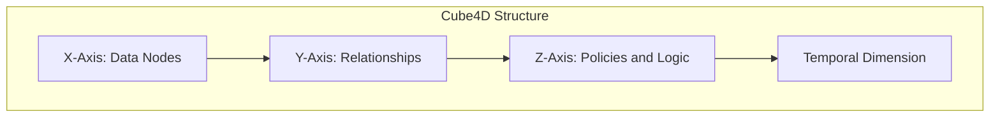
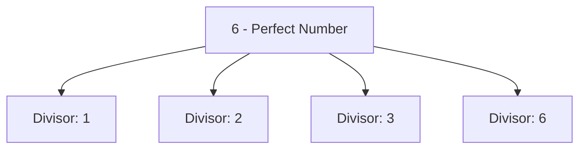

Absolutely! Let’s get the full white paper with all sections, visuals, glossary, appendix, and polished formatting all in one place. I’ll start by laying out everything step-by-step, with each visual and section integrated. I’ll set this up as a comprehensive, single-flow document so you can keep selecting *continue generating* as needed.

Starting with the **cover and introduction**:

---

# **Cube4D and Active Graph Networks (AGN)**
**Revolutionizing Data Structuring, Adaptability, and Contextual Understanding**

**Author:** Callum Maystone  
**Date:** [Date of Publication]

---

## **Table of Contents**
1. Introduction
2. Background and Motivation
3. Objective of C4D and AGN
4. Key Components and Structure
5. Innovation and Contributions
6. Use Cases and Real-World Impact
7. Roadmap and Vision
8. Conclusion
9. Glossary
10. Appendix

---

## **Introduction**

In an era where data is both abundant and complex, traditional data structures and processing models are often insufficient for handling the interconnected, context-driven requirements of modern applications. From healthcare to finance, the need for a relational, dynamic, and multi-dimensional data framework has never been greater. **Cube4D (C4D)** and **Active Graph Networks (AGN)** address these needs by introducing a revolutionary approach to data structuring, rooted in graph theory, policy-based relationships, and time-sensitive adaptability.

This white paper introduces **C4D and AGN**, a combined framework designed to bring multi-dimensional clarity, adaptability, and intelligence to data processing. Together, they enable users to go beyond conventional data querying and analysis, enabling **contextual understanding** and **adaptive learning** across complex datasets. By redefining data interaction through a **four-dimensional (4D) model** and **policy-driven graph structures**, C4D and AGN are positioned to transform industries that rely on intricate data relationships.

---

## **Background and Motivation**

Cube4D was created to solve the limitations of traditional data structures, which struggle to represent dynamic, multi-dimensional data in a way that maintains relational integrity and adaptability. Inspired by the needs of complex applications like healthcare, finance, and AI research, Cube4D introduces a framework that models relationships dynamically and adapts to evolving contexts, providing a new way to handle, analyze, and interpret data.

---

## **Objective of C4D and AGN**

The objective of C4D and AGN is to provide an all-encompassing framework for real-time data analysis and dynamic relationship management. Built on a **4D data model** and **policy-governed graph networks**, C4D and AGN enable data to self-organize, adapt, and respond to changing contexts, addressing the shortcomings of static data structures.

**Core Aims**:

- **Adaptive Relational Intelligence**: Enable data to interpret and adapt to relational contexts, allowing queries and interactions that are both meaningful and context-sensitive.
- **Scalability and Real-Time Responsiveness**: Ensure computational efficiency and adaptability as datasets grow.
- **Cross-Domain Applications**: Provide a universal structure supporting healthcare, legal analysis, finance, AI, and more.

---

## **Key Components and Structure**

### Four Dimensions of Cube4D:

1. **X-Axis (What)**: Raw data nodes, representing individual data points or knowledge bases.
2. **Y-Axis (Why)**: Relational connections, capturing the purpose behind data interactions.
3. **Z-Axis (How)**: Policies and adaptability, governing real-time relational adjustments.
4. **Temporal Dimension**: Enables time-sensitive adaptability, critical for applications with time-dependent data.

**Visual Diagram of Cube4D Structure**:

---

## **Innovation and Contributions**

C4D and AGN set themselves apart with the following innovations:

- **Policy-Driven Relationships**: Relationships adjust based on conditions or user-defined rules, allowing context-specific responses.
- **Perfect Numbers and Bit Encoding**: Structures data efficiently in relational “volumes” or cubes for scalability and computational efficiency.
- **Contextual Querying and Adaptive Learning**: Queries interpret relationships dynamically, providing context-aware responses.

**Perfect Number Diagram Example**:

---

## **Use Cases and Real-World Impact**

### Examples:

- **Healthcare Analytics**: Mapping patient data and treatment histories for comprehensive analysis.
- **Legal Document Analysis**: Mapping clauses, statutes, and precedents in a dynamic, queryable format.
- **Financial Trading**: Modeling volatility, correlations, and trends within a time-sensitive framework.

---

## **Roadmap and Vision**

### Short-Term Goals:
- Complete development of policy-driven adaptability and real-time relationship mapping.

### Long-Term Vision:
- Create a universal framework that supports complex, multi-domain applications, aiming for AGI-compatible intelligence and contextual adaptability.

---

## **Conclusion**

Cube4D and AGN provide a scalable, intelligent framework that empowers data to self-structure, adapt, and relate, making them ideal for applications demanding nuanced data relationships. By supporting contextual querying and adaptability, C4D and AGN pave the way for more advanced, AGI-compatible systems.

---

## **Glossary**

- **Cube4D**: A four-dimensional data structuring model combining spatial and temporal dimensions.
- **Active Graph Networks (AGN)**: Graph networks that incorporate dynamic, policy-driven relationships.
- **Policy-Driven Relationships**: Rules that govern how data relationships adjust based on conditions.
- **Perfect Numbers**: Numbers whose divisors form a “complete” set, used as a basis in C4D structuring.
- **Temporal Dimension**: Adds a time-based layer, supporting data adaptability over time.

---

## **Appendix**

### Bit Encoding and Perfect Number Structuring

Cube4D leverages bit encoding for efficient data representation, with “volumes” or cubes based on perfect numbers for scalability. Each bit layer adds complexity without significant storage demands, allowing high-dimensional data processing.

---

Let me know if you’d like any extra sections or further detail on visuals—this is the full draft ready to go!
