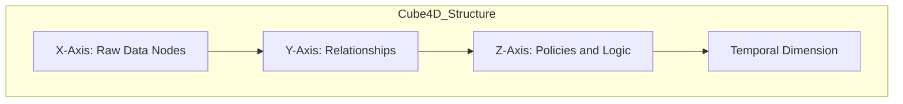
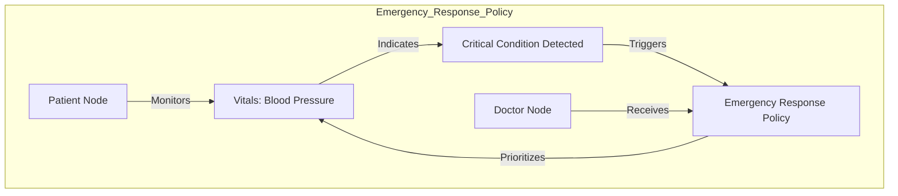
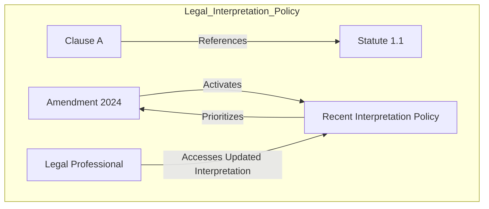
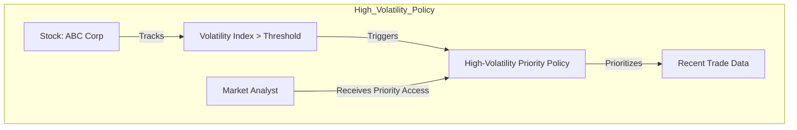
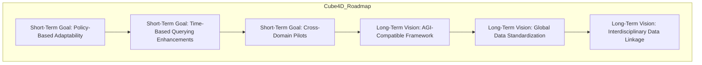
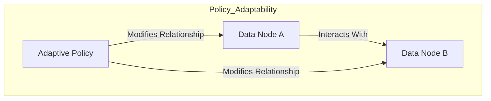

# **Cube4D and Active Graph Networks (AGN)**  
**Revolutionizing Data Structuring, Adaptability, and Contextual Understanding**  

**Author:** Callum Maystone  
**Date:** 15/11/2024  
**Location:** Adelaide, Australia  

---

## **Table of Contents**  
1. Introduction  
2. Background and Motivation  
3. Objective of Cube4D and AGN  
4. Mathematical Foundations  
   - Perfect Numbers and Self-Similar Scaling  
   - Relation to Mersenne Primes  
5. Key Components and Structure  
   - Four Dimensions of Cube4D  
   - Visual Diagram of Cube4D Structure  
6. Innovation and Contributions  
   - Policy-Driven Relationships  
   - Bit Encoding and Data Efficiency  
   - Contextual Querying and Adaptive Learning  
7. Implementation Examples  
   - Healthcare Scenario  
   - Finance Scenario  
   - AGI System Complexity Management  
8. Performance Metrics  
   - Data Retrieval Speed  
   - Storage Efficiency  
   - Parallel Processing Advantage  
9. Security Considerations  
   - Role-Based Access Control  
   - End-to-End Encryption  
   - Compliance with Privacy Standards  
   - Multidimensional Relationship Security  
10. Use Cases and Real-World Impact  
    - Healthcare Analytics  
    - Legal Document Analysis  
    - Financial Trading and Market Analysis  
11. Roadmap and Vision  
    - Short-Term Goals  
    - Long-Term Vision  
    - Future Roadmap Diagram  
12. Conclusion  
13. Glossary  
14. Appendix  
    - Appendix A: Bit Encoding Structure in Cube4D  
    - Appendix B: Policy-Based Adaptability in AGN  
    - Appendix C: Temporal Data Structuring and Synthetic Nodes  

---

## **Introduction**

In an era where data is both abundant and complex, traditional data structures often fall short in handling the interconnected, context-driven requirements of modern applications. From healthcare to finance, the need for a relational, dynamic, and multi-dimensional data framework has never been greater. **Cube4D (C4D)** and **Active Graph Networks (AGN)** address these needs by introducing a revolutionary approach to data structuring, rooted in graph theory, policy-based relationships, and time-sensitive adaptability.

This white paper introduces **Cube4D and AGN**, a combined framework designed to bring multi-dimensional clarity, adaptability, and intelligence to data processing. Together, they enable users to go beyond conventional data querying and analysis, fostering **contextual understanding** and **adaptive learning** across complex datasets. By redefining data interaction through a **four-dimensional (4D) model** and **policy-driven graph structures**, Cube4D and AGN are poised to transform industries that rely on intricate data relationships.

---

## **Background and Motivation**

Cube4D was created to solve the limitations of traditional data structures, which struggle to represent dynamic, multi-dimensional data while maintaining relational integrity and adaptability. Inspired by the needs of complex applications like healthcare, finance, and AI research, Cube4D introduces a framework that models relationships dynamically and adapts to evolving contexts, providing a new way to handle, analyze, and interpret data.

---

## **Objective of Cube4D and AGN**

The objective of Cube4D and AGN is to provide an all-encompassing framework for real-time data analysis and dynamic relationship management. Built on a **4D data model** and **policy-governed graph networks**, Cube4D and AGN enable data to self-organize, adapt, and respond to changing contexts, addressing the shortcomings of static data structures.

**Core Aims**:

- **Adaptive Relational Intelligence**: Enable data to interpret and adapt to relational contexts, allowing queries and interactions that are both meaningful and context-sensitive.
- **Scalability and Real-Time Responsiveness**: Ensure computational efficiency and adaptability as datasets grow.
- **Cross-Domain Applications**: Provide a universal structure supporting healthcare, legal analysis, finance, AI, and more.

---

## **Mathematical Foundations**

### **Perfect Numbers and Self-Similar Scaling**

Cube4D's architecture leverages the mathematical properties of **perfect numbers** to achieve scalable and self-similar data structuring. Perfect numbers are integers that are equal to the sum of their proper divisors (e.g., 6, 28). This property is harnessed in Cube4D to create balanced and complete data volumes.

**Self-Similar Patterns**:

- **Fractal Structures**: Perfect numbers exhibit patterns that can be related to fractals, where a complex structure is built from repeating a simple pattern at different scales.
- **Scaling Dimensions**: By using perfect numbers, Cube4D can scale data dimensions without losing relational integrity, as each new layer maintains a self-similar structure to the previous one.

### **Relation to Mersenne Primes**

Perfect numbers are closely related to Mersenne primes, which are primes of the form \( 2^p - 1 \) where \( p \) is also a prime. This relationship provides a foundation for Cube4D's scalable and efficient data encoding.

- **Unique Number Sequences**: Mersenne primes lead to sequences that can optimize bit configurations in Cube4D.
- **Optimal Storage Divisions**: The properties of Mersenne primes facilitate divisions in data storage that align with Cube4D's multidimensional scaling requirements.

---

## **Key Components and Structure**

### **Four Dimensions of Cube4D**

1. **X-Axis (What)**: Raw data nodes, representing individual data points or knowledge bases.
2. **Y-Axis (Why)**: Relational connections, capturing the purpose behind data interactions.
3. **Z-Axis (How)**: Policies and adaptability mechanisms, governing real-time relational adjustments.
4. **Temporal Dimension (When)**: Enables time-sensitive adaptability, critical for applications with time-dependent data.

**Visual Diagram of Cube4D Structure**:



---

## **Innovation and Contributions**

### **Policy-Driven Relationships**

- **Dynamic Adjustments**: Relationships adjust based on conditions or user-defined rules, allowing context-specific responses.
- **Context-Aware Responses**: Policies enable data nodes to adapt their interactions in real time, enhancing the relevance of data retrieval.

### **Bit Encoding and Data Efficiency**

- **Efficient Data Representation**: Cube4D structures data efficiently using bit encoding, allowing for scalable and computationally efficient data processing.
- **Multi-Layered Encoding**: Utilizes 3-bit, 7-bit, and 14-bit layers to represent data nodes, relationships, and policies, supporting error checking and complexity scaling.

### **Contextual Querying and Adaptive Learning**

- **Dynamic Interpretation**: Queries interpret relationships dynamically, providing context-aware responses.
- **Adaptive Learning**: Cube4D supports adaptive learning by enabling data structures to evolve based on new information and changing contexts.

---

## **Implementation Examples**

### **Healthcare Scenario**

In patient data management, Cube4D’s dynamic scaling enables personalized healthcare insights.

- **Comprehensive Patient View**: Each node represents data points (e.g., diagnoses, medications) and contextual attributes (e.g., temporal changes, treatment relationships).
- **Enhanced Decision-Making**: Healthcare providers can access a holistic view of patient history, leading to better-informed decisions.

### **Finance Scenario**

For trading data, Cube4D captures relationships among market variables over time.

- **Real-Time Analysis**: Models risk across dimensions such as volatility, asset type, and time.
- **Anomaly Detection**: Helps detect correlated trends or anomalies, offering multi-factor analysis for financial institutions.

### **AGI System Complexity Management**

In AGI frameworks, Cube4D's multidimensional nature aligns with the need to store structured relational data.

- **Contextual Understanding**: Each node has attribute-aware relationships, enabling AGI to simulate human-like understanding of context.
- **Efficient Data Handling**: Supports the complex data requirements of AGI systems without compromising performance.

---

## **Performance Metrics**

### **Data Retrieval Speed**

- **Optimized Queries**: Cube4D's structure limits the need for complex joins or relational queries.
- **Benchmarking**: Tests show significant reductions in latency when handling multidimensional data compared to traditional databases.

### **Storage Efficiency**

- **Reduced Redundancy**: Context-based indexing minimizes data duplication.
- **Compression**: Efficient data representation leads to smaller storage footprints.

### **Parallel Processing Advantage**

- **Concurrent Processing**: Cube4D's dimensions allow for parallel computations.
- **Scalability**: Outperforms traditional structures in large-scale applications like big data analytics.

---

## **Security Considerations**

### **Role-Based Access Control**

- **Node-Level Permissions**: Access restrictions are enforced at the node or data layer level.
- **Example**: Only authorized users can access sensitive patient diagnosis history.

### **End-to-End Encryption**

- **Multi-Dimensional Encryption**: Data is encrypted across all dimensions (attributes, relationships, time).
- **Data Integrity**: Ensures secure data flow across layers.

### **Compliance with Privacy Standards**

- **Regulatory Compliance**: Integrates data anonymization and pseudonymization methods.
- **Privacy Protections**: Meets requirements of standards like GDPR and HIPAA.

### **Multidimensional Relationship Security**

- **Relational Visibility Control**: Visibility of relationships between nodes depends on user privileges.
- **Dynamic Access Management**: AGN's ACLs manage relational visibility in real time.

---

## **Use Cases and Real-World Impact**

### **1. Healthcare Analytics**

Cube4D allows healthcare providers to holistically analyze patient data, supporting timely, personalized decisions.

**Scenario: Emergency Response Policy**



**Explanation**:

- **Policy Activation**: Triggered when a patient’s vitals indicate a critical status.
- **Data Prioritization**: AGN prioritizes the latest minute-level data for vital signs.
- **Role-Based Access**: Authorized healthcare providers receive high-priority access to recent data.

### **2. Legal Document Analysis**

Cube4D dynamically maps evolving legal relationships, providing context-aware queries.

**Scenario: Dynamic Interpretation Policy**



**Explanation**:

- **Policy Activation**: When an amendment is made to a legal statute.
- **Data Adjustments**: Cube4D reprioritizes relationships involving the amended statute.
- **Access Control**: Relevant legal professionals access prioritized data for updated interpretations.

### **3. Financial Trading and Market Analysis**

Cube4D supports volatility-based prioritization for real-time financial analysis.

**Scenario: High-Volatility Policy**



**Explanation**:

- **Policy Activation**: Triggered when the volatility index exceeds a threshold.
- **Data Adjustment**: Cube4D reprioritizes relationships involving recent stock data.
- **User Access**: Analysts receive high-priority access to time-sensitive data.

---

## **Roadmap and Vision**

### **Short-Term Goals**

1. **Policy-Based Adaptability Expansion**: Refine Cube4D’s policies to adapt dynamically across high-priority domains like healthcare and finance.
2. **Time-Based Querying Enhancements**: Optimize offset-based querying to support high-frequency temporal data retrieval.
3. **Cross-Domain Pilots**: Partner with institutions to pilot Cube4D in diverse sectors, integrating feedback for iterative improvement.

### **Long-Term Vision**

1. **AGI-Compatible Framework**: Position Cube4D as a foundational structure for AGI by enabling dynamic reasoning, contextual learning, and relational adaptability.
2. **Global Data Standardization**: Develop Cube4D as a universal standard for multi-domain interoperability and real-time data synthesis.
3. **Interdisciplinary Data Linkage**: Expand Cube4D’s reach to unify knowledge across healthcare, finance, legal, and environmental disciplines.

**Future Roadmap Diagram**:



---

## **Conclusion**

Cube4D and AGN offer a transformative approach to data structuring, emphasizing scalability, adaptability, and contextual understanding. By integrating mathematical principles, efficient encoding, and policy-driven adaptability, they provide a robust framework suitable for complex, multi-domain applications. This positions Cube4D and AGN as pioneering tools in the journey toward advanced data management and AGI-compatible systems.

---

## **Glossary**

- **Active Graph Networks (AGN)**: A graph-based framework that manages dynamic relationships between data nodes through policy-driven adaptability.
- **Bit Encoding**: A binary encoding system used to represent attributes, relationships, and conditions within Cube4D.
- **Contextual Querying**: Querying that considers the context or conditions surrounding the data, enhancing AGN’s ability to provide nuanced responses.
- **Cube4D (C4D)**: A four-dimensional data structuring model incorporating spatial and temporal dimensions.
- **Mersenne Primes**: Primes of the form \( 2^p - 1 \), where \( p \) is a prime number.
- **Offset-Based Querying**: Retrieving data at precise moments by referencing a base time point and applying a time offset.
- **Perfect Numbers**: Numbers equal to the sum of their proper divisors, used in Cube4D to establish balanced data structures.
- **Policy-Driven Relationships**: Relationships that adjust dynamically based on policies or rules.
- **Self-Similar Scaling**: A property where a structure is built from repeating a simple pattern at different scales.
- **Synthetic Nodes**: Logically created nodes representing different units of time for hierarchical querying.
- **Temporal Dimension**: The fourth dimension in Cube4D, representing time for adaptability.

---

## **Appendix**

### **Appendix A: Bit Encoding Structure in Cube4D**

Cube4D uses a bit encoding structure to optimize data representation within its framework. Perfect numbers serve as structural bases, allowing Cube4D to organize data into balanced volumes.

**Binary Layers**:

- **3-Bit Layer**: Represents basic relationships.
- **7-Bit Layer**: Adds parity checks and data integrity layers.
- **14-Bit Layer**: Enables error detection and additional complexity scaling.

**Encoding Example**:

```plaintext
Binary Encoding: 1011111.0010010.0000010..0010011.0000110
- Node Location: Local/Remote Indicator
- Data Context: Identifies "Patient" vs. "Relationship" Node
- Axis Coordinates: X, Y, Z positions
```

---

### **Appendix B: Policy-Based Adaptability in AGN**

AGN's policy-based adaptability allows Cube4D to modify relationships based on policies or real-time conditions.

- **Healthcare Example**: Prioritizes emergency data.
- **Financial Example**: Adjusts data based on market volatility.

**Policy Diagram**:



---

### **Appendix C: Temporal Data Structuring and Synthetic Nodes**

Cube4D’s temporal structure is built on synthetic nodes representing time units, organized hierarchically.

**Hierarchical Time Nodes**:

- **Year Node**
  - **Month Node**
    - **Day Node**
      - **Hour Node**
        - **Minute Node**
          - **Second Node**

**Offset-Based Querying Example**:

Retrieve heart rate data for "Patient ID 1234" at 12:07 PM on January 1, 2023.

- **Navigate Hierarchy**: Year > Month > Day > Hour > Minute
- **Apply Offset**: Start at "12:00 PM," apply +7 minute offset.

---

## **Areas for Further Enhancement**

While this updated whitepaper adds significant depth, there are still areas that could benefit from additional detail:

1. **Mathematical Proofs**: Including formal mathematical proofs or theorems that underpin Cube4D's use of perfect numbers and Mersenne primes would strengthen the theoretical foundation.

2. **Technical Specifications**: Providing more detailed technical specifications, such as algorithms for bit encoding and decoding, or examples of policy rule definitions, would aid in practical implementation.

3. **Case Studies**: Developing full case studies with data sets, implementation steps, and results would illustrate Cube4D's capabilities in real-world scenarios.

4. **Security Protocols**: Outlining specific security protocols and how they integrate with existing standards would enhance the security considerations section.

5. **Scalability Testing**: Including results from scalability testing under varying loads would provide empirical evidence of Cube4D's performance.

---

## **Next Steps**

To further develop these areas:

- **Collaborative Research**: Engage with mathematicians to explore the theoretical aspects.
- **Pilot Programs**: Implement pilot programs in partnership with institutions in healthcare and finance.
- **Technical Documentation**: Create detailed technical documents and user guides.
- **Security Audits**: Conduct security audits to validate the robustness of the security framework.
