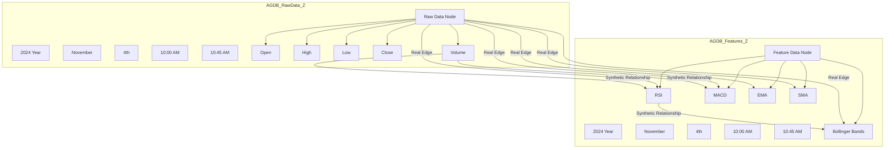
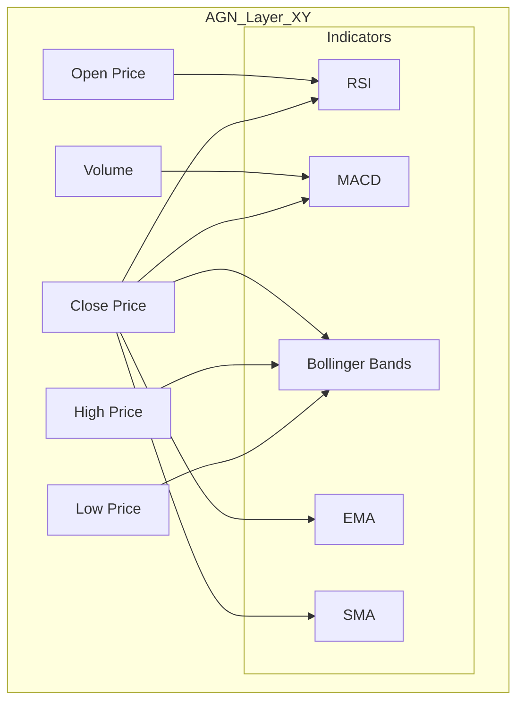
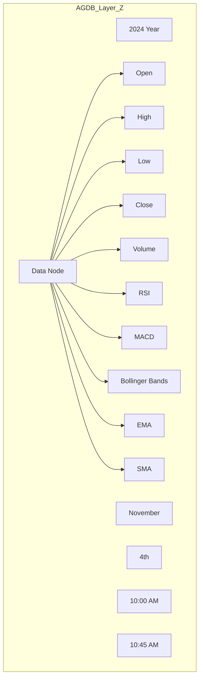

Certainly! Here’s a comprehensive document that merges all aspects of the **Active Graph Database (AGDB)** and **Active Graph Network (AGN)** framework, focusing on its utility, layered structure, and technical design. This document will use the trading bot as an example but will highlight its adaptability to various domains.

---

# Active Graph Database (AGDB) & Active Graph Network (AGN) Framework

## Introduction

**Active Graph Database (AGDB)** and **Active Graph Network (AGN)** together form a revolutionary framework for handling complex, structured, and time-based data across diverse domains. This system allows raw data to be efficiently stored, transformed, and analyzed alongside feature-engineered data, with powerful synthetic relationships for contextual insights. It enables a seamless flow from raw data to feature engineering and then into domain-specific inference policies, ideal for use cases in trading, healthcare, finance, and other fields that rely on dynamic, data-driven decision-making.

### Overview of AGDB and AGN Layers

AGDB and AGN leverage a **3D structure** that combines:
- **X and Y Axes (AGN Layer)**: Define relationships and dependencies between raw data and feature-engineered attributes, allowing for feature engineering and complex relationship mapping.
- **Z Axis (AGDB Layer)**: Maintains temporal hierarchy, structuring data in time-based checkpoints for efficient querying, traversal, and lag-based analysis.
  
Through **real** and **synthetic relationships** defined by policies, this framework enables both immediate analysis of raw data and in-depth insights from engineered features.

---

## 1. Core Components and Architecture

### AGDB: Dual Database Structure

The AGDB framework utilizes **two main databases**:
1. **AGDB 1 (Raw Data)**: Stores raw trading data (e.g., Open, High, Low, Close, Volume) across a structured time series.
2. **AGDB 2 (Feature-Engineered Data)**: Stores feature-engineered indicators (e.g., RSI, MACD, Bollinger Bands), calculated from AGDB 1 data.

**Cross-AGDB Relationships**: These databases are interconnected through **real edges** (representing direct dependencies between raw and feature-engineered data) and **synthetic relationships** (showing inferred patterns, such as correlations between volume and RSI).

### Diagram: AGDB Dual Database Structure



**Explanation**:
- **Real Edges**: Show the dependency of feature-engineered nodes on specific raw data attributes.
- **Synthetic Relationships**: These inferred relationships provide additional insights based on patterns, such as correlations between volume and feature indicators like RSI.

---

## 2. Layered Structure: AGN X and Y Axes

In the AGN layer, the X and Y axes define the relationships between raw features and engineered indicators, allowing for feature engineering, dependency mapping, and indicator calculation workflows.

### Feature Engineering Nodes and Calculations

Each feature is represented by a calculation node within AGN, specifying the computation required for indicators such as RSI, MACD, and Bollinger Bands.

#### Diagram: Feature Engineering and Calculation Nodes



### Explanation:
- **Calculation Nodes**: Each feature-engineered node (e.g., RSI, MACD) connects to specific raw features, enabling step-by-step transformations.
- **Indicator Dependencies**: Indicators rely on multiple features (e.g., Close, Volume) for dynamic calculations, enabling diverse queries and analysis.

---

## 3. Z Axis: Temporal Structure and Query Traversal

The Z-axis in AGDB represents a structured time series, allowing for efficient traversal of nodes by time (e.g., Year > Month > Day > Hour > Minute). Both AGDB 1 and AGDB 2 are organized by time to align raw and engineered data chronologically.

### Temporal Structure and Checkpoints

AGDB leverages **temporal checkpoints** for fast traversal across time intervals, while also allowing **lag-based queries** for analyzing patterns over time (e.g., moving averages).

#### Diagram: Temporal Structure and Time-Based Nodes



### Checkpoints and Lagged Analysis

- **Checkpoints**: Temporal checkpoints simplify time-based querying by jumping directly to intervals like hourly or daily nodes.
- **Lag-Based Features**: Supports lags for indicators such as SMA and EMA, enabling momentum-based analysis.

---

## 4. Policy and Workflow Layer for Calculations and Queries

This layer applies policies to manage relationships, calculations, and synthetic inferences across AGDB and AGN. Policies define workflows for each indicator, manage access control, and establish synthetic relationships for contextual inferences.

### Sample Policies and Commands

#### Feature Calculation Policy Example

```json
{
  "policies": {
    "feature_calculation": {
      "RSI": {
        "dependencies": ["Close"],
        "period": 14,
        "method": "smoothing"
      },
      "MACD": {
        "dependencies": ["Close", "Volume"],
        "EMA_periods": [12, 26],
        "signal_period": 9
      }
    }
  }
}
```

### Unified Command Logic

Commands manage data across both AGDBs and AGNs, with syntax that reflects the operation and the target data:

- **create-graph**: Initializes a new graph for a dataset.
- **create-node**: Adds raw data or feature-engineered node.
- **get-node.attribute**: Retrieves specific attributes (e.g., "Close") at a timestamp.
- **get-relationship**: Queries relationships across nodes (e.g., correlations between Volume and RSI).

### Enhanced Query Examples

**Retrieve Raw and Feature-Engineered Node**:
```plaintext
get-node AGDB_1/2024/11/04/10:45
get-node AGDB_2/2024/11/04/10:45
```

**Cross-AGDB Synthesis Query**:
```plaintext
get-relationship synthetic_edge -from Volume -to RSI -relationship correlates_with
```

---

## 5. Expanded Application Scenarios

### Domain-Agnostic Utility

While trading data is the primary example, the AGDB-AGN framework applies to healthcare, finance, and any field where structured data relationships and temporal trends need dynamic insights.

1. **Healthcare**: AGDBs can connect patient data across multiple domains (e.g., treatments, diagnostics), while AGN policies manage relationships and patient histories.
2. **Finance**: Allows modeling of economic indicators, linking multiple datasets for comprehensive market analysis.
3. **Public Service**: Uses synthetic relationships to analyze data across social and transportation domains, helping in resource allocation and trend prediction.

### Conclusion

The **AGDB & AGN Framework** transforms raw data into actionable insights, using a 3D structure that scales effortlessly across various domains. By integrating real and synthetic relationships, checkpoints, and lagged analysis, this approach empowers users to uncover hidden patterns and leverage
