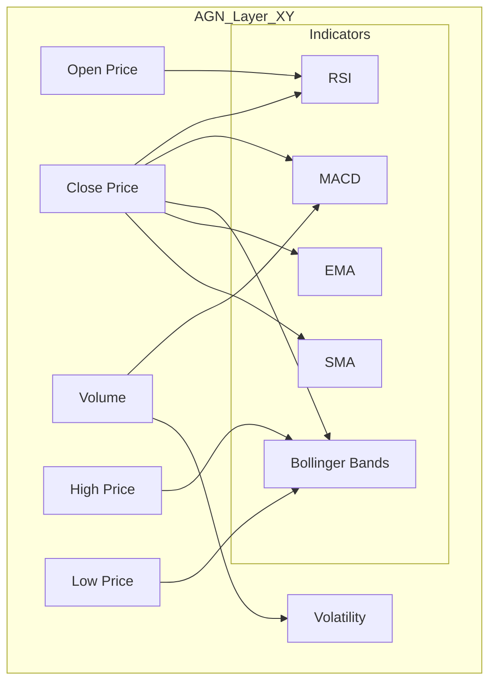
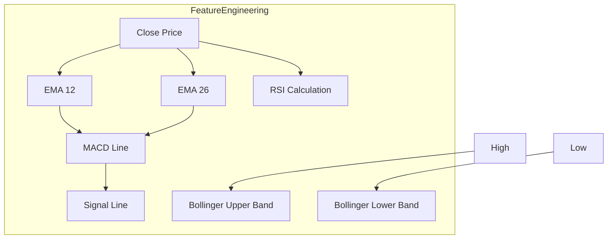
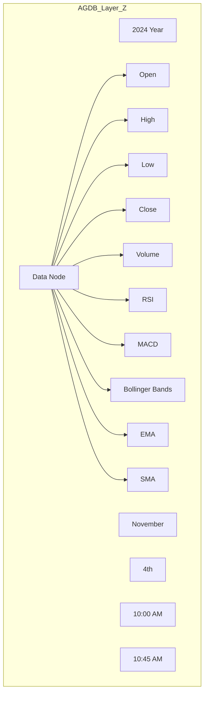

Focusing on trading data allows us to make the framework more concrete and brings the example closer to your use case. I'll expand on the AGN-AGDB 3D structure specifically for trading data, incorporating feature engineering for indicators like RSI, MACD, Bollinger Bands, EMA, and SMA. Here’s how we can approach it:

1. **X and Y Axes (AGN Layer)**: This layer will define relationships between raw trading data (Open, High, Low, Close, Volume) and derived features or indicators (RSI, MACD, Bollinger Bands, etc.). Each derived feature will have calculation nodes and relationships that define how it’s computed based on raw data. 

2. **Z Axis (AGDB Layer)**: The Z-axis represents the temporal structure of the trading data (timestamps), allowing us to traverse across time and apply lags, define checkpoints, and add weights based on recent trends.

3. **Unified Policy and Workflow Layer**: We'll add policies in the AGN layer for calculating these indicators and managing feature relationships dynamically. This layer will also incorporate calculation nodes and lags to understand the temporal effects on each feature.

### 1. Expanded AGN Layer (X and Y Axes)

In the AGN layer, we’ll define relationships between the raw data and the engineered features. Calculation nodes for indicators will also be represented to track workflows for derived features.



**Explanation**:
- **Feature Relationships**: Each indicator (RSI, MACD, etc.) connects to one or more raw features. For example, RSI uses `Close` prices to calculate relative strength, while MACD might rely on volume and closing prices.
- **Calculation Nodes**: Each indicator node acts as a calculation node that derives a new feature based on its dependencies on raw data.
  
### 2. Feature Engineering and Calculation Nodes

Within AGN, we’ll add nodes to represent the steps for calculating each indicator. For instance, we could have nodes for calculating the moving averages and signal lines within the MACD.



**Explanation**:
- **EMA Calculations for MACD**: MACD is calculated using a 12-period and 26-period EMA on closing prices. The MACD line and signal line nodes represent intermediary steps in this workflow.
- **RSI Calculation**: RSI relies on the Close price and applies a smoothing factor to determine strength or weakness.
- **Bollinger Bands**: Calculated based on a moving average of closing prices with upper and lower bounds derived from standard deviations.

### 3. Z Axis (AGDB Layer for Temporal Data)

The Z-axis in AGDB stores trading data across time, enabling time-series navigation with predefined checkpoints and lag definitions for feature engineering.



**Explanation**:
- **Temporal Structure**: Nodes are structured in a hierarchical format (Year > Month > Day > Hour > Minute), allowing AGDB to store time-based data efficiently.
- **Data Nodes with Attributes**: Each timestamped data node holds raw features (Open, High, Low, Close, Volume) and engineered indicators (RSI, MACD, etc.).
- **Checkpoints and Lags**: AGDB supports checkpoints (e.g., hourly, daily) to facilitate fast navigation, while the calculation nodes can be configured to apply lags for calculating moving averages or other time-delayed metrics.

### 4. Unified Policy and Workflow Layer

This layer defines policies and rules for feature calculations, lags, and attribute weightings. For instance, policies can govern the calculation of RSI or MACD and apply different weights based on recency or volatility trends.

#### Example JSON Policy

```json
{
  "policies": {
    "feature_calculation": {
      "RSI": {
        "dependencies": ["Close"],
        "period": 14,
        "method": "smoothing"
      },
      "MACD": {
        "dependencies": ["Close", "Volume"],
        "EMA_periods": [12, 26],
        "signal_period": 9
      },
      "BollingerBands": {
        "dependencies": ["Close"],
        "moving_average_period": 20,
        "std_dev_multiplier": 2
      }
    },
    "lag_definition": {
      "SMA_Lag": {
        "feature": "SMA",
        "lag_periods": [1, 5, 10]
      },
      "EMA_Lag": {
        "feature": "EMA",
        "lag_periods": [1, 5, 10]
      }
    },
    "attribute_weighting": {
      "recent_data_weight": {
        "attribute": "Close",
        "weight": 0.8,
        "time_decay_factor": 0.02
      },
      "volatility_weight": {
        "attribute": "Volatility",
        "weight": 0.6,
        "high_threshold": 1.5
      }
    }
  }
}
```

**Explanation**:
- **Feature Calculation Policies**: Defines dependencies and calculation methods for each indicator (e.g., RSI, MACD), including periods and smoothing factors.
- **Lag Definitions**: Specifies lags for features like SMA and EMA, which are essential for temporal analysis in AGDB. Each lag period corresponds to a calculated delay in values.
- **Attribute Weighting**: Weights are applied to specific attributes (e.g., Close price) based on recent data and volatility. The weighting policy adjusts based on recency and other contextual factors (e.g., volatility spikes).

### 5. Full Workflow for Indicator Calculation and Querying

1. **Raw Data Loading**: Load time-series data (Open, High, Low, Close, Volume) into AGDB’s Z-axis.
2. **Indicator Calculation**: AGN policies trigger the calculation of indicators based on the relationships between raw data attributes.
3. **Synthetic Relationships**: The AGN layer applies synthetic relationships across indicators to infer trends (e.g., RSI moving from overbought to oversold).
4. **Time-Based Traversal with Lags**: AGDB allows querying nodes with specific lags, such as accessing the RSI or SMA values from previous time intervals to analyze momentum.
5. **Feature Engineering Query Example**:
   - Query to calculate MACD:
     ```plaintext
     calculate-indicator MACD -source Close -EMA_periods 12,26 -signal_period 9
     ```
   - Query to retrieve RSI with lag:
     ```plaintext
     get-indicator RSI -lag 5 -period 14
     ```

### Final Diagram: 3D Structure Specific to Trading Data

```mermaid
graph TD
  subgraph AGN_Layer_XY
    Open[Open]
    High[High]
    Low[Low]
    Close[Close]
    Volume[Volume]
    
    subgraph Indicators
      RSI[RSI]
      MACD[MACD]
      Bollinger[Bollinger Bands]
      EMA[EMA]
      SMA[SMA]
    end

    Open --> RSI
    Close --> RSI
    Volume --> MACD
    Close --> MACD
    Close --> Bollinger
    High --> Bollinger
    Low --> Bollinger
    Close --> EMA
    Close --> SMA
  end

  subgraph AGDB_Layer_Z
    Year2024[2024 Year]
    Month11[November]
    Day04[4th]
    Hour10[10:00 AM]
    Minute45[10:45 AM]
    Data_Node[Data Node]
    
    Data_Node --> Open[Open]
    Data_Node --> High[High]
    Data_Node --> Low[Low]
    Data_Node --> Close[Close]
    Data_Node --> Volume[Volume]
    Data_Node --> RSI[
