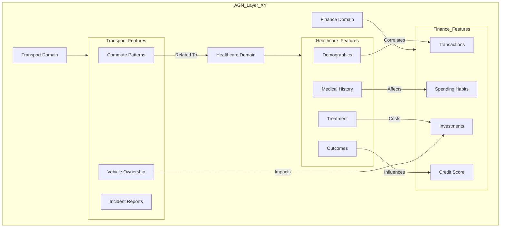
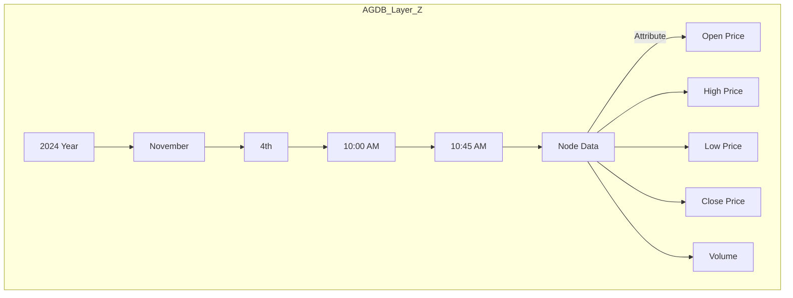
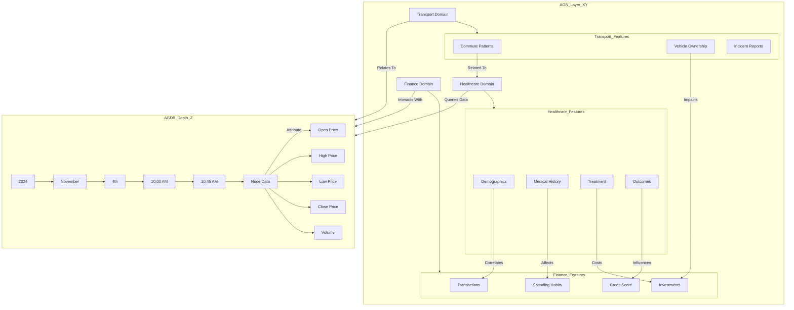

1. **X and Y Axes (AGN Layer)** - Showcasing the horizontal and vertical relationships within the AGN layer where we define inter-domain and intra-domain relationships. This will include features and inferred relationships between nodes.

2. **Z Axis (AGDB Layer)** - Representing the depth of the contextual data within each domain and time sequence, visualized as vertical layers that provide additional context.

3. **3D Representation of AGN-AGDB Integration** - A combined view, showing how AGN on the X-Y plane connects multiple AGDBs, each with its own Z depth of contextual nodes and attributes.

### 1. AGN Layer (X and Y Axes)

This mermaid diagram will illustrate the AGN relationships across various features and domains, showing connections between different data types, such as healthcare, finance, and transport.

**Explanation**:
- This diagram showcases the AGN layer's X and Y axes, connecting features across domains.
- Each domain (Healthcare, Finance, Transport) has sub-features (e.g., Demographics, Transactions) that establish inter- and intra-domain relationships, which allow for relational inference.
  
### 2. AGDB Layer (Z Axis with Temporal and Contextual Depth)

In this layer, each data point has multiple levels of depth along the Z-axis, representing the AGDB’s time or context-driven nodes within a domain. 

**Explanation**:
- **Time Hierarchy**: The Z-axis represents the temporal layers of the AGDB, where each time node (Year, Month, Day, etc.) is connected in a hierarchy.
- **Data Nodes**: Each node contains attributes like Open, High, Low, Close, Volume for financial data, which can be structured based on the dataset type.
- **Checkpoint**: Using predefined checkpoints at hourly intervals, for example, enables efficient traversal through time-based layers.

### 3. Combined AGN-AGDB 3D Structure

This diagram will illustrate how AGN and AGDB integrate into a 3D structure, where AGNs define policies on the X-Y plane, and AGDBs contain layered Z-depth context.

**Explanation**:
- **AGN Layer**: Defines relational inference and policies on the X-Y plane, connecting domains such as Healthcare, Finance, and Transport.
- **AGDB Layer**: Holds the contextual depth along the Z-axis, allowing nodes to store time-based or context-driven information.
- **Cross-Domain Relationships**: Each domain in AGN can query or interact with AGDB to retrieve detailed data based on predefined or synthetic relationships.
  
### How This Structure Supports Unified Policies

1. **AGN-Level Policies (X-Y)**:
   - Policies applied here set up cross-domain and within-domain relationships on the X-Y axis, enabling efficient traversal between domains or features.
   - Example: `apply-AGN-policy -type "Cross-Domain" -domains [Healthcare, Finance]`

2. **AGDB-Level Policies (Z)**:
   - Define policies for time series or context-based relationships on the Z-axis, enabling fine-grained control of data retrieval and attribute weighting.
   - Example: `apply-AGDB-policy -depth "Hourly" -attributes [Open, Close]`

### ACL Layer Across AGN and AGDB

For both AGN and AGDB, ACLs manage access and visibility:

- **AGN ACLs**: Define access on the X-Y plane, managing who can access cross-domain connections and relational inferences.
- **AGDB ACLs**: Apply depth-wise, controlling visibility based on time or context within AGDB.

This 3D framework allows for scalable, multidimensional data interactions where AGN manages breadth and AGDB captures depth. The mermaid diagrams provide a visualization of these layers, making it easier to conceptualize how data traverses and is queried across domains and contexts. Let me know if you’d like to explore this further or add additional layers!
