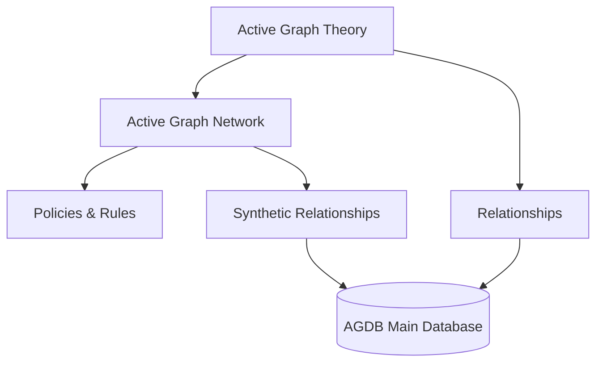

# Active Graph Databases (AGDB): Comprehensive Guide

Active Graph Databases (AGDBs) are designed for efficient data management, offering contextual and cross-domain insights through **Active Graph Theory (AGT)** and **Active Graph Networks (AGN)**. This structure combines hierarchical data nodes with synthetic relationships, enabling scalable, intuitive, and resource-efficient querying across time-series and other data types.

---

## Table of Contents

1. **Introduction to AGDB**
2. **Core Components of AGDB**
   - Time Nodes
   - Data Nodes
   - Synthetic Relationships
   - Policies and Contextual Rules
3. **Integrating AGT and AGN**
4. **JSON Schema for AGDB Structure**
5. **Enhanced Query Structure and Examples**
6. **Real-World Applications**
7. **Scalability and Efficiency Considerations**

---

### 1. Introduction to AGDB

AGDB is a highly adaptable framework built to store and query complex, interrelated datasets with minimal computational resources. Whether handling simple tables or large, multi-layered datasets, AGDB structures data in a way that reflects natural relationships and provides rapid access to insights through synthetic relationships and predefined policies.

### 2. Core Components of AGDB

#### Time Nodes
- **Hierarchical Structure**: Time nodes are structured from the year down to minutes, facilitating time-based traversal in both sequential and query-based interactions.
- **Checkpoints**: Predefined checkpoints (hourly, daily, etc.) create “shortcuts” for quicker access to relevant data, significantly reducing query complexity in large time-series datasets.

#### Data Nodes
- **Definition**: Data nodes represent individual data entries, such as financial data points, patient records, or transactional events.
- **Attribute Structure**: Each data node contains attributes specified by a schema (e.g., Open, High, Low, Close, Volume for trading data), making it easy to apply domain-specific queries.

#### Synthetic Relationships
- **Purpose**: Synthetic relationships are dynamically generated based on attribute similarities or policies, enabling efficient traversal without requiring GPU-intensive processing.
- **Application**: For example, in a financial dataset, synthetic relationships might identify periods of volatility by linking nodes with similar price fluctuations or trading volumes.

#### Policies and Contextual Rules
- **Policies**: Rules that dictate synthetic relationships and contextual inferences. Policies define how attributes or features interact, allowing AGN to draw meaningful insights from data relationships.
- **Contextual Rules**: Specific configurations that adapt AGDB for domains, such as healthcare (linking similar patient records) or finance (identifying trends across time).

---

### 3. Integrating AGT and AGN

AGT provides the theoretical foundation for contextual relationships within AGDB, while AGN applies AGT principles to execute queries and manage relationships.



- **AGT**: Provides the logic and structure for understanding context and relationships.
- **AGN**: Utilizes AGT’s logic to execute queries, infer relationships, and apply policies, enabling AGDB to return meaningful, context-rich results.

---

### 4. JSON Schema for AGDB Structure

The JSON structure for AGDB encapsulates metadata, schema definitions, nodes, relationships, and policies. This modularity supports both static and dynamic data handling.

```json
{
    "metadata": {
        "title": "Time Series Trading Data",
        "source": "AGT Platform",
        "description": "Time-series AGDB with synthetic relationships for trading insights",
        "created_at": "2024-11-04",
        "timezone": "UTC"
    },
    "schema": {
        "entity": "TradingData",
        "type": "TimeSeriesNode",
        "domain": "Finance",
        "attributes": ["Time", "Node_ID", "Open", "High", "Low", "Close", "Volume"]
    },
    "data": [
        ["2024-10-14 07:30:00", "node_0001", 50, 52, 48, 51, 5000],
        ["2024-10-14 07:31:00", "node_0002", 51, 55, 43, 55, 3000]
    ],
    "relationships": [
        {
            "type": "temporal_sequence",
            "from": "node_0001",
            "to": "node_0002",
            "relationship": "next"
        }
    ],
    "policies": {
        "AGN": {
            "trading_inference": {
                "rules": {
                    "time_series_trend": {
                        "relationship": "temporal_sequence",
                        "weight_threshold": 0.5
                    },
                    "volatility_correlation": {
                        "attributes": ["High", "Low"],
                        "relationship": "correlates_with",
                        "weight_threshold": 0.3
                    }
                }
            }
        }
    }
}
```

---

### 5. Enhanced Query Structure and Examples

AGDB supports a versatile query syntax, enabling efficient access to both direct and synthetic relationships across data nodes.

#### Command Examples:

1. **Direct Node Access**: Retrieve specific data for `10:45` on `2024-11-04`.
   ```plaintext
   get-node ts-path {domain}/2024/11/04/10/45
   ```

2. **Synthetic Pathing with Checkpoints**: Use synthetic relationships to jump to the closest checkpoint.
   ```plaintext
   get-node ts-path {domain}/2024/11/04/10/40 +5
   ```

3. **Rule-Based Trading Strategy**: Retrieve data using predefined rules for trend analysis.
   ```plaintext
   apply-policy trading_inference/{MarketCondition}
   ```

---

### 6. Real-World Applications

#### Finance
AGDB enables rapid querying and inference for trading strategies by structuring price data, synthetic relationships, and rule-based strategies, making it ideal for real-time decision-making.

#### Healthcare
AGDB’s policies and synthetic relationships make it possible to link similar patient records, identify treatment trends, and derive meaningful insights from complex medical datasets.

---

### 7. Scalability and Efficiency Considerations

AGDB’s structure allows it to handle both small and large datasets efficiently by balancing predefined relationships with synthetic inferences. By structuring relationships and policies within JSON schemas, AGDB maintains flexibility while supporting rapid, efficient data traversal.

