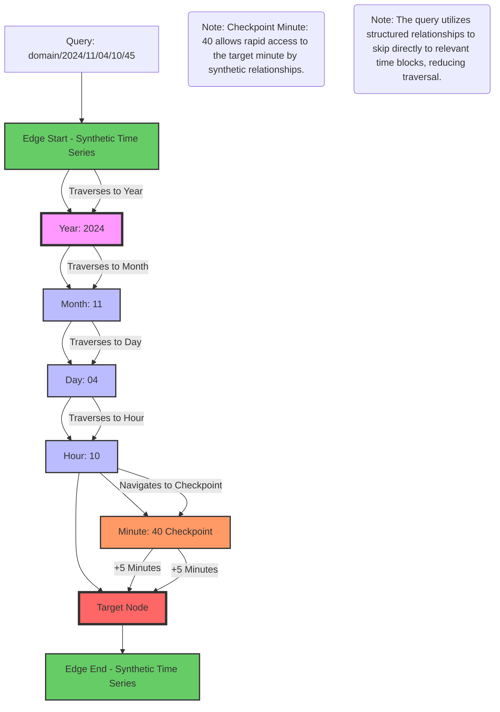

```mermaid
graph TD
    %% Time Series Hierarchical Nodes %%
    A[Year: 2024] --> B[Month: 11]
    B --> C[Day: 04]
    C --> D[Hour: 10]
    D --> E[Minute: 40 Checkpoint]
    D --> F[Minute: 45]
    
    %% Synthetic Relationships %%
    E -->|+5 Minutes| F

    %% Synthetic Time Series Start/End Nodes %%
    Start[Edge Start - Synthetic Time Series] --> A
    F --> End[Edge End - Synthetic Time Series]

    %% Node Navigation %%
    Query[Query: domain/2024/11/04/10/45] --> Start
    Start -->|Traverses to Year| A
    A -->|Traverses to Month| B
    B -->|Traverses to Day| C
    C -->|Traverses to Hour| D
    D -->|Navigates to Checkpoint| E
    E -->|+5 Minutes| F[Target Node]

    %% Additional Explanation %%
    note1(Note: Checkpoint Minute: 40 allows rapid access to the target minute by synthetic relationships.)
    note2(Note: The query utilizes structured relationships to skip directly to relevant time blocks, reducing traversal.)

    style A fill:#f9f,stroke:#333,stroke-width:4px
    style B fill:#bbf,stroke:#333,stroke-width:2px
    style C fill:#bbf,stroke:#333,stroke-width:2px
    style D fill:#bbf,stroke:#333,stroke-width:2px
    style E fill:#f96,stroke:#333,stroke-width:2px
    style F fill:#f66,stroke:#333,stroke-width:4px
    style Start fill:#6c6,stroke:#333,stroke-width:2px
    style End fill:#6c6,stroke:#333,stroke-width:2px
```
