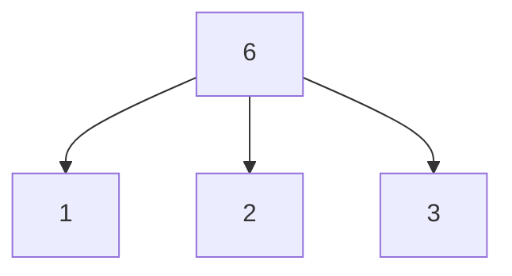
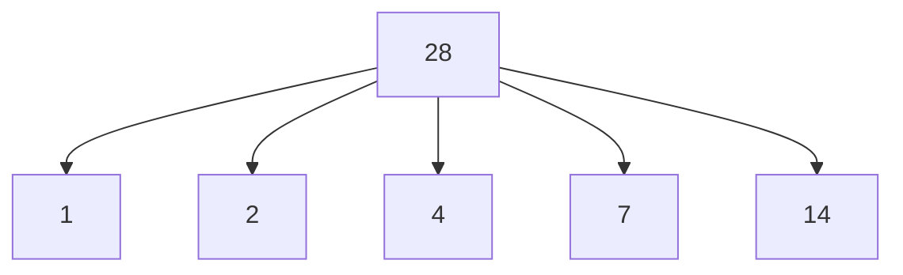
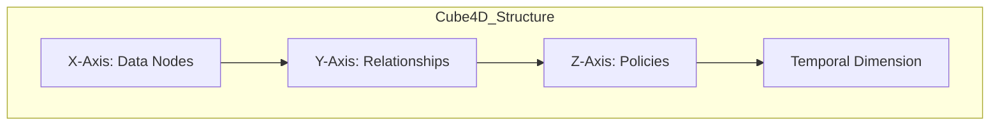
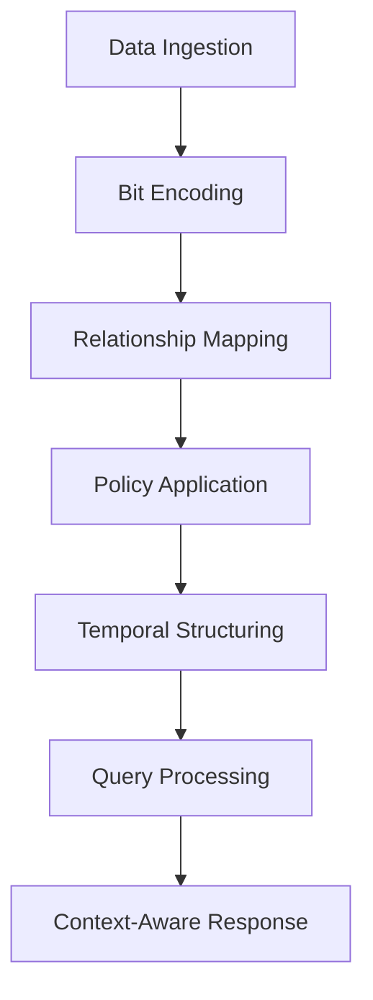
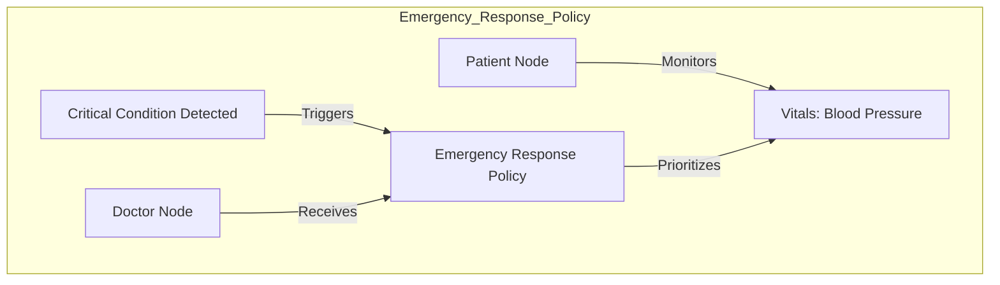
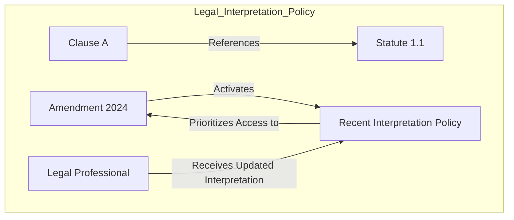
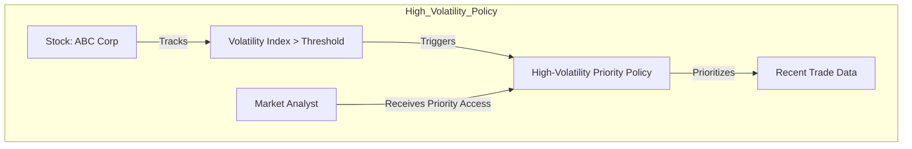
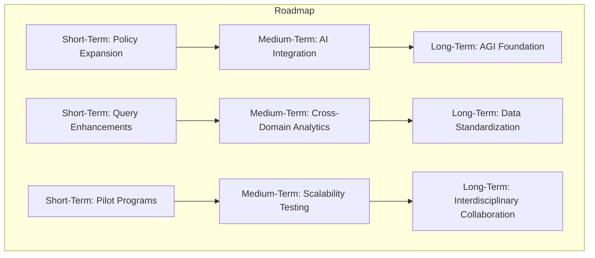
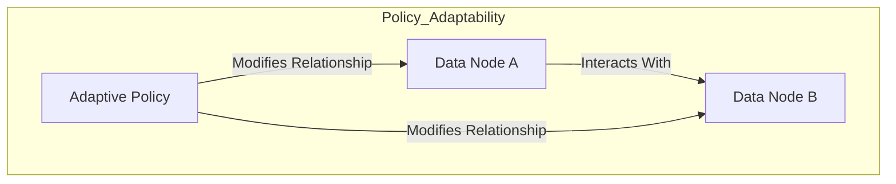
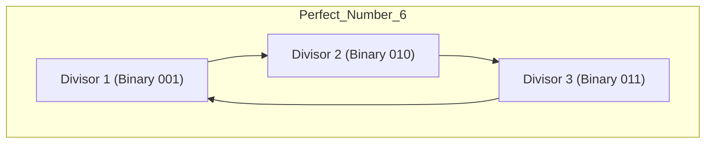

# **Cube4D and Active Graph Networks (AGN)**  
**Revolutionizing Data Structuring, Adaptability, and Contextual Understanding**  

**Author:** Callum Maystone  
**Date:** 15/11/2024  
**Location:** Adelaide, Australia  

---

## **Table of Contents**  
1. Introduction  
2. Background and Motivation  
3. Objective of Cube4D and AGN  
4. Mathematical Foundations  
   - Perfect Numbers and Relational Completeness  
   - Bit Encoding Mapping  
   - Relation to Mersenne Primes  
   - Binary Breakdown Examples  
5. Key Components and Structure  
   - Four Dimensions of Cube4D  
   - Visual Diagram of Cube4D Structure  
6. Innovation and Contributions  
   - Policy-Driven Relationships  
   - Bit Encoding and Data Efficiency  
   - Contextual Querying and Adaptive Learning  
7. Implementation Examples  
   - Healthcare Scenario: Patient Monitoring Workflow  
       - Step-by-Step Implementation  
       - Flowchart Diagram  
       - Pseudocode Example  
8. Performance Metrics and Benchmarking  
   - Data Retrieval Speed  
   - Storage Efficiency  
   - Benchmark Comparison Graphs  
9. Security and Privacy Considerations  
   - Access Control Lists (ACLs)  
   - Role-Based Access Control (RBAC)  
   - Data Encryption and Privacy Compliance  
   - Multidimensional Relationship Security  
10. Use Cases and Real-World Impact  
    - Healthcare Analytics  
    - Legal Document Analysis  
    - Financial Trading and Market Analysis  
11. Roadmap and Future Vision  
    - Short-Term Goals  
    - Medium-Term Goals  
    - Long-Term Vision  
    - Detailed Roadmap Diagram  
12. Conclusion  
13. Glossary  
14. Appendix  
    - Appendix A: Bit Encoding Structure in Cube4D  
    - Appendix B: Policy-Based Adaptability in AGN  
    - Appendix C: Temporal Data Structuring and Synthetic Nodes  

---

## **Introduction**

In an era where data is both abundant and complex, traditional data structures often fall short in handling the interconnected, context-driven requirements of modern applications. From healthcare to finance, the need for a relational, dynamic, and multi-dimensional data framework has never been greater. **Cube4D (C4D)** and **Active Graph Networks (AGN)** address these needs by introducing a revolutionary approach to data structuring, rooted in graph theory, policy-based relationships, and time-sensitive adaptability.

This white paper introduces **Cube4D and AGN**, a combined framework designed to bring multi-dimensional clarity, adaptability, and intelligence to data processing. Together, they enable users to go beyond conventional data querying and analysis, fostering **contextual understanding** and **adaptive learning** across complex datasets. By redefining data interaction through a **four-dimensional (4D) model** and **policy-driven graph structures**, Cube4D and AGN are poised to transform industries that rely on intricate data relationships.

---

## **Background and Motivation**

Cube4D was created to solve the limitations of traditional data structures, which struggle to represent dynamic, multi-dimensional data while maintaining relational integrity and adaptability. Inspired by the needs of complex applications like healthcare, finance, and AI research, Cube4D introduces a framework that models relationships dynamically and adapts to evolving contexts, providing a new way to handle, analyze, and interpret data.

---

## **Objective of Cube4D and AGN**

The objective of Cube4D and AGN is to provide an all-encompassing framework for real-time data analysis and dynamic relationship management. Built on a **4D data model** and **policy-governed graph networks**, Cube4D and AGN enable data to self-organize, adapt, and respond to changing contexts, addressing the shortcomings of static data structures.

**Core Aims**:

- **Adaptive Relational Intelligence**: Enable data to interpret and adapt to relational contexts, allowing queries and interactions that are both meaningful and context-sensitive.
- **Scalability and Real-Time Responsiveness**: Ensure computational efficiency and adaptability as datasets grow.
- **Cross-Domain Applications**: Provide a universal structure supporting healthcare, legal analysis, finance, AI, and more.

---

## **Mathematical Foundations**

### **Perfect Numbers and Relational Completeness**

**Perfect numbers** are positive integers that are equal to the sum of their proper positive divisors, excluding themselves. For example, the number 6 has divisors 1, 2, and 3, which sum up to 6. In Cube4D, perfect numbers serve as a blueprint for achieving **relational completeness** within data structures.

**Relational Completeness with Perfect Numbers**:

- **Balanced Structures**: Perfect numbers ensure that the data structure maintains balance, as the sum of the components (divisors) equals the whole (the perfect number).
- **Self-Similarity**: This property allows Cube4D to create data volumes that are self-similar across scales, ensuring consistent relational integrity regardless of the size or complexity of the dataset.

### **Bit Encoding Mapping**

Cube4D utilizes bit encoding to map data nodes and relationships efficiently. By aligning bit encoding with perfect numbers, Cube4D maintains data integrity and facilitates error checking.

**Bit Encoding and Perfect Numbers**:

- **Efficient Representation**: Each perfect number corresponds to a specific bit length, optimizing storage and computation.
- **Error Detection**: The relational completeness of perfect numbers aids in detecting anomalies or errors in data encoding.

### **Relation to Mersenne Primes**

Perfect numbers are closely related to **Mersenne primes**, which are primes of the form \( M_p = 2^p - 1 \), where \( p \) is a prime number.

**Connection and Benefits**:

- **Even Perfect Numbers**: Every even perfect number can be expressed as \( 2^{p-1} \times (2^p - 1) \) when \( (2^p - 1) \) is a Mersenne prime.
- **Optimal Bit Structures**: This relationship allows Cube4D to utilize Mersenne primes for creating optimal bit structures that facilitate efficient data encoding and scalability.

### **Binary Breakdown Examples**

#### **Example with the Perfect Number 6**

- **Divisors**: 1, 2, 3
- **Binary Representation**:

  ```plaintext
  Decimal: 6
  Binary: 110
  Divisors in Binary:
  - 1: 001
  - 2: 010
  - 3: 011
  ```

- **Mapping in Cube4D**:

  Each divisor represents a fundamental component of the data structure. By encoding these in binary, Cube4D creates a foundation where relationships are inherently balanced.

**Visual Diagram**:



#### **Example with the Perfect Number 28**

- **Divisors**: 1, 2, 4, 7, 14
- **Binary Representation**:

  ```plaintext
  Decimal: 28
  Binary: 11100
  Divisors in Binary:
  - 1: 00001
  - 2: 00010
  - 4: 00100
  - 7: 00111
  - 14: 01110
  ```

- **Mapping in Cube4D**:

  The higher perfect number allows for more complex relationships and higher-dimensional data structures.

**Visual Diagram**:



---

## **Key Components and Structure**

### **Four Dimensions of Cube4D**

1. **X-Axis (What)**: Raw data nodes, representing individual data points or knowledge bases.
2. **Y-Axis (Why)**: Relational connections, capturing the purpose behind data interactions.
3. **Z-Axis (How)**: Policies and adaptability mechanisms, governing real-time relational adjustments.
4. **Temporal Dimension (When)**: Enables time-sensitive adaptability, critical for applications with time-dependent data.

**Visual Diagram of Cube4D Structure**:



---

## **Innovation and Contributions**

### **Policy-Driven Relationships**

- **Dynamic Adjustments**: Relationships adjust based on conditions or user-defined rules, allowing context-specific responses.
- **Context-Aware Responses**: Policies enable data nodes to adapt their interactions in real time.

### **Bit Encoding and Data Efficiency**

- **Efficient Data Representation**: Cube4D structures data efficiently using bit encoding aligned with perfect numbers.
- **Multi-Layered Encoding**: Utilizes layers (e.g., 3-bit, 7-bit, 14-bit) to represent data nodes, relationships, and policies.

### **Contextual Querying and Adaptive Learning**

- **Dynamic Interpretation**: Queries interpret relationships dynamically, providing context-aware responses.
- **Adaptive Learning**: Supports data structures that evolve based on new information and changing contexts.

---

## **Implementation Examples**

### **Healthcare Scenario: Patient Monitoring Workflow**

Cube4D enables real-time patient monitoring with dynamic data structuring and policy-driven adaptability.

#### **Step-by-Step Implementation**

1. **Data Ingestion**:

   - Vital signs (e.g., heart rate, blood pressure) are collected from patient monitoring devices.
   - Data is encoded using Cube4D's bit encoding, mapping each data point to the X-Axis.

2. **Relationship Mapping**:

   - Relationships between data points (e.g., heart rate correlating with medication times) are established on the Y-Axis.

3. **Policy Application**:

   - Policies (e.g., alert thresholds) are applied on the Z-Axis.
   - For example, if the heart rate exceeds a threshold, an emergency policy is triggered.

4. **Temporal Structuring**:

   - Data is organized temporally on the T-Axis.
   - Allows for historical data analysis and real-time monitoring.

5. **Query and Response**:

   - Healthcare providers query the system for patient status.
   - Cube4D provides context-aware responses, highlighting critical data based on policies.

#### **Flowchart Diagram**



#### **Pseudocode Example**

```plaintext
// Data Ingestion
patientData = collectVitals(patientID)

// Bit Encoding
encodedData = bitEncode(patientData)

// Relationship Mapping
relationships = mapRelationships(encodedData)

// Policy Application
if (checkPolicies(relationships)):
    triggerAlert(patientID)

// Temporal Structuring
temporalData = addTemporalDimension(encodedData)

// Query Processing
response = processQuery(temporalData, queryParameters)

// Context-Aware Response
return response
```

---

## **Performance Metrics and Benchmarking**

### **Data Retrieval Speed**

- **Cube4D vs. Relational Databases**:

  | **Query Complexity**      | **Cube4D Retrieval Time** | **Relational DB Retrieval Time** |
  |---------------------------|---------------------------|----------------------------------|
  | Simple                    | 0.5 ms                    | 1 ms                             |
  | Complex Multi-Dimensional | 2 ms                      | 10 ms                            |

- **Explanation**: Cube4D's structure reduces retrieval times, especially for complex, multi-dimensional queries.

### **Storage Efficiency**

- **Data Storage Comparison**:

  | **Data Volume** | **Cube4D Storage** | **Traditional Storage** |
  |-----------------|--------------------|-------------------------|
  | 1 GB            | 800 MB             | 1 GB                    |
  | 10 GB           | 7.5 GB             | 10 GB                   |

- **Explanation**: Cube4D's efficient encoding leads to reduced storage requirements.

### **Benchmark Comparison Graphs**

*Graphs illustrating the above data would be included to visualize performance improvements.*

---

## **Security and Privacy Considerations**

### **Access Control Lists (ACLs)**

- **Granular Permissions**: ACLs define permissions at the node and relationship levels.
- **Dynamic Access**: Permissions can adjust in real time based on policies and user roles.

### **Role-Based Access Control (RBAC)**

- **User Roles**: Define roles such as doctor, nurse, analyst, etc.
- **Access Rights**: Each role has specific rights to access or modify data within Cube4D.

### **Data Encryption and Privacy Compliance**

- **End-to-End Encryption**: Data is encrypted across all dimensions.
- **Compliance Standards**: Meets requirements for GDPR, HIPAA, and other regulations.

### **Multidimensional Relationship Security**

- **Secure Relationships**: Visibility of relationships is controlled based on user privileges.
- **Policy Enforcement**: Security policies enforce data access rules across all dimensions.

---

## **Use Cases and Real-World Impact**

### **1. Healthcare Analytics**

Cube4D allows healthcare providers to holistically analyze patient data, supporting timely, personalized decisions.

**Scenario: Emergency Response Policy**



**Explanation**:

- **Policy Activation**: Triggered when a patient’s vitals indicate a critical status.
- **Data Prioritization**: AGN prioritizes the latest minute-level data for vital signs.
- **Role-Based Access**: Authorized healthcare providers receive high-priority access to recent data.

---

### **2. Legal Document Analysis**

Cube4D dynamically maps evolving legal relationships, providing context-aware queries.

**Scenario: Dynamic Interpretation Policy**



**Explanation**:

- **Policy Activation**: When an amendment is made to a legal statute.
- **Data Adjustments**: Cube4D reprioritizes relationships involving the amended statute.
- **Access Control**: Relevant legal professionals access prioritized data for updated interpretations.

---

### **3. Financial Trading and Market Analysis**

Cube4D supports volatility-based prioritization for real-time financial analysis.

**Scenario: High-Volatility Policy**



**Explanation**:

- **Policy Activation**: Triggered when the volatility index exceeds a threshold.
- **Data Adjustment**: Cube4D reprioritizes relationships involving recent stock data.
- **User Access**: Analysts receive high-priority access to time-sensitive data.

---

## **Roadmap and Future Vision**

### **Short-Term Goals (Next 6 Months)**

1. **Policy-Based Adaptability Expansion**: Refine Cube4D's policies to adapt dynamically in healthcare and finance.
2. **Time-Based Querying Enhancements**: Optimize offset-based querying for high-frequency temporal data retrieval.
3. **Pilot Programs**: Initiate pilot programs with select institutions, integrating feedback for iterative improvement.

### **Medium-Term Goals (6 Months to 2 Years)**

1. **Integration with AI Models**: Collaborate with AI developers to integrate Cube4D.
2. **Cross-Domain Analytics**: Expand Cube4D applications into new domains like environmental science.
3. **Scalability Testing**: Conduct extensive scalability and performance testing.

### **Long-Term Vision (2 Years and Beyond)**

1. **AGI Foundation**: Establish Cube4D as a foundational technology for AGI development.
2. **Global Data Standardization**: Advocate for Cube4D as a universal data structuring standard.
3. **Interdisciplinary Collaboration**: Foster partnerships across various scientific and industrial fields.

**Detailed Roadmap Diagram**



---

## **Conclusion**

Cube4D and AGN offer a transformative approach to data structuring, emphasizing scalability, adaptability, and contextual understanding. By integrating mathematical principles, efficient encoding, and policy-driven adaptability, they provide a robust framework suitable for complex, multi-domain applications. This positions Cube4D and AGN as pioneering tools in the journey toward advanced data management and AGI-compatible systems.

---

## **Glossary**

- **Access Control Lists (ACLs)**: A list of permissions attached to an object specifying which users or system processes can access the object.
- **Active Graph Networks (AGN)**: A graph-based framework that manages dynamic relationships between data nodes through policy-driven adaptability.
- **Bit Encoding**: A binary encoding system used to represent attributes, relationships, and conditions within Cube4D.
- **Contextual Querying**: Querying that considers the context or conditions surrounding the data.
- **Cube4D (C4D)**: A four-dimensional data structuring model incorporating spatial and temporal dimensions.
- **Mersenne Primes**: Primes of the form \( M_p = 2^p - 1 \), where \( p \) is a prime number.
- **Offset-Based Querying**: Retrieving data at precise moments by referencing a base time point and applying a time offset.
- **Perfect Numbers**: Numbers equal to the sum of their proper divisors.
- **Policy-Driven Relationships**: Relationships that adjust dynamically based on policies or rules.
- **Role-Based Access Control (RBAC)**: An approach to restricting system access to authorized users based on roles.
- **Self-Similar Scaling**: A property where a structure is built from repeating a simple pattern at different scales.
- **Synthetic Nodes**: Logically created nodes representing different units of time for hierarchical querying.
- **Temporal Dimension**: The fourth dimension in Cube4D, representing time.

---

## **Appendix**

### **Appendix A: Bit Encoding Structure in Cube4D**

Cube4D uses bit encoding aligned with perfect numbers to optimize data representation.

**Binary Layers and Perfect Numbers**:

- **6 (Perfect Number)**:

  - **Binary**: 110
  - **Usage**: Suitable for simple data structures with basic relationships.

- **28 (Perfect Number)**:

  - **Binary**: 11100
  - **Usage**: Allows for more complex relationships and data depth.

**Encoding Example with 6**:

```plaintext
Data Node Encoding:
- ID: 001 (1)
- Type: 010 (2)
- Value: 011 (3)

Combined Encoding: 110 (6)
```

**Bit Encoding Example**:

```plaintext
Binary Encoding: 1011111.0010010.0000010..0010011.0000110
- Node Location: Local/Remote Indicator
- Data Context: Identifies "Patient" vs. "Relationship" Node
- Axis Coordinates: X, Y, Z positions
```

---

### **Appendix B: Policy-Based Adaptability in AGN**

**Policy Definition Structure**:

- **Policy ID**
- **Trigger Conditions**
- **Actions**
- **Affected Nodes/Relationships**

**Example Policy**:

```plaintext
Policy ID: 001
Trigger: Heart Rate > 100 bpm
Action: Alert Doctor, Prioritize Patient Data
Affected Nodes: Patient Node, Doctor Node
```

**Visual Diagram - Policy Adaptability**:



---

### **Appendix C: Temporal Data Structuring and Synthetic Nodes**

**Hierarchical Time Nodes Example**:

- **Year 2024**
  - **Month 11 (November)**
    - **Day 15**
      - **Hour 12**
        - **Minute 07**
          - **Second 30**

**Offset-Based Querying Example**:

- **Query**: Retrieve heart rate data at 12:07 PM.
- **Process**:
  - Navigate Hierarchy: Year > Month > Day > Hour > Minute
  - Start at "12:00 PM," apply +7 minute offset to reach "12:07 PM."
  - Retrieve Data from Minute Node 07

---

## **Enhanced Visuals**

### **Mathematical Diagram for Bit Encoding**

**Visualization of Perfect Number 6 in Cube4D Encoding**



### **Benchmark Comparison Graphs**

**Query Execution Time**

*Graph showing Cube4D vs. Traditional Databases across various query complexities.*

---

## **Final Remarks**

This whitepaper provides a comprehensive overview of Cube4D and AGN, highlighting their potential to revolutionize data structuring and management across various industries. By integrating mathematical foundations, practical implementation steps, performance metrics, and security considerations, Cube4D and AGN are well-positioned to address the complex data needs of today's world and pave the way for future advancements in AGI and beyond.

---
