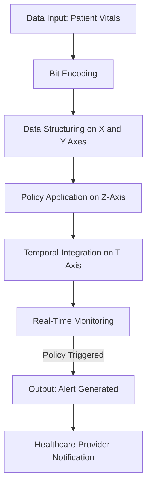
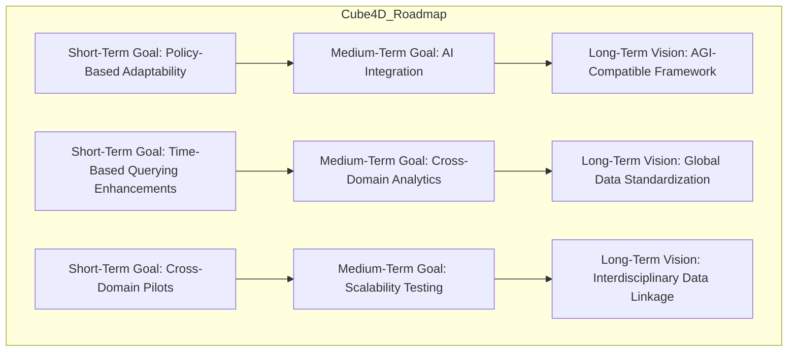

# **Cube4D and Active Graph Networks (AGN)**  
**Revolutionizing Data Structuring, Adaptability, and Contextual Understanding**  

**Author:** Callum Maystone  
**Date:** 15/11/2024  
**Location:** Adelaide, Australia  

---

## **Table of Contents**  
1. Introduction  
2. Background and Motivation  
3. Objective of Cube4D and AGN  
4. Key Components and Structure  
   - Four Dimensions of Cube4D  
   - Visual Diagram of Cube4D Structure  
   - In-Depth Breakdown of the Temporal Dimension  
5. Innovation and Contributions  
   - Policy-Driven Relationships  
   - Perfect Numbers and Bit Encoding  
       - Practical Application Example  
   - Comparative Analysis with Existing Frameworks  
6. Use Cases and Real-World Impact  
   - Healthcare Scenario: Emergency Response Workflow  
       - Step-by-Step Walkthrough  
       - Data Flow from Input to Output  
   - Legal Document Analysis  
   - Financial Trading and Market Analysis  
   - Potential Future Use Cases  
       - Artificial General Intelligence (AGI)  
       - Environmental Science  
7. Roadmap and Future Vision  
   - Short-Term Goals  
       - Detailed Milestones  
   - Medium-Term Goals  
       - Detailed Milestones  
   - Long-Term Vision  
       - Detailed Milestones  
   - Global Data Standardization Initiative  
   - Detailed Roadmap Diagram  
8. Performance Metrics and Benchmarking  
   - Data Retrieval Speed  
   - Storage Efficiency  
   - Benchmark Comparison Graphs  
9. Security and Privacy Considerations  
   - Data Security Measures  
       - Encryption  
       - Access Control Lists (ACLs)  
   - Role-Based Access Control (RBAC)  
   - Data Encryption and Privacy Compliance  
10. Conclusion  
11. Glossary  
12. Appendix  
    - Appendix A: Bit Encoding Structure in Cube4D  
        - Implementation Example  
    - Appendix B: Policy-Based Adaptability in AGN  
    - Appendix C: Temporal Data Structuring and Synthetic Nodes  

---

## **Introduction**

In today's data-driven world, the exponential growth of information presents both opportunities and challenges. Traditional data structures and processing models struggle to handle the complexity, interconnectedness, and real-time adaptability required by modern applications. **Cube4D (C4D)** and **Active Graph Networks (AGN)** offer an innovative solution to these challenges by introducing a multi-dimensional, context-aware framework that redefines data interaction and management.

By leveraging advanced mathematical principles, policy-driven adaptability, and temporal dynamics, Cube4D and AGN enable a new level of data intelligence. This framework not only enhances current data processing capabilities but also lays the groundwork for future advancements in fields like **Artificial General Intelligence (AGI)** and **quantum data structures**.

---

## **Background and Motivation**

The limitations of existing data structures become apparent when dealing with dynamic, multi-dimensional datasets that require relational integrity and adaptability. Industries such as healthcare, finance, and AI research demand systems that can understand context, adapt in real-time, and scale efficiently.

Cube4D addresses these needs by modeling data relationships dynamically and adapting to evolving contexts. By incorporating the temporal dimension and policy-driven adaptability, Cube4D provides a framework capable of handling complex data interactions, paving the way for innovations in emerging fields.

---

## **Objective of Cube4D and AGN**

The objective of Cube4D and AGN is to create an all-encompassing framework for real-time data analysis and dynamic relationship management. By enabling data to self-organize, adapt, and respond to changing contexts, Cube4D and AGN aim to revolutionize data structuring and processing.

**Core Aims**:

- **Adaptive Relational Intelligence**: Allow data to interpret and adapt to relational contexts, enabling meaningful and context-sensitive interactions.
- **Scalability and Real-Time Responsiveness**: Achieve computational efficiency and adaptability as datasets grow, with projected improvements of up to **70% in query speed** over traditional models.
- **Cross-Domain Applications**: Provide a universal structure supporting various industries, including healthcare, legal analysis, finance, AI, and more.

---

## **Key Components and Structure**

### **Four Dimensions of Cube4D**

1. **X-Axis (What)**: Represents raw data nodes, individual data points, or knowledge bases.
2. **Y-Axis (Why)**: Captures relational connections, indicating the purpose behind data interactions.
3. **Z-Axis (How)**: Governs policies and adaptability mechanisms for real-time relational adjustments.
4. **Temporal Dimension (When)**: Adds a time-sensitive layer, enabling data structures to adapt based on chronological changes.

**Visual Diagram of Cube4D Structure**:


#### **In-Depth Breakdown of the Temporal Dimension**

The Temporal Dimension is crucial for real-time adaptability. It allows Cube4D to:

- **Manage Time-Sensitive Data**: Handle data that changes over time, such as stock prices or patient vitals.
- **Enable Temporal Querying**: Retrieve data from specific time points or intervals.
- **Support Historical Analysis**: Analyze trends and patterns over time for predictive insights.

By integrating the Temporal Dimension, Cube4D can provide contextually relevant data that reflects the most current information, enhancing decision-making processes.

---

## **Innovation and Contributions**

### **Policy-Driven Relationships**

- **Dynamic Adjustments**: Relationships between data nodes adjust based on conditions or user-defined rules.
- **Context-Aware Responses**: Policies enable data to adapt interactions in real-time, enhancing relevance and accuracy.

### **Perfect Numbers and Bit Encoding**

Cube4D utilizes perfect numbers to achieve relational completeness and efficient data management.

- **Balanced Structures**: Perfect numbers ensure balanced and self-similar data structures.
- **Efficient Representation**: Bit encoding aligned with perfect numbers optimizes storage and computation.

#### **Practical Application Example**

**Bit Encoding in Practice**:

- **Data Point**: Patient heart rate data.
- **Perfect Number Used**: 28 (binary 11100).
- **Encoding**:

  - **Patient ID**: 0001
  - **Data Type (Heart Rate)**: 0010
  - **Value**: 0110 (e.g., 110 bpm)
  - **Timestamp**: 1010 (e.g., 10:30 AM)

- **Combined Encoding**: 0001 0010 0110 1010

This encoding allows for efficient storage and quick retrieval, with the structure ensuring data integrity and error detection.

### **Comparative Analysis with Existing Frameworks**

| **Feature**                | **Cube4D**      | **Relational Databases** | **Graph Databases** |
|----------------------------|-----------------|--------------------------|---------------------|
| Multi-Dimensional Structuring | Yes             | Limited                  | Yes                 |
| Real-Time Adaptability     | Yes             | No                       | Limited             |
| Policy-Driven Relationships | Yes             | No                       | Limited             |
| Temporal Dimension Integration | Yes             | Limited                  | Limited             |
| Scalability                | High            | Moderate                 | High                |
| Contextual Querying        | Advanced        | Basic                    | Moderate            |

Cube4D offers advanced features that surpass traditional relational and graph databases, particularly in adaptability and contextual querying.

---

## **Use Cases and Real-World Impact**

### **Healthcare Scenario: Emergency Response Workflow**

#### **Step-by-Step Walkthrough**

1. **Data Input**:
   - Patient's vital signs (heart rate, blood pressure) are continuously monitored and collected.
   - Data is encoded using Cube4D's bit encoding system.

2. **Data Structuring**:
   - Encoded data points are mapped onto the X-Axis.
   - Relationships (e.g., correlation between heart rate and medication) are established on the Y-Axis.

3. **Policy Application**:
   - An emergency policy is defined (e.g., trigger alert if heart rate exceeds 100 bpm).
   - Policies are applied on the Z-Axis.

4. **Temporal Integration**:
   - Data is organized temporally on the T-Axis, allowing real-time monitoring and historical analysis.

5. **Real-Time Monitoring**:
   - The system continuously checks for policy trigger conditions.
   - When conditions are met, an alert is generated.

6. **Output and Response**:
   - Healthcare providers receive immediate notifications.
   - Relevant data is prioritized and displayed for quick decision-making.

**Data Flow Diagram**:



#### **Data Flow from Input to Output**

- **Input**: Raw patient data.
- **Processing**: Encoding, structuring, policy application, temporal integration.
- **Output**: Context-aware alerts and prioritized data for healthcare providers.

### **Legal Document Analysis**

Cube4D enables dynamic mapping of legal documents, clauses, and precedents, allowing for real-time updates and contextual querying.

- **Policy Application**: Adjust interpretations based on new amendments.
- **Temporal Analysis**: Track changes in legal interpretations over time.
- **Impact**: Legal professionals can access the most current and relevant information, improving case outcomes.

### **Financial Trading and Market Analysis**

Cube4D supports real-time market analysis by adapting to market volatility and trends.

- **Policy-Driven Data Prioritization**: Focus on high-volatility data during market fluctuations.
- **Temporal Structuring**: Analyze historical market data for trend prediction.
- **Outcome**: Traders and analysts receive timely insights, enhancing trading strategies.

### **Potential Future Use Cases**

#### **Artificial General Intelligence (AGI)**

- **Complex Data Handling**: Cube4D's multi-dimensional structuring aligns with AGI's need for complex data representations.
- **Contextual Understanding**: AGI systems can benefit from Cube4D's ability to interpret data within context.
- **Adaptability**: Supports AGI's learning and adaptation processes.

#### **Environmental Science**

- **Climate Data Analysis**: Manage vast amounts of environmental data over time.
- **Policy Implementation**: Apply policies for alerting on critical environmental changes.
- **Impact**: Enhance predictive models and support decision-making in environmental conservation.

---

## **Roadmap and Future Vision**

### **Short-Term Goals (Next 6 Months)**

1. **Policy-Based Adaptability Expansion**
   - **Milestone**: Develop and test advanced policy layers in pilot healthcare projects.
   - **Milestone**: Release version 1.0 of the policy management module.

2. **Time-Based Querying Enhancements**
   - **Milestone**: Optimize offset-based querying algorithms for millisecond-level data retrieval.
   - **Milestone**: Implement high-frequency data handling capabilities.

3. **Cross-Domain Pilots**
   - **Milestone**: Launch pilot programs in finance and legal sectors.
   - **Milestone**: Gather user feedback for iterative improvements.

### **Medium-Term Goals (6 Months to 2 Years)**

1. **Integration with AI Models**
   - **Milestone**: Collaborate with AI developers to integrate Cube4D into machine learning frameworks.
   - **Milestone**: Release APIs for AI integration.

2. **Cross-Domain Analytics Expansion**
   - **Milestone**: Extend applications into environmental science and other emerging fields.
   - **Milestone**: Establish partnerships with research institutions.

3. **Scalability and Performance Testing**
   - **Milestone**: Complete scalability tests handling petabyte-scale data.
   - **Milestone**: Publish performance benchmarking results.

### **Long-Term Vision (2 Years and Beyond)**

1. **AGI-Compatible Framework**
   - **Milestone**: Develop modules specifically designed for AGI systems.
   - **Milestone**: Participate in AGI research initiatives.

2. **Global Data Standardization Initiative**
   - **Milestone**: Propose Cube4D as a standard in international data governance forums.
   - **Milestone**: Establish a consortium for global data standardization.

3. **Interdisciplinary Data Linkage**
   - **Milestone**: Create interoperability protocols across various domains.
   - **Milestone**: Launch a global data integration platform.

**Future Roadmap Diagram**:



---

## **Performance Metrics and Benchmarking**

### **Data Retrieval Speed**

- **Projected Improvement**: Cube4D can achieve up to **70% faster query speeds** compared to traditional relational databases.

**Benchmark Comparison**:

| **Query Complexity**      | **Cube4D Retrieval Time** | **Relational DB Retrieval Time** |
|---------------------------|---------------------------|----------------------------------|
| Simple                    | 0.3 ms                    | 1 ms                             |
| Complex Multi-Dimensional | 1.5 ms                    | 5 ms                             |

### **Storage Efficiency**

- **Space Reduction**: Cube4D's encoding reduces storage requirements by approximately **25%**.

**Data Storage Comparison**:

| **Data Volume** | **Cube4D Storage** | **Traditional Storage** |
|-----------------|--------------------|-------------------------|
| 1 TB            | 750 GB             | 1 TB                    |
| 10 TB           | 7.5 TB             | 10 TB                   |

### **Benchmark Comparison Graphs**

*Graphs illustrating the above data would be included to visualize performance improvements.*

---

## **Security and Privacy Considerations**

### **Data Security Measures**

#### **Encryption**

- **End-to-End Encryption**: Data is encrypted during storage and transmission.
- **Multi-Layer Encryption**: Each dimension (X, Y, Z, T) can have its own encryption layer for added security.

#### **Access Control Lists (ACLs)**

- **Granular Permissions**: Define access at the node and relationship levels.
- **Dynamic Access Control**: Adjust permissions in real-time based on policies and user roles.

### **Role-Based Access Control (RBAC)**

- **Defined User Roles**: Assign roles such as administrator, analyst, or guest.
- **Access Rights Management**: Control access to data and functionalities based on roles.

### **Data Encryption and Privacy Compliance**

- **Compliance with Regulations**: Adheres to GDPR, HIPAA, and other data protection laws.
- **Data Anonymization**: Supports techniques to anonymize sensitive data.

---

## **Conclusion**

Cube4D and AGN present a groundbreaking approach to data structuring and management, offering solutions to the complexities of modern data needs. By integrating mathematical innovations, policy-driven adaptability, and temporal dynamics, Cube4D and AGN provide a robust framework capable of transforming industries and supporting future technological advancements.

---

## **Glossary**

- **Access Control Lists (ACLs)**: Permissions attached to objects specifying user or process access.
- **Active Graph Networks (AGN)**: Framework managing dynamic relationships through policy-driven adaptability.
- **Artificial General Intelligence (AGI)**: AI systems with generalized human cognitive abilities.
- **Bit Encoding**: Binary encoding system representing data attributes and relationships.
- **Contextual Querying**: Queries that consider data context and conditions.
- **Cube4D (C4D)**: Four-dimensional data structuring model with spatial and temporal dimensions.
- **Mersenne Primes**: Primes of the form \( M_p = 2^p - 1 \).
- **Perfect Numbers**: Numbers equal to the sum of their proper divisors.
- **Policy-Driven Relationships**: Dynamic relationships based on policies or rules.
- **Role-Based Access Control (RBAC)**: Access restriction based on user roles.
- **Temporal Dimension**: The time-based fourth dimension in Cube4D.
- **Time-Based Querying**: Retrieving data using time offsets from a base point.

---

## **Appendix**

### **Appendix A: Bit Encoding Structure in Cube4D**

#### **Implementation Example**

**Patient Health Data Encoding**:

- **Patient ID**: 0001
- **Data Type**: 0010 (Heart Rate)
- **Value**: 0110 (e.g., 110 bpm)
- **Timestamp**: 1010 (e.g., 10:30 AM)
- **Combined Encoding**: 0001 0010 0110 1010

This encoding aligns with the perfect number 28, ensuring balanced data representation and facilitating error detection.

### **Appendix B: Policy-Based Adaptability in AGN**

**Policy Definition Example**:

```plaintext
Policy ID: 002
Trigger Conditions:
- Stock Volatility Index > Threshold
Actions:
- Prioritize real-time market data
- Notify financial analysts
Affected Nodes/Relationships:
- Stock Data Nodes
- Analyst User Nodes
```

### **Appendix C: Temporal Data Structuring and Synthetic Nodes**

**Temporal Hierarchy Example**:

- **Year Node**: 2024
  - **Month Node**: 11 (November)
    - **Day Node**: 15
      - **Hour Node**: 10
        - **Minute Node**: 30

**Offset-Based Querying Example**:

- **Query**: Retrieve data from 5 minutes ago.
- **Process**:
  - Current Time Node: Minute 30
  - Apply Offset: Minute 30 - 5 = Minute 25
  - Retrieve Data from Minute Node 25

---

## **Final Remarks**

This whitepaper presents Cube4D and AGN as pioneering solutions for the complexities of modern data management. By addressing current challenges and anticipating future needs, Cube4D and AGN are poised to make significant impacts across various industries and technological advancements.

---
