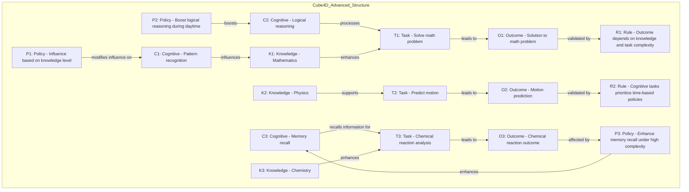

# Cube4D: A Thesis on Active Graph Networks and Four-Dimensional Data Programming

**Author**: *Callum Maystone*

**Abstract**:  
Cube4D represents a paradigm shift in data structuring and programming logic, combining graph theory with multidimensional, policy-driven data interactions. This thesis explores Cube4D’s technical foundations, conceptual structure, and real-world applicability. Originating from insights in data architecture and cognitive reasoning, Cube4D enables dynamic data handling by introducing Active Graph Networks (AGN) — a framework designed to optimize complex data relationships through adaptable policy enforcement, rule-based logic, and time-based conditions.

---

## Index

1. [Background and Motivation](#background-and-motivation)
2. [Core Philosophical Foundations](#core-philosophical-foundations)
3. [Technical Foundations of Cube4D](#technical-foundations-of-cube4d)
4. [Dependency Model and Hierarchical Structure](#dependency-model-and-hierarchical-structure)
5. [Programming Logic and Four-Dimensional Design](#programming-logic-and-four-dimensional-design)
6. [Practical Use Cases](#practical-use-cases)
7. [Roadmap and Project Outline](#roadmap-and-project-outline)
8. [Comprehensive Mermaid Diagrams and Visuals](#comprehensive-mermaid-diagrams-and-visuals)
9. [Technical Insights and Future Vision](#technical-insights-and-future-vision)
10. [Cube4D Structure and Interaction Overview](#cube4d-structure-and-interaction-overview)
11. [Conclusion](#conclusion)

---

## Background and Motivation

Cube4D was born from a journey through AI model building, healthcare data systems, and an insatiable curiosity for exploring complex relationships in data. This thesis encapsulates that journey, diving into the “how, why, and what” behind Cube4D’s creation. By bridging the gap between abstract reasoning and practical application, Cube4D provides a novel approach to processing logic, policy-driven relationships, and scalable data structures.

---

## Core Philosophical Foundations

Cube4D operates on fundamental principles of structure, purpose, and adaptability, reflected in three key conceptual axes:

1. **X-Axis (What)**: Represents the core data or information — the essence of stored knowledge within the Cube4D framework.
2. **Y-Axis (Why)**: Reflects relational connections, signifying the purpose behind data interlinking and connectivity.
3. **Z-Axis (How)**: Denotes the logic and policies applied to data, adapting dynamically to external conditions.
4. **Temporal Dimension**: Time-based conditions that further refine how data relationships evolve, making them adaptable to change.

Together, these axes facilitate **Effectus** — the cumulative result of Cube4D’s dynamic interactions, and **Quomodo** — the structured, scalable method Cube4D uses for processing.

---

## Technical Foundations of Cube4D

### Multi-dimensional Bit Encoding for Data and Logic

Cube4D’s binary encoding creates a highly efficient structure for representing each element within the data framework:
   - **Binary Encoding Structure**: Each node, query, or relationship in Cube4D has a distinct binary identifier.
   - **7-Bit and 14-Bit Structures**: These configurations enhance data complexity handling, with additional bits allowing for parity checks and error detection.
   - **Efficiency Scaling with Bits**: This modular design lets the system grow in complexity by simply adding bits, preserving efficiency across increased data layers.

### Policy-Driven Relationships and Rule-Based Logic

Cube4D introduces policy-driven relationships where data connections adapt based on contextual parameters. Each relationship type (e.g., influences, processes) can be dynamically modified by:
   - **Policies**: Modifying influence levels based on external factors like time or access requirements.
   - **Rules**: Governing the outcome of tasks under specific conditions, adding a layer of conditional adaptability.

### Node Types and Interaction Protocols

The Cube4D framework categorizes nodes into distinct roles that mirror real-world data processing:
   - **Cognitive Nodes (e.g., Pattern Recognition)**: Responsible for tasks related to AI adaptability and recognition.
   - **Knowledge Nodes (e.g., Mathematics, Physics)**: Domain-specific information nodes that contextualize data.
   - **Task and Outcome Nodes (e.g., Problem Solving)**: Execute specific objectives, completing assigned tasks within defined rules.
   - **Policy and Rule Nodes**: Control relationship evolution and enforce the logical outcome.

---

## Dependency Model and Hierarchical Structure

Cube4D is built around a hierarchical structure that employs dependencies to streamline data handling:

### Dependency Index and Cube Referencing
Each Cube4D structure references a **cube_dependency_index** to manage interconnected data. Dependencies are organized across the following levels:
   - **Root Level (T_0)**: The base cube with foundational cognitive, task, and policy nodes.
   - **Child Nodes**: Nodes like knowledge or outcome nodes that derive logic based on T_0 principles.
   - **Cross-Cube Dependencies**: Allows data from other cubes to inform the current cube’s logic, enabling cross-functional intelligence.

---

## Programming Logic and Four-Dimensional Design

Cube4D’s design introduces a four-dimensional programming model where each axis represents a unique facet of data interaction:

1. **X-Axis**: Information/data nodes.
2. **Y-Axis**: Relational connections.
3. **Z-Axis**: Logical rules and policies.
4. **Temporal Dimension**: Adapts connections and relationships based on time-sensitive conditions.

This structure lets Cube4D handle complex relationships in real-time, maintaining both a clear hierarchy and adaptive, policy-based processing.

### Example Code and Structure

Below is the Cube4D schema for processing complex data relationships, leveraging policy-driven adaptability:

```json
{
    "T_0": {
        "nodes": {
            "C1": {"type": "Cognitive", "description": "Pattern recognition"},
            "C2": {"type": "Cognitive", "description": "Logical reasoning"},
            "K1": {"type": "Knowledge", "description": "Mathematics"},
            "K2": {"type": "Knowledge", "description": "Physics"},
            "T1": {"type": "Task", "description": "Solve math problem"},
            "O1": {"type": "Outcome", "description": "Solution to math problem"},
            "P1": {"type": "Policy", "description": "Influence based on knowledge level"}
        },
        "relationships": [
            {"source": "C1", "target": "K1", "relationship_type": "influences", "policy": "P1"},
            {"source": "C2", "target": "T1", "relationship_type": "processes", "policy": "P1"}
        ]
    }
}
```

### Example Query Execution with Binary Encoding
Cube4D uses a unique encoding system to streamline queries:

```plaintext
Get-Patient-Record | Where {$_.name -eq First:'Arthur'/Last:'Dent'}
Binary: 1011111.0010010.0000010..0010011.0000110
```

---

## Comprehensive Mermaid Diagrams and Visuals

Below is a mermaid diagram illustrating the relationships within the Cube4D schema:



---

## Conclusion

Cube4D and Active Graph Networks (AGN) redefine the landscape of data processing and programming with a multi-dimensional, policy-driven structure that supports complex data relationships and real-time adaptability. This framework represents an evolution in how data is stored, accessed, and manipulated, offering a universal approach that applies to a range of industries, from healthcare to artificial intelligence and beyond. By integrating policy, rules, and binary encoding in a four-dimensional architecture, Cube4D enables efficient, scalable, and intelligent data handling.

The architecture of Cube4D is founded on three principal axes—Data, Relationship, and Logic—supplemented by a Temporal layer for time-sensitive processing. This structure enables Cube4D to process high-dimensional data in real-time, creating adaptable systems that can anticipate and respond to changes dynamically. As a versatile framework, Cube4D is poised to become a foundational tool in next-generation applications, with capabilities ranging from predictive analytics in healthcare to adaptive AI in autonomous systems.

With an open-source roadmap and collaborative potential, Cube4D invites developers, researchers, and organizations to contribute to its evolution. Together, we can harness the power of structured, multi-dimensional programming to tackle some of the most complex challenges in data science and beyond.

