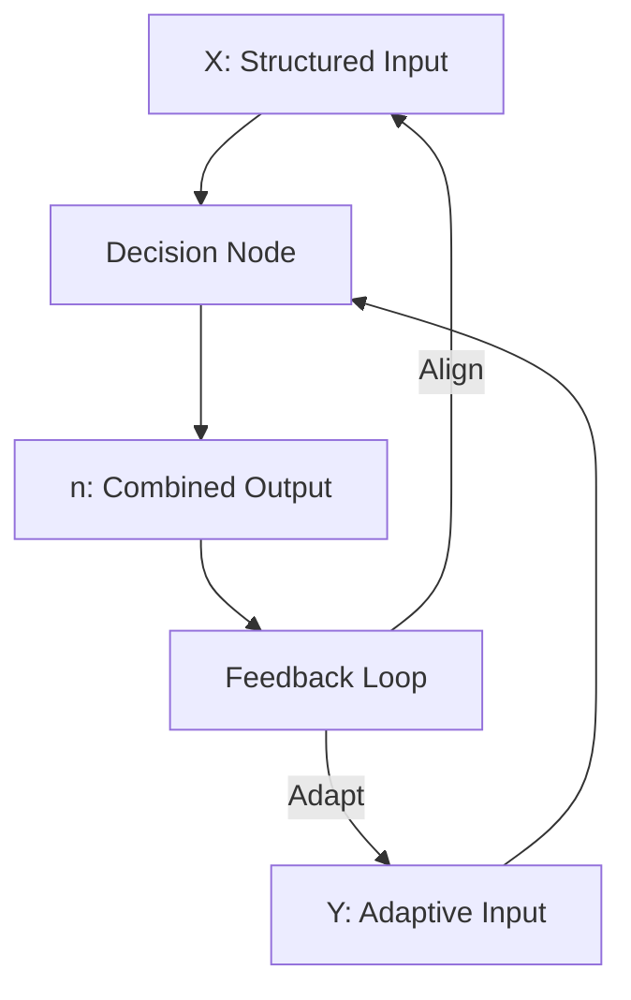

## **Dynamic Relationship Expansion (DRE) Framework: Iteration 4**

### **1. The Duality of X and Y**
- **X**: The **structured foundation**, the framework that defines the **rules, stability, and guidelines**. X can function independently because it is self-contained and self-sustaining.
- **Y**: The **adaptive input**, representing **possibilities, creativity, and variability**. Y operates within the constraints of X, but without structure, it is prone to **self-decay over time**.

### **2. The Interplay of X and Y**
- Together, X and Y **define the space of possibilities**:
  - **X + Y = n**: X provides the structure, and Y fills the structure with variability and potential.
  - **X without Y**: Stability without adaptability—can stagnate.
  - **Y without X**: Chaos without boundaries—leads to decay.
- **Decision at the Center**: At the intersection of X and Y lies the **decision process**—a node that determines whether Y fits within the structure of X.

---

### **3. X and Y as a Whole**
- **X and Y Together**:
  - They form **n**, a composite output that integrates the structure and adaptability.
  - **X and Y as Inputs**: Represent the raw possibilities of all inputs and outputs.  
- **Structure vs. Adaptability**:
  - X ensures that outcomes align with the broader system or environment.
  - Y allows for novelty, exploration, and growth.

---

### **4. Temporal Dynamics**
- **Over Time**:
  - **X evolves slowly**, providing stability and continuity.
  - **Y fluctuates rapidly**, exploring possibilities and adapting.
  - Without integration, Y self-decays due to a lack of constraints, and X becomes rigid without adaptability.
- **Decision Nodes**:
  - Every iteration evaluates whether Y fits the constraints of X.
  - **Temporal Scaling**: Over multiple iterations, Y adapts more closely to X, stabilizing the relationship.

---

### **5. Formalizing This in the Framework**
#### **Mermaid Diagram: Duality of X and Y**

---

### **6. Practical Implications**
- **Inputs and Outputs in Raw Form**:
  - X and Y collectively represent **all possibilities** in a system.
  - The framework evaluates how well Y adapts to X.
- **Self-Decay of Y**:
  - Y without X is unstable, prone to entropy. It requires structure (X) to sustain and evolve.

---

### **7. Next Steps**
1. **Refine the Feedback Loop**:
   - Define the **rules for adaptation** of Y and the constraints imposed by X.
   - Model how self-decay of Y influences decision-making over time.

2. **Apply to Datasets**:
   - Test this framework with structured data (e.g., cancer or genomic datasets) to see how inputs (X, Y) evolve into outputs (n).

3. **Visualization**:
   - Create a dynamic diagram showing how X and Y interact over multiple iterations.
