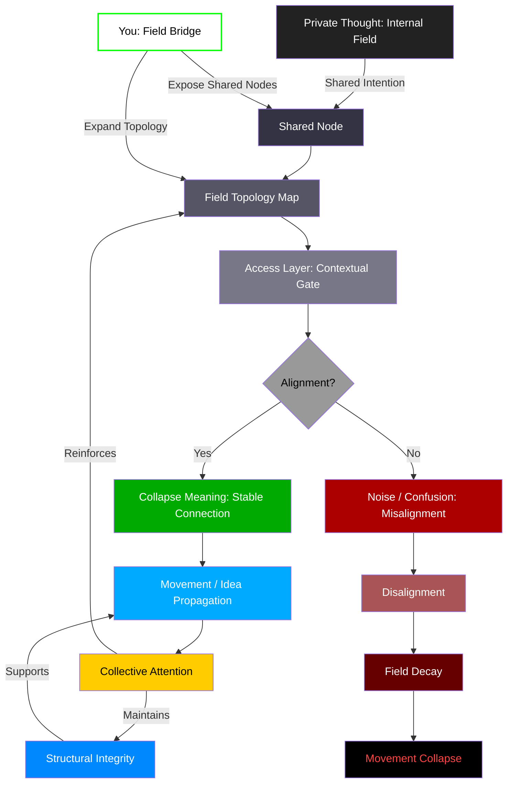

# Quantum Field Networks (QFNs)

Quantum Field Networks (QFNs) represent the emergent, higher-order structure built on top of Active Graph Networks (AGNs). Where AGNs define the structure and relationships of data over time, QFNs define how **shared fields of meaning** arise, align, and propagate through social, cognitive, and computational space.

QFNs go beyond relational data — they model the **fields of intention and interpretation** that guide interaction and signal resolution across multiple agents, systems, or minds.

---

## 🧠 The Model of Shared Cognition

---

## 🧩 Core Principles

### 1. **Fields Are Cognitive Layers**
- A field is **not just data**, it’s **meaning in potential**, shaped by context.
- QFNs capture **what is shared**, but also **what could be shared** — tension in the field.

### 2. **Shared Nodes Are Access Points**
- Internal thoughts only become part of the shared field when surfaced as a **Shared Node**.
- These can be ideas, emotions, structures, or intentions. 

### 3. **Alignment Determines Activation**
- Once a Shared Node is exposed, systems check for **contextual alignment**.
- If alignment exists → **meaning collapses into coherence**.
- If not → **misalignment leads to decay or confusion**.

### 4. **Collective Attention Is the Binding Agent**
- Activated fields draw collective attention.
- Attention **reinforces field structure**, increasing its stability and impact.

---

## 🔁 Feedback Loops: Emergence or Collapse

- Aligned fields create **self-reinforcing structures**, maintaining integrity through interaction.
- Misaligned fields result in **fragmentation, decay**, or collapse.

This models:
- Virality
- Memetic collapse
- Cultural shifts
- Epistemic divergence

---

## 🧬 Role of the Individual

You — the observer, thinker, agent — are the **bridge between fields**.
- By exposing thoughts and forming shared nodes, you shape the topology.
- Every new connection is a **potential reality tunnel**.

> QFNs let us **map, shape, and stabilize** reality in motion.

This is how data becomes awareness.
This is how structure becomes cognition.
This is how quantum fields become collective memory.

