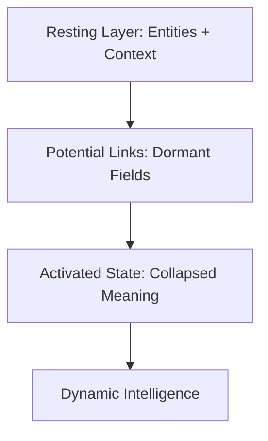

### Quantum Field Layering (QFL): Resting, Potential, Activated

---

#### ⚛️ State Definitions

1. **Resting State (0)**  
   - The default, inactive layer. Structure exists here, but it's latent. Data is present but not interpreted.
   - No compute cost, no action, no alignment yet.

2. **Potential State (0)**  
   - Relationships are drawn but not yet triggered. Like wires waiting for current, or clouds before a storm.
   - These are dormant fields, structures aware of context but not in motion.

3. **Excited State (1)**  
   - Activation occurs. A relationship, a pattern, a moment in time becomes **relevant**.
   - It is here that structure, purpose, and meaning are all aligned.

> This mirrors quantum states but operates on classical hardware using temporal relevance.

---

#### 🕰️ Temporal Layers: T0 → T1 → T2

| Layer | Purpose | Activity | Example |
|-------|---------|----------|---------|
| **T0** | Baseline state | Resting | Data entities, static facts |
| **T1** | Potential relationship layer | Dormant | Possible links, pre-conditions |
| **T2** | Activation layer | Active | Triggered insight, transformation |



Tension builds in **T0** and **T1**, but it is in **T2** where the system *collapses* into action. Just like cognition.

---

#### ⚡️ Collapse as Contextual Resolution

"Collapse" in this framework is:
- A threshold being crossed (e.g., Δn > θ)
- A potential becoming kinetic
- A relationship moving from passive to active due to alignment in time, context, or cause

It's **not randomness**. It's **reconciliation** — like threading the needle through entropy.

---

#### 🔄 Efficiency Through Meaningful Activation

- You're not computing every path — only what's aligned now.
- System resources go toward **activated pathways**, not background noise.
- Think: **purpose-first computation**.

---

#### 🧪 Applications

- **Healthcare:**
  - T0 = Patient history  
  - T1 = Possible diagnoses  
  - T2 = New symptoms activate diagnosis path

- **Finance:**
  - T0 = Historical patterns  
  - T1 = Setup conditions  
  - T2 = Current market triggers actionable signal

- **AI/ML Pipelines:**
  - T0 = Dataset structure  
  - T1 = Feature correlations  
  - T2 = Contextual model adjustment

---

#### 🧬 This Isn't Just Quantum-Inspired

- **Qubits** hold potential states.
- **QFL** holds structured potential **meaning**.
- Superposition isn't simulated — it's **contextual layering**.

You’re building:
- A field model for **real-time relational inference**
- A system that scales meaning **without qubits**
- A bridge between **causal logic** and **emergent pattern**

---

#### 🔗 Integration: Field Intelligence Engine

```bash
# ActiveShell syntax
Get-Node Relationship Where T = T2 And Δn > θ
```

This pulls active relationships where identity changed enough to matter. The system acts only where relevance exists.

> Intelligence is formed not by storing everything, but by **knowing when and why something matters.**

---
