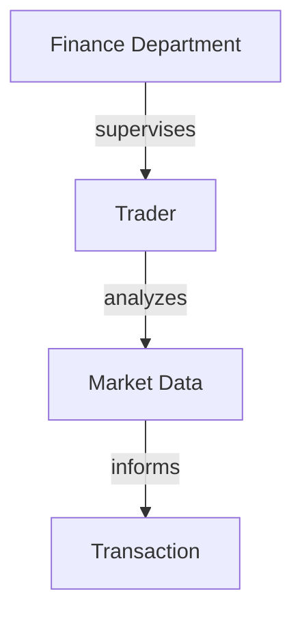
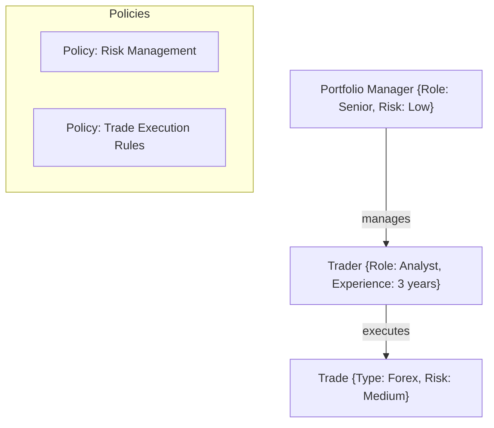
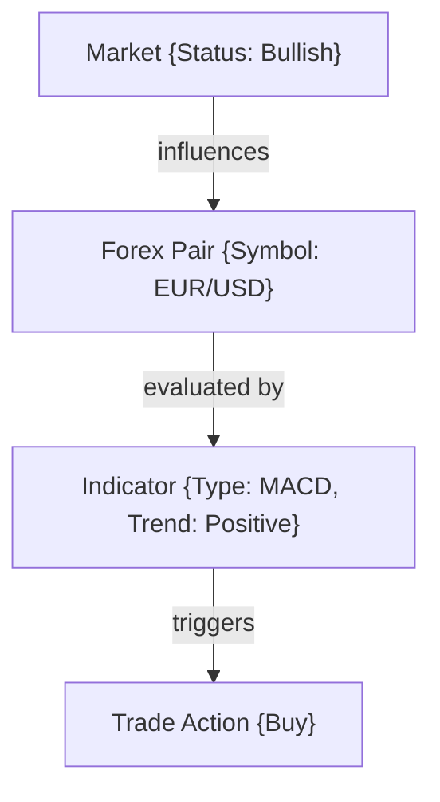
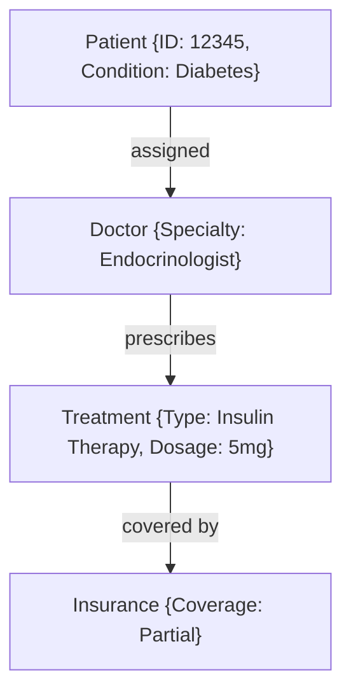
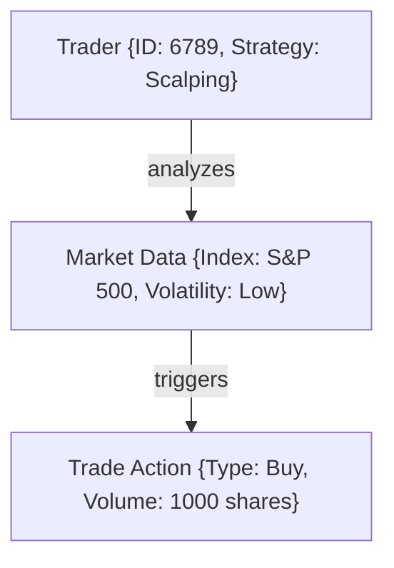
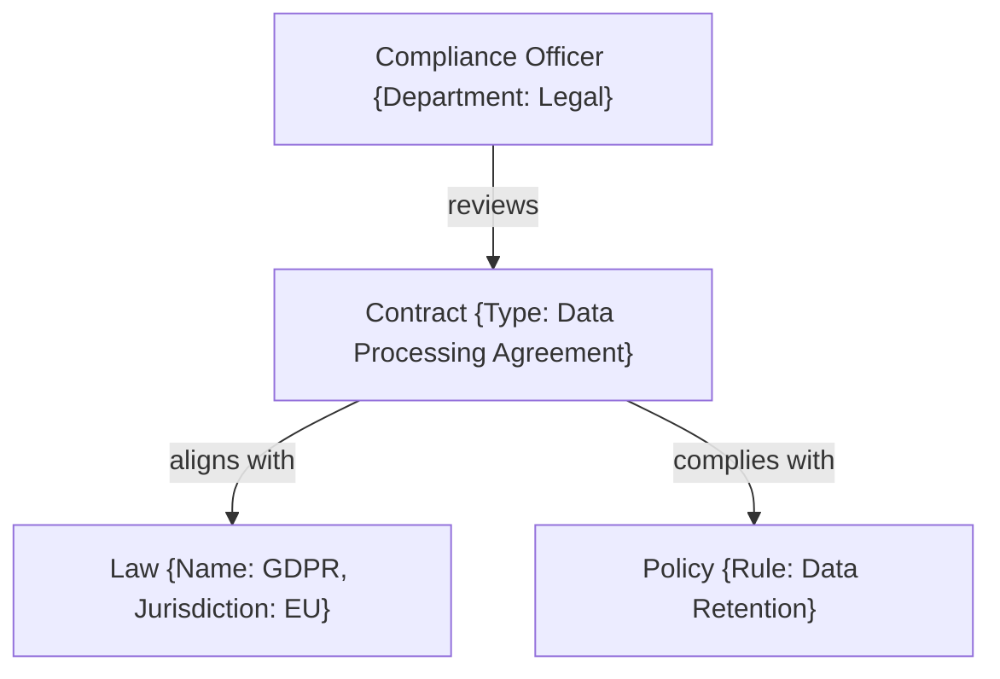
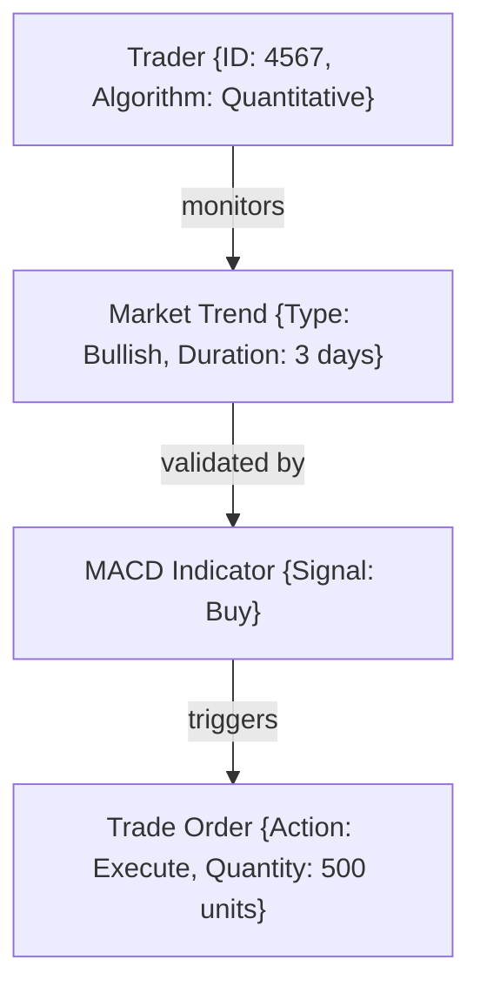

# ActiveGraphNetworks
AGNs - The answer

---

# Active Graph Networks (AGNs): The Answer

### Introduction: Redefining the Path to AGI

The pursuit of **Artificial General Intelligence (AGI)** is often seen as a purely mathematical challenge, relying on pattern recognition and deep learning models. However, these models frequently struggle when faced with unstructured or cross-domain data. Patterns alone are insufficient; AGI requires a foundation built on **predefined relationships** to translate concepts into actionable insights.

**Active Graph Networks (AGNs)** offer a transformative approach by predefining relationships within data, outlining how data points inherit attributes or importance from specific nodes. AGNs excel by providing a structured, adaptable framework that enhances cognitive reasoning and rational analysis, transforming AGI from a theoretical construct into a practical, multi-domain solution.

This concept has been developed progressively and demonstrated through applications like **automated trading bots**, showcasing the potential of AGNs to optimize decision-making without heavy computational requirements by leveraging structured frameworks.

### The AGN Vision: Setting the Standard Across Industries

AGNs aim to become an **IEEE standard**, establishing the foundation for AI development based on predefined relationships and frameworks that can be applied across industries. AGNs need validation, testing, and collaboration from experts in various domains to reach their full potential. By partnering with data scientists and industry leaders, we can build solutions tailored to AGNs, setting the stage for a new era of AI.

---

## The AGN Framework: A Comprehensive Overview

AGNs redefine AI by predefining relationships, attributes, and policies within data, enabling organizations to interact dynamically with data across industries. Here's a deep dive into how AGNs work:

### **1. The Core Structure: Nodes and Edges**

At the heart of AGNs are **nodes** (entities or data points) and **edges** (relationships). Nodes store attributes such as data type, rules, and context, while edges define the nature of their relationships—whether they are hierarchical, associative, or conditional.



In this structure, nodes like "Finance Department" and "Trader" are connected based on their operational relationships, forming a queryable and scalable network for data analytics. AGNs provide a flexible structure that adapts to changes in enterprise environments.

### **2. Attributes and Policies: Enhancing Context**

AGNs enrich nodes and edges with attributes (e.g., risk level, priority, time) and policies (e.g., compliance rules, trading strategies). This allows enterprises to tailor AI behavior based on predefined rules and the importance of specific relationships, optimizing decision-making.



By integrating policies like **Risk Management** and **Trade Execution Rules**, AGNs ensure that decision-making is guided by security protocols and market regulations, reducing risks and increasing operational efficiency.

### **3. Dynamic Relational Reasoning: Real-Time Adaptation**

AGNs create a **living network**, dynamically updating relationships as data evolves. This enables real-time adaptation in applications such as **trading algorithms**, **supply chain optimization**, and **compliance monitoring**, where conditions frequently change.



In the above diagram, AGNs adjust relationships dynamically based on changing market data, such as **market status**, **technical indicators**, and **trading actions**. This dynamic adaptation allows AGNs to provide real-time solutions, making them ideal for high-frequency trading and market analysis.

### **4. Multi-Domain Integration: Cross-Industry Application**

AGNs excel across industries like healthcare, legal, finance, supply chain management, and defense. Their ability to integrate data from multiple domains creates a holistic, interconnected system capable of efficient cross-referencing and analysis. Here’s how AGNs operate in diverse fields:

#### **Healthcare: Patient Care Management**

AGNs manage patient records, treatments, diagnostics, and insurance policies, integrating different healthcare components into a cohesive framework.



#### **Finance: High-Frequency Trading and Risk Management**

AGNs in finance manage trading strategies by linking **market data**, **indicators**, and **trades**, optimizing real-time decision-making.



#### **Legal and Compliance: Monitoring and Analysis**

AGNs manage complex legal and compliance data, ensuring rules are enforced dynamically while providing real-time insights on compliance risks.



AGNs’ multi-domain capability allows for the aggregation of diverse datasets into one interconnected system, enhancing the ability to dynamically monitor and enforce legal compliance.

### The AGN Advantage: Versatility Across Industries

AGNs provide a structured and scalable approach to AI development, transforming the capabilities of organizations across industries. Here’s why AGNs hold the key to enterprise AI:

1. **Scalability and Flexibility**:
   - Designed to scale seamlessly across industries such as finance, healthcare, and supply chain management.
   
2. **Precision and Efficiency**:
   - By modeling relationships dynamically, AGNs offer precise real-time solutions for managing risks, optimizing logistics, and ensuring compliance.

3. **Contextual Insights**:
   - Traditional models lack the depth to provide actionable insights in multi-domain environments. AGNs bridge this gap, creating a highly contextual, relationship-driven AI framework.

### AGNs in Action: The Trading Bot Example

Imagine a trading bot using AGNs. The network includes nodes representing **market data**, **traders**, **indicators** (e.g., MACD, RSI), and **trade actions**. Each node stores attributes such as **time**, **volume**, and **price movement**, while edges define their relationships, like **moving averages** and **crossovers**.



AGNs continually monitor market conditions, allowing the trading bot to adapt dynamically. The predefined relationships between nodes ensure that the bot’s behavior aligns with changing conditions, such as **market sentiment** or **price volatility**, without manual intervention.

### Multi-Industry Scalability: From Legal to Defense

AGNs apply to multiple domains:

- **Legal and Compliance**: AGNs dynamically manage and enforce policies and compliance measures, providing real-time monitoring and risk assessments.
- **Supply Chain Management**: AGNs track and manage relationships between suppliers, logistics partners, warehouses, and products to optimize resource allocation and response times.
- **Healthcare**: AGNs integrate patient care, diagnostics, treatments, and insurance policies, ensuring efficient and accurate real-time health management.
- **Defense and Signals Analysis**: AGNs analyze signals and data across nodes, dynamically updating the relationships based on patterns in the environment, offering strategic insights and intelligence.

```mermaid
graph TD;
    SignalNode["Signal Node {Frequency: High, Source: Satellite}"]
    Analyst["Analyst {Specialization: Defense}"]
    IntelReport["Intelligence Report {Type: Classified}"]
    SignalNode -->|analyzed by| Analyst
    Analyst -->|creates| IntelReport
    IntelReport -->|distributed to|

 CommandCenter
```

### The AGN Advantage: Redefining AI for Real-World Impact

AGNs’ strengths lie in their ability to adapt dynamically, scale efficiently, and integrate multiple domains. By predefining relationships and leveraging structured data, AGNs provide enterprises with context-aware AI solutions capable of solving real-world problems.

### Conclusion: AGNs as the Future of AI

Active Graph Networks (AGNs) are not merely a theoretical construct but a versatile, scalable solution capable of revolutionizing AI across industries. By emphasizing predefined relationships, dynamic adaptation, and multi-domain integration, AGNs lay the foundation for the future of AI.

The next step is refining and standardizing AGNs through collaboration, making them an industry-standard framework that transforms AI applications in sectors like healthcare, finance, defense, and more.

Now is the time to partner, innovate, and build the future of AGNs—where real-world solutions meet advanced AI frameworks.


This expanded version covers multiple industries, illustrating the adaptability and potential impact of AGNs across different domains. It provides technical insight into how AGNs work, offering practical examples and diagrams for visualization.
