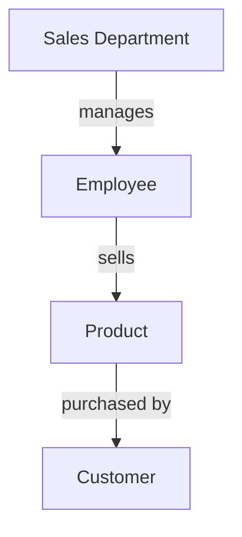
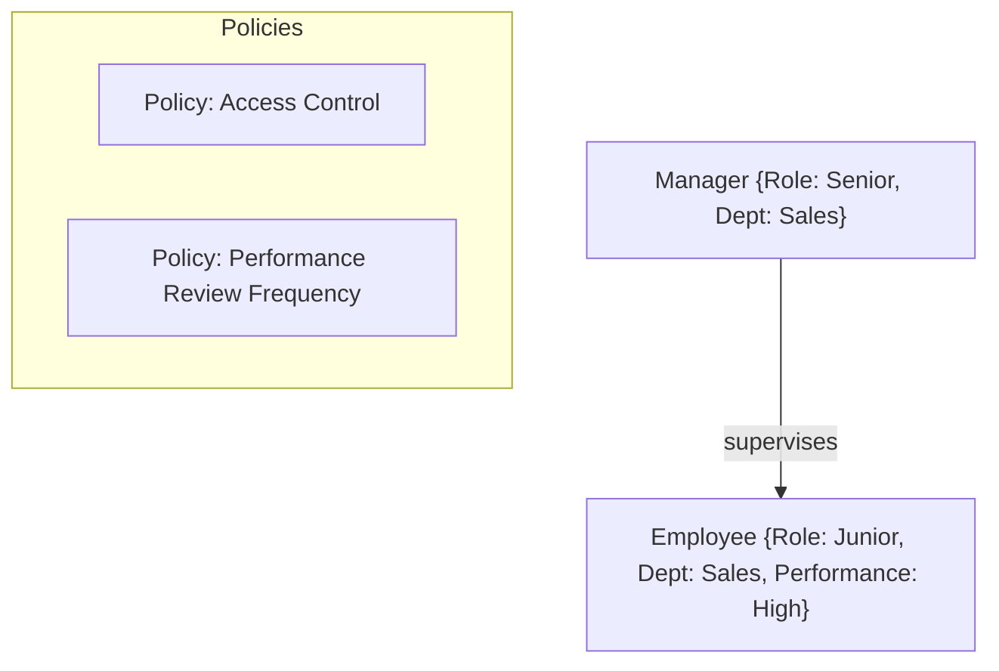
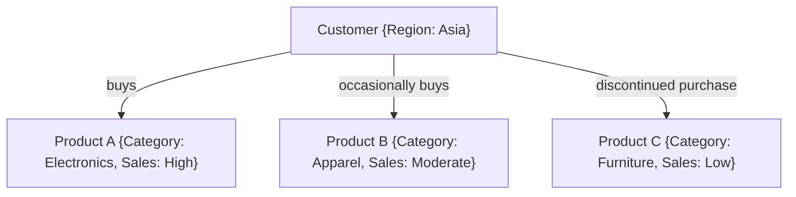
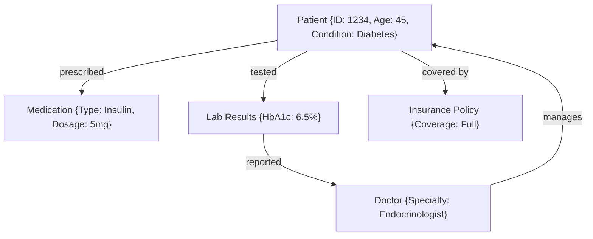
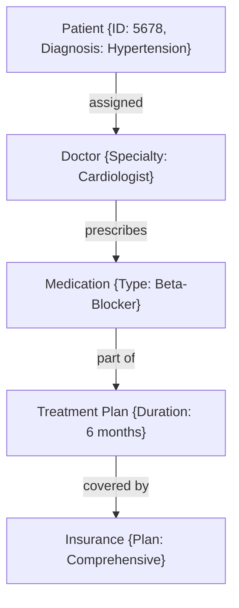

# ActiveGraphNetworks
AGNs - The answer
Here's the updated and expanded article with additional technical details and diagrams specifically related to **Active Graph Networks (AGNs)**:

---

# Active Graph Networks (AGNs): The Answer

### Introduction: Redefining the Path to AGI

Currently, the world approaches **Artificial General Intelligence (AGI)** primarily as a mathematical challenge, focusing on pattern recognition and deep learning models. However, these models often struggle when handling unstructured or multi-domain data. Patterns alone are insufficient; what’s required is the **pre-definition of relationships** to translate concepts into reality effectively.

AGI cannot reason without sufficient context. **Active Graph Networks (AGNs)** aim to fill this gap by predefining relationships within data, establishing how certain data points inherit attributes or precedence from specific nodes. This structured framework is where AGNs excel—enhancing cognitive reasoning and rational analysis, transforming AGI from a theoretical concept into a practical solution.

This concept has evolved over time, and I've gradually built it into reality. Using AGNs, I've developed **efficient trading bots** that demonstrate the power of predefined relationships and structured frameworks without relying on excessive computational resources.

### The AGN Vision: Setting the Standard for AI Frameworks

The goal of AGNs is to become an **IEEE standard**, laying the groundwork for AI development based on predefined relationship structures and frameworks. For AGNs to achieve their full potential, collaboration is essential. Experts from various industries must test and apply their domain knowledge, partnering with data scientists to define solutions that align with the AGN framework, enabling a new era of AI.

---

## The AGN Framework: An In-Depth Exploration

AGNs go beyond conventional AI models by predefining relationships, attributes, and policies within data, allowing organizations to interact dynamically with data. The following sections provide a detailed breakdown of the AGN framework:

### **1. The Core Structure: Nodes and Edges**

The foundation of AGNs lies in **nodes** (entities or data points) and **edges** (relationships). Nodes encapsulate attributes such as data type, context, and rules, while edges define the nature of their relationships—whether hierarchical, associative, or conditional.

This structure creates a **queryable network**, allowing for real-time insights and analytics. In the diagram, nodes like "Sales Department" and "Employee" are connected based on their operational relationships, forming a dynamic and scalable network.

### **2. Attributes and Policies: Contextualizing the Network**

Every node and edge within AGNs can be enhanced with attributes (e.g., time, location, priority) and policies (e.g., access controls, compliance rules). This adds context and enables the network to adapt AI behavior based on predefined rules and the relevance of specific relationships.

Policies enrich relationships, guiding decision-making and maintaining security and operational integrity. For example, an **Access Control List (ACL)** determines node visibility based on the user's role, adding a layer of depth in security management.

### **3. Dynamic Relational Reasoning: Real-Time Adaptation**

AGNs form a **living network**, dynamically updating relationships as data changes. This adaptability is critical for applications like **supply chain management**, **finance**, or **customer service**, where conditions and relationships often evolve.

The above diagram shows how AGNs map customer behavior dynamically, offering actionable insights as new sales data enters the system. This level of adaptability allows AGNs to optimize enterprise processes in real-time.

### **4. Multi-Domain Integration: Cross-Industry Applications**

AGNs support integration across multiple domains, including healthcare, finance, legal, and supply chain management. Here's an example of how AGNs manage healthcare data:

AGNs’ multi-domain structure allows the aggregation of disparate data types into one interconnected system, enabling efficient cross-referencing, dynamic analysis, and real-time insights that static models cannot achieve.

### The AGN Advantage: Why This Framework Is Transformational

AGNs are not just another AI model; they are a paradigm shift. Here’s why AGNs hold the key to enterprise AI:

1. **Scalability and Flexibility**:
   - Designed to scale effortlessly across multiple domains and evolve based on enterprise needs.
   
2. **Precision and Efficiency**:
   - By modeling relationships and attributes dynamically, AGNs efficiently pinpoint inefficiencies and provide real-time solutions for complex operations like logistics and resource management.

3. **Contextual AI Insights**:
   - Traditional models lack the context needed for accurate predictions. AGNs bridge this gap, integrating multi-domain attributes and policies, yielding more accurate AI-driven insights.

### AGNs in Action: Real-World Use Case - Healthcare

Imagine a healthcare system using AGNs to manage patient care. The network includes nodes for **patients**, **doctors**, **medications**, **lab results**, and **insurance policies**. Each node has attributes such as **treatment**, **coverage**, and **prescription**, while edges define relationships like **treatment plans** and **insurance coverage**.

This visualization demonstrates the network's flexibility, as AGNs continuously monitor and adjust relationships based on patient outcomes and treatment efficacy, ensuring efficient, personalized healthcare.

### The Path Forward: Establishing AGNs as an Industry Standard

AGNs have the potential to become the **IEEE standard** for AI frameworks, focusing on predefined relationships and adaptive structures. However, achieving this requires collaboration. Professionals from different sectors must collaborate with developers to define tailored solutions aligned with the AGN framework.

By building, testing, and refining AGNs, we move closer to unlocking the full potential of enterprise AI, transforming static data into actionable intelligence.

### Conclusion

Active Graph Networks (AGNs) represent a shift in AI development, emphasizing the importance of predefined relationships, dynamic reasoning, and real-time adaptation. By offering a robust framework for structured analysis, AGNs aren’t just a new solution; they are the foundation for the future of enterprise AI.

AGNs pave the way for collaboration and innovation, bringing together industry experts to refine and implement this breakthrough technology. The next step is making AGNs a recognized standard, revolutionizing efficiency, data integration, and analytics.

