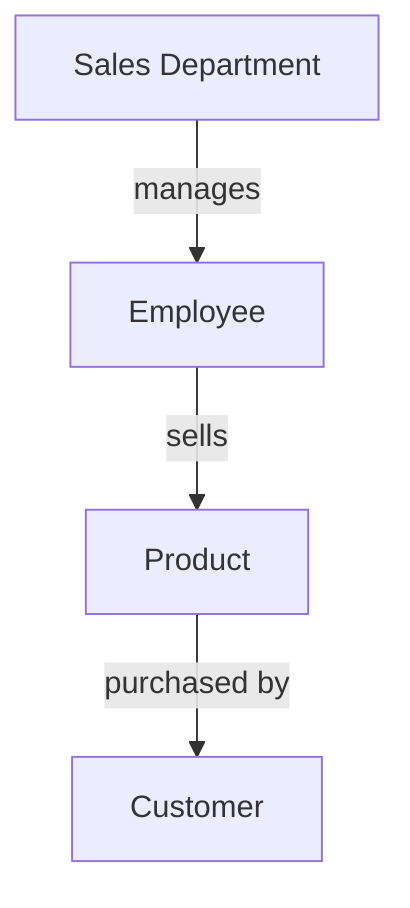
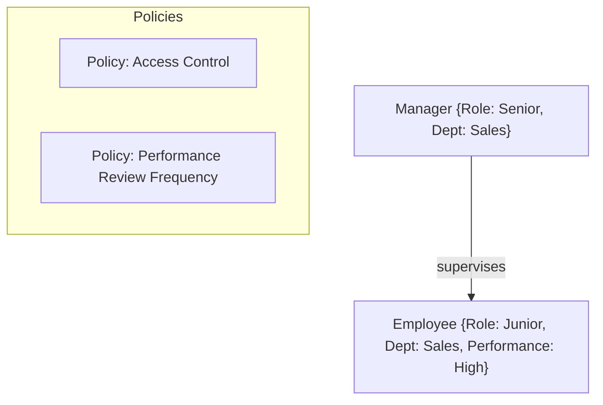
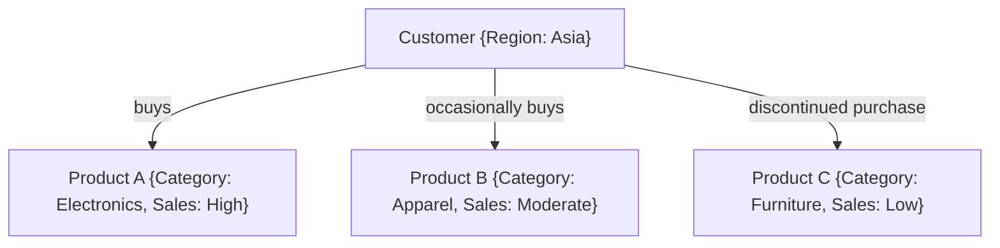
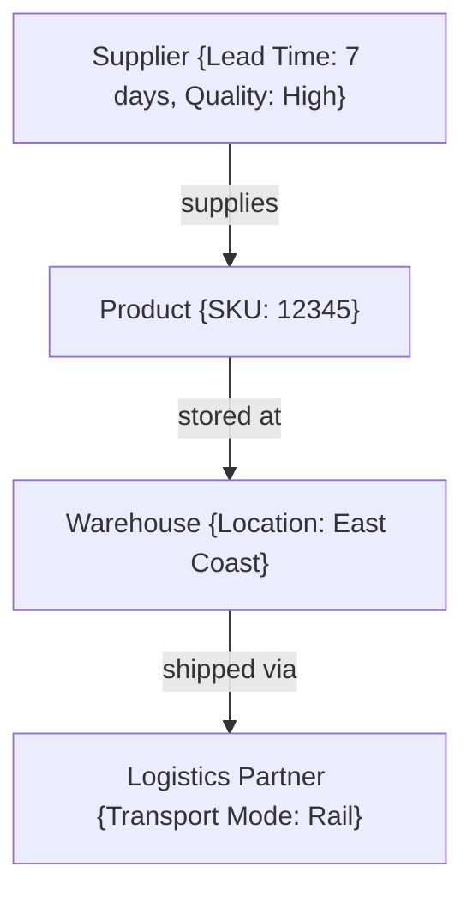

# ActiveGraphNetworks
AGNs - The answer

---

### Introduction: Redefining the Path to AGI

Currently, the world is approaching **Artificial General Intelligence (AGI)** as a purely mathematical challenge, focusing on pattern recognition and deep learning models. However, in our structured society, these models struggle when dealing with unstructured data. Patterns alone are insufficient; what’s required is the **pre-definition of relationships** to translate concepts into reality. 

AGI cannot truly reason if it lacks sufficient context. **Active Graph Networks (AGNs)** are about predefining relationships within data, establishing how certain data points inherit precedence or attributes from specific nodes. This is where AGNs excel: they provide a structured, robust framework designed to enhance cognitive reasoning and rational analysis, transforming AGI from a theoretical concept into a practical solution.

This idea has been a work in progress, and I’ve slowly built it into reality. With AGNs, I’ve developed **effective trading bots** that operate efficiently without relying on massive computations, demonstrating the power of predefined relationships and structured frameworks.

### The AGN Vision: Setting the Standard for AI Frameworks

It is my goal for AGNs to become an **IEEE standard**, establishing a foundation for AI development based on predefined relationship structures and frameworks. However, this isn’t a one-size-fits-all solution yet. For AGNs to reach their full potential, we need people from various industries to test, apply their domain knowledge, and collaborate with data scientists. Together, we can define solutions that work hand-in-hand with the AGN framework, paving the way for a new era of AI.

---

**Title: Unleashing the Power of Active Graph Networks (AGNs) for Enterprise AI and Efficiency Optimization**

In today’s data-driven world, enterprises face increasing challenges in leveraging AI to its fullest potential. Traditional models often lack the depth and flexibility needed to interpret and react to complex, unstructured information. AGNs offer a revolutionary solution, providing a **living framework** that enhances real-time decision-making and efficiency across multi-domain datasets.

### The AGN Framework: An Overview

AGNs go beyond conventional AI models by predefining relationships, attributes, and policies within data. This **structured approach** allows enterprises to interact with data in a dynamic, context-aware manner. Here’s how it works:

#### **1. The Core Structure: Nodes and Edges**

The foundation of AGNs lies in **nodes** (entities or data points) and **edges** (relationships). Nodes contain attributes such as data type, context, and rules, while edges define the nature of their relationships—whether hierarchical, associative, or conditional.

In this diagram, the AGN structure shows how each node (e.g., Sales Department, Employee) relates to others. This creates a **queryable network**, providing enterprises with real-time insights and analytics.

#### **2. Attributes and Policies: Contextualizing the Network**

Every node and edge within AGNs can be enriched with attributes (e.g., time, location, priority) and policies (e.g., access controls, compliance rules). This enriches the network and adds context, making it possible to tailor AI behavior based on predefined rules and the importance of specific relationships.

Attributes and policies enrich relationships, guiding decision-making and maintaining security or operational integrity. For instance, an **Access Control List (ACL)** might determine the visibility of a node based on the user’s role, allowing for deeper security management.

#### **3. Dynamic Relational Reasoning: Real-Time Adaptation**

Unlike static models, AGNs create a **living network**, dynamically updating relationships as data changes. This enables real-time adaptation, critical for applications like **supply chain management**, **finance**, or **customer service**, where conditions shift frequently.

The above diagram illustrates how AGNs map customer behavior dynamically, providing actionable insights as new sales data comes in. This level of adaptability makes AGNs an ideal solution for enterprises seeking to optimize processes in real-time.

### Why AGNs Hold the Key: The AGN Advantage

AGNs are not just another framework; they are a breakthrough that transforms AI from theoretical to practical by focusing on structured, relationship-driven analysis. Here’s why they hold the key to enterprise AI:

1. **Scalability and Flexibility**:
   - The AGN framework is designed to scale, integrating seamlessly with multiple data domains and evolving with the enterprise’s needs.
   
2. **Efficiency and Precision**:
   - By modeling relationships and attributes dynamically, AGNs can precisely target inefficiencies and provide real-time solutions for complex operations like logistics, finance, and resource management.
   
3. **Contextual AI Insights**:
   - Traditional models often lack the necessary context to make accurate predictions. AGNs fill this gap by integrating multi-domain attributes and policies, leading to more relevant and accurate AI-driven insights.

### AGNs in Action: Real-World Application

Imagine a manufacturing enterprise using AGNs to manage its supply chain. The network includes nodes representing suppliers, logistics partners, products, and warehouses. Each node contains attributes such as **lead time**, **cost**, and **quality rating**. The relationships (edges) show dependencies like **shipping routes** or **quality assurance checkpoints**.

As new data enters the network (e.g., delays in shipping), AGNs adjust the relationships, offering updated insights and suggestions to reroute or optimize resources—something static models can’t achieve without extensive re-training.

This visualization highlights the supply chain dynamics, with each edge representing dependencies that AGNs monitor and optimize in real-time.

### The Path Forward: Building AGNs into a Standard

AGNs have the potential to become the **IEEE standard** for AI frameworks, focusing on predefined relationship structures and frameworks. However, this requires collaboration across industries. For AGNs to reach their full potential, it’s essential for professionals to **test** and **apply their expertise**, working closely with data scientists to refine the framework.

The future of AGNs lies in creating tailored solutions, where enterprises partner with developers to define the relationship structures that best suit their needs. The more we build, test, and refine AGNs, the closer we come to unlocking the full potential of enterprise AI.

### Conclusion

Active Graph Networks (AGNs) represent a shift in AI development, emphasizing the importance of predefined relationships, dynamic reasoning, and real-time data adaptation. By providing a robust framework for structured analysis, AGNs are not just a solution but the foundation upon which the future of enterprise AI will be built.

Now is the time for collaboration and innovation. By working together, we can refine AGNs into an industry standard, revolutionizing AI, efficiency data, and statistical analysis.

---
