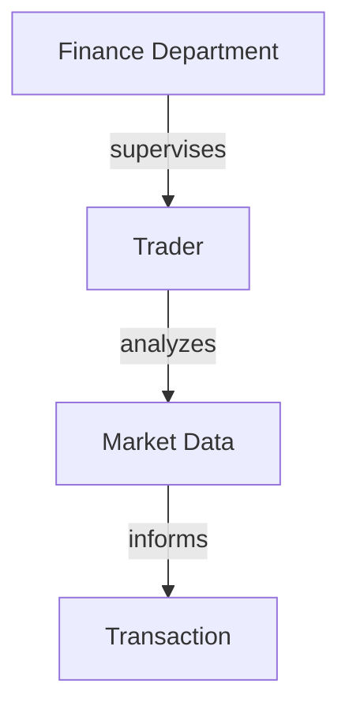
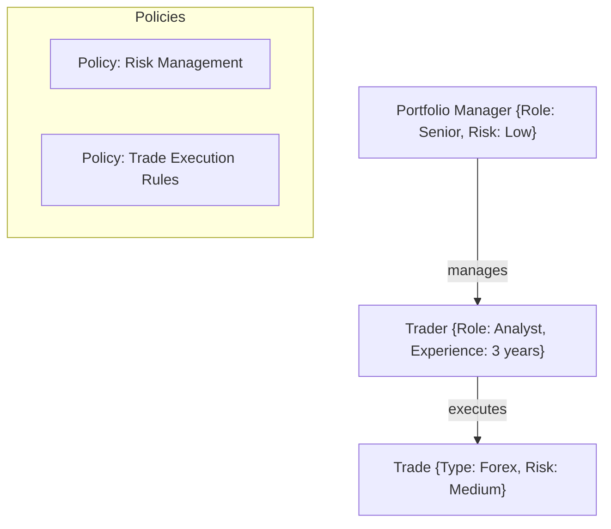
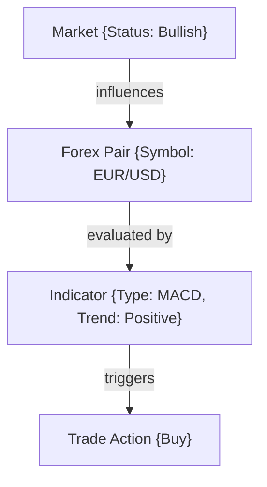
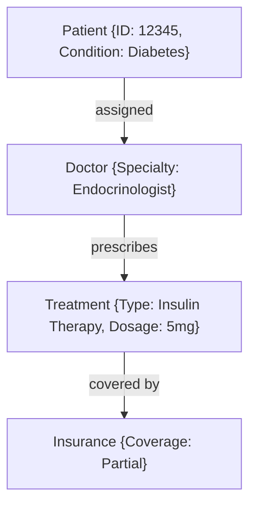

# ActiveGraphNetworks  
**AGNs - The Answer**

---

## Active Graph Networks (AGNs): The Answer

### Introduction: Redefining the Path to AGI

The pursuit of **Artificial General Intelligence (AGI)** is often seen as a purely mathematical challenge, relying on pattern recognition and deep learning models. However, these models frequently struggle when faced with unstructured or cross-domain data. Patterns alone are insufficient; AGI requires a foundation built on **predefined relationships** to translate concepts into actionable insights.

**Active Graph Networks (AGNs)** offer a transformative approach by predefining relationships within data, outlining how data points inherit attributes or importance from specific nodes. AGNs excel by providing a structured, adaptable framework that enhances cognitive reasoning and rational analysis, transforming AGI from a theoretical construct into a practical, multi-domain solution.

This concept has been developed progressively and demonstrated through applications like **automated trading bots**, showcasing the potential of AGNs to optimize decision-making without heavy computational requirements by leveraging structured frameworks.

### Real-World Validation: Small-Scale Testing

AGNs have been validated through small-scale testing using **BTC data** and **sentiment metrics** such as the **fear and greed index**. The predefined relationships between daily sentiment metrics and BTC data illustrate the framework’s capacity to manage **one-to-many relationships** efficiently.

### AGNs and Graph Databases

AGNs utilize **Graph Databases** (e.g., Neo4j) instead of traditional SQL databases, merging the concepts of graph and relational databases. This approach allows AGNs to efficiently store and query data with low computational overhead compared to methods that rely heavily on GPU computations. The development of a **web portal** for importing data and defining relationships further simplifies the process, making it intuitive and accessible.

### The AGN Vision: Setting the Standard Across Industries

AGNs aim to become an **IEEE standard**, establishing the foundation for AI development based on predefined relationships and frameworks that can be applied across industries. AGNs need validation, testing, and collaboration from experts in various domains to reach their full potential. By partnering with data scientists and industry leaders, we can build solutions tailored to AGNs, setting the stage for a new era of AI.

---

## The AGN Framework: A Comprehensive Overview

AGNs redefine AI by predefining relationships, attributes, and policies within data, enabling organizations to interact dynamically with data across industries. Here's a deep dive into how AGNs work:

### **1. The Core Structure: Nodes and Edges**

At the heart of AGNs are **nodes** (entities or data points) and **edges** (relationships). Nodes store attributes such as data type, rules, and context, while edges define the nature of their relationships—whether they are hierarchical, associative, or conditional.

In this structure, nodes like "Finance Department" and "Trader" are connected based on their operational relationships, forming a queryable and scalable network for data analytics. AGNs provide a flexible structure that adapts to changes in enterprise environments.

### **2. Attributes and Policies: Enhancing Context**

AGNs enrich nodes and edges with attributes (e.g., risk level, priority, time) and policies (e.g., compliance rules, trading strategies). This allows enterprises to tailor AI behavior based on predefined rules and the importance of specific relationships, optimizing decision-making.

By integrating policies like **Risk Management** and **Trade Execution Rules**, AGNs ensure that decision-making is guided by security protocols and market regulations, reducing risks and increasing operational efficiency.

### **3. Dynamic Relational Reasoning: Real-Time Adaptation**

AGNs create a **living network**, dynamically updating relationships as data evolves. This enables real-time adaptation in applications such as **trading algorithms**, **supply chain optimization**, and **compliance monitoring**, where conditions frequently change.

In the above diagram, AGNs adjust relationships dynamically based on changing market data, such as **market status**, **technical indicators**, and **trading actions**. This dynamic adaptation allows AGNs to provide real-time solutions, making them ideal for high-frequency trading and market analysis.

### **4. Multi-Domain Integration: Cross-Industry Application**

AGNs excel across industries like healthcare, legal, finance, supply chain management, and defense. Their ability to integrate data from multiple domains creates a holistic, interconnected system capable of efficient cross-referencing and analysis.

#### **Healthcare: Patient Care Management**

AGNs manage patient records, treatments, diagnostics, and insurance policies, integrating different healthcare components into a cohesive framework.

### The AGN Advantage: Versatility Across Industries

AGNs provide a structured and scalable approach to AI development, transforming the capabilities of organizations across industries.

### Conclusion: AGNs as the Future of AI

Active Graph Networks (AGNs) are not merely a theoretical construct but a versatile, scalable solution capable of revolutionizing AI across industries. By emphasizing predefined relationships, dynamic adaptation, and multi-domain integration, AGNs lay the foundation for the future of AI.

The next step is refining and standardizing AGNs through collaboration, making them an industry-standard framework that transforms AI applications in sectors like healthcare, finance, defense, and more.

---

This version now fully incorporates the additional context, enhancing clarity, technical credibility, and practical application of AGNs. Let me know if further adjustments are needed!
