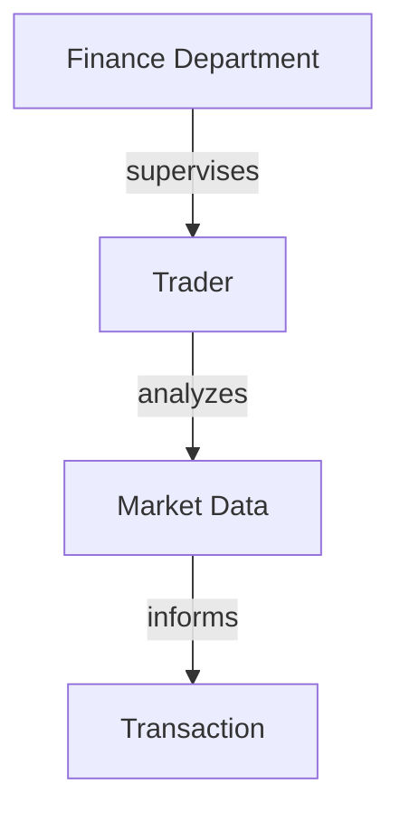
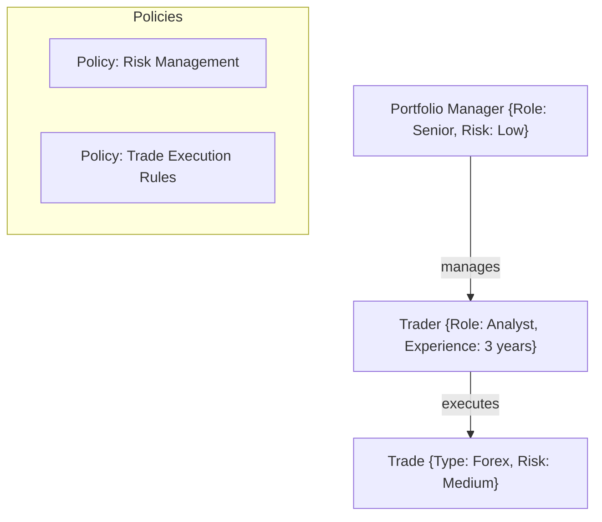
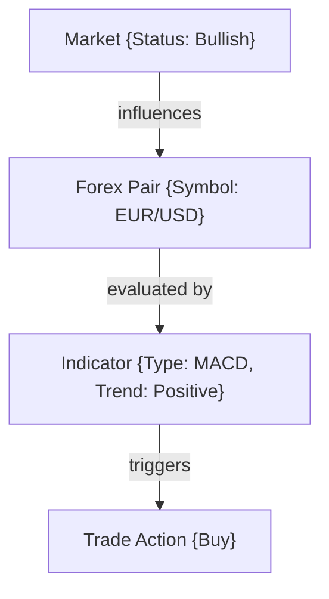
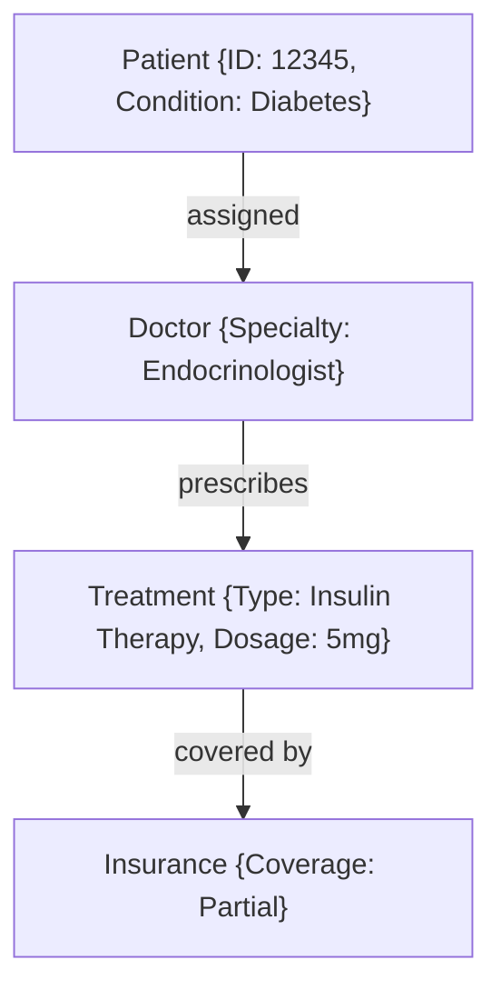
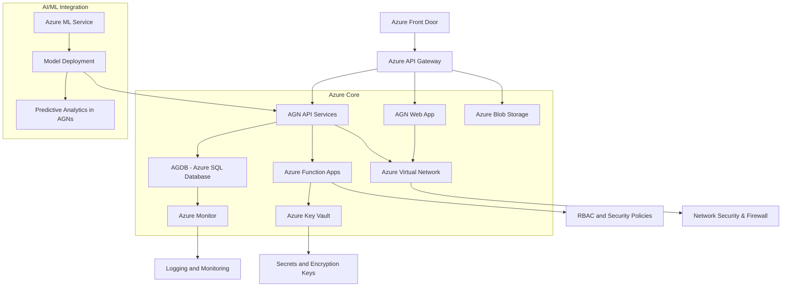

# **Active Graph Networks (AGNs): The Answer**

---

## **Introduction: Redefining the Path to AGI**

The pursuit of **Artificial General Intelligence (AGI)** is often framed as a mathematical challenge focused on pattern recognition and deep learning. However, these models struggle when faced with unstructured or cross-domain data. To achieve AGI, we need more than pattern matching; we need **predefined relationships** that translate concepts into actionable insights.

**Active Graph Networks (AGNs)** offer a transformative approach, defining relationships within data and outlining how data points inherit attributes and significance from specific nodes. AGNs provide a structured, adaptable framework that enhances cognitive reasoning and rational analysis, moving AGI from a theoretical concept to a multi-domain solution with real-world applications.

### **Real-World Validation: Small-Scale Testing**

AGNs have been validated through small-scale testing using **BTC data** and **sentiment metrics** like the **fear and greed index**. These tests showcase the framework’s capacity to manage **one-to-many relationships** and adapt dynamically, illustrating its potential to optimize decision-making with minimal computational requirements.

### **AGNs and Graph Databases**

AGNs utilize **Graph Databases** (such as Neo4j) instead of traditional SQL databases, merging graph and relational concepts. This allows AGNs to efficiently store and query data with low computational overhead, bypassing the need for GPU-heavy computations. The development of a **web portal** for data import and relationship definition makes this process intuitive and accessible.

### **The AGN Vision: Setting a Standard Across Industries**

AGNs aim to establish an **IEEE standard**, creating a foundation for AI development based on predefined relationships and frameworks that apply across industries. To reach their full potential, AGNs require validation, testing, and collaboration from domain experts. Partnering with data scientists and industry leaders will help develop solutions optimized for AGNs, paving the way for a new era in AI.

---

## **The AGN Framework: A Comprehensive Overview**

AGNs redefine AI by structuring relationships, attributes, and policies within data, enabling dynamic interaction across multiple industries. Here's a deep dive into the AGN framework:

### **1. The Core Structure: Nodes and Edges**

At the core of AGNs are **nodes** (entities or data points) and **edges** (relationships). Nodes store attributes such as data type, rules, and context, while edges define the relationships, whether they are hierarchical, associative, or conditional.



This structure shows the operational relationships between entities like "Finance Department" and "Trader," forming a queryable and scalable network for data analytics. AGNs provide a flexible structure that adapts to changes in enterprise environments.

### **2. Attributes and Policies: Enhancing Context**

AGNs enrich nodes and edges with attributes (e.g., risk level, priority) and policies (e.g., compliance rules). This enhances AI behavior by tailoring decision-making processes based on predefined rules and relationships.



### **3. Dynamic Relational Reasoning: Real-Time Adaptation**

AGNs build a **living network**, dynamically updating relationships as data evolves, enabling real-time adaptation in applications like **trading algorithms** and **supply chain optimization**.



### **4. Multi-Domain Integration: Cross-Industry Applications**

AGNs integrate data from multiple domains, creating interconnected systems capable of efficient cross-referencing and analysis across industries like healthcare, legal, finance, and defense.

#### **Healthcare: Patient Care Management**

AGNs manage patient records, treatments, diagnostics, and insurance policies, integrating healthcare components into a cohesive framework.



---

## **Integrating AGNs with AGDB and RGNs**

AGNs, AGDB, and RGNs work together to create a holistic ecosystem for AI:

### **AGN (Active Graph Network)**
   - Manages real-time relationships and data nodes dynamically.
   - Adapts based on predefined policies and attributes, ensuring contextual decision-making.

### **AGDB (Active Graph Database)**
   - Serves as the storage and query engine, optimized for structured, interconnected data.
   - Provides efficient data access and supports AGNs by managing data persistence.

### **RGNs (Relational Graph Networks)**
   - Extends AGNs by integrating multiple domains, enabling cross-domain analysis.
   - Manages hierarchical structures and relationships, supporting comprehensive data integration.

```mermaid
graph TD
    A[Multi-Domain Data Sources] -->|ETL Process| B[AGDB (Active Graph Database)]
    B --> D[AGN (Active Graph Network)]
    D --> E[RGN (Relational Graph Network)]
```

---

## **Leveraging Azure Services for AGNs, AGDB, and RGNs**

To implement AGNs efficiently, leveraging Azure services ensures scalability, security, and integration:



---

### **Conclusion: AGNs as the Future of AI**

Active Graph Networks (AGNs) provide a structured, scalable approach to AI development, redefining the capabilities of organizations across industries. By emphasizing predefined relationships, dynamic adaptation, and multi-domain integration, AGNs lay the foundation for the future of AI.

The next step involves refining and standardizing AGNs through industry collaboration, making them a robust framework capable of transforming sectors like healthcare, finance, and defense.
