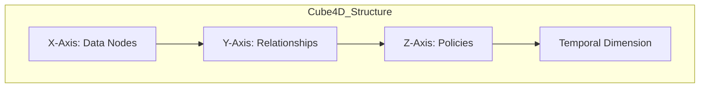
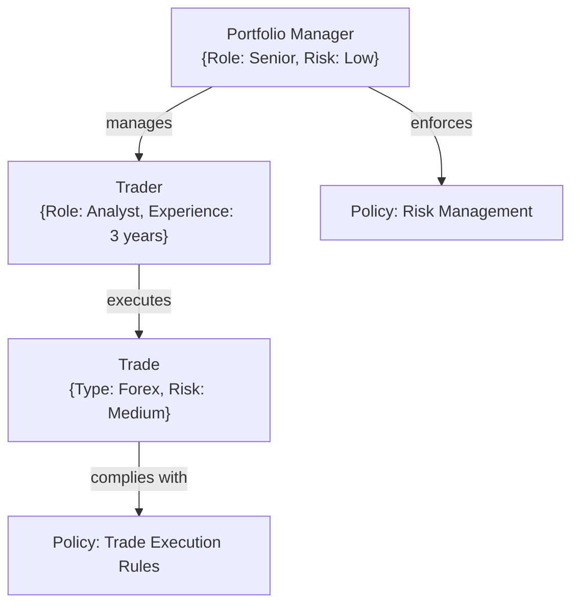
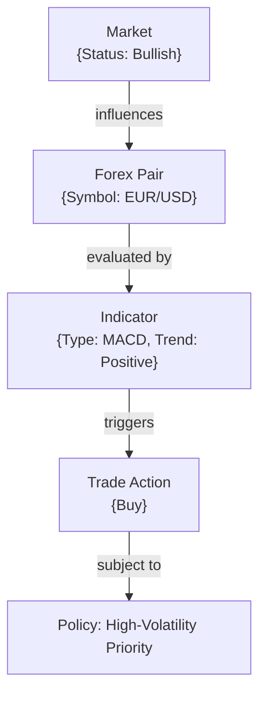
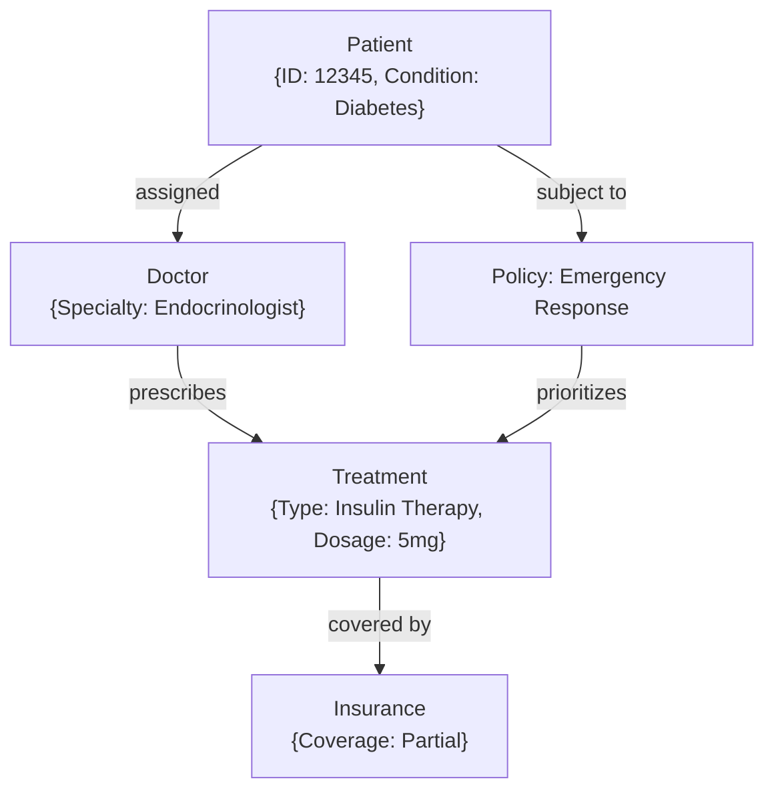
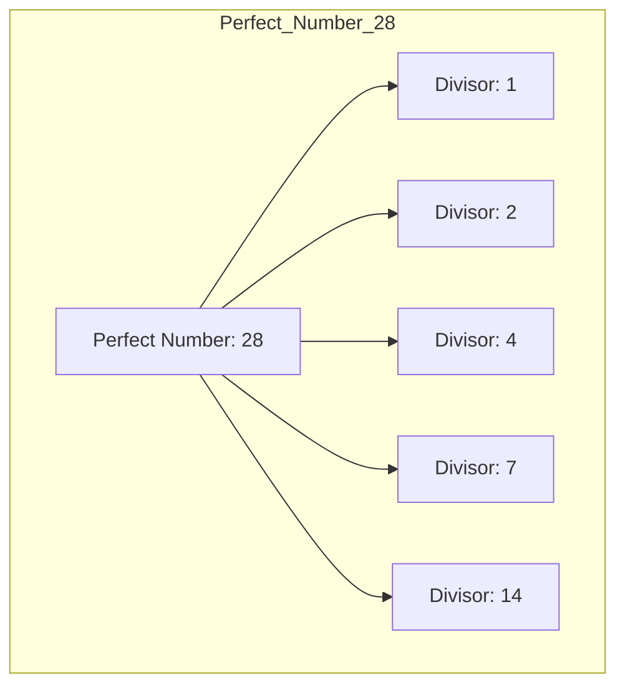
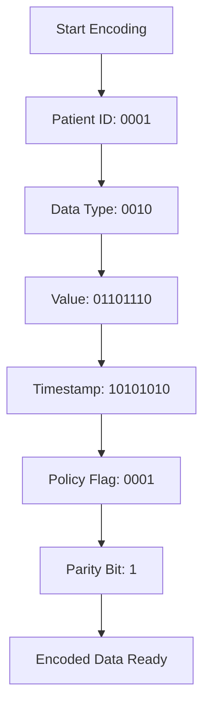
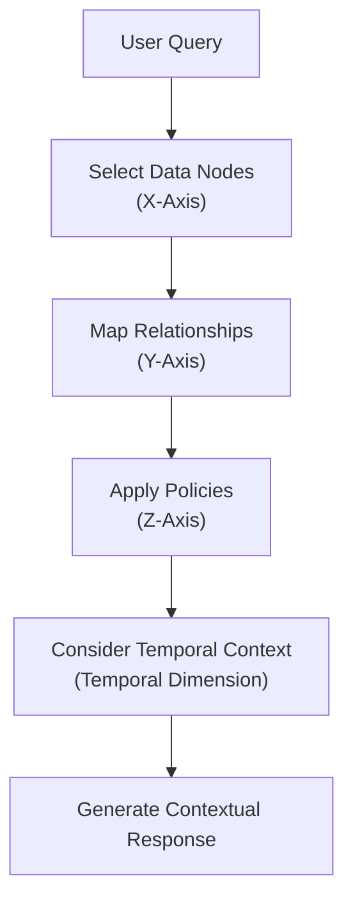
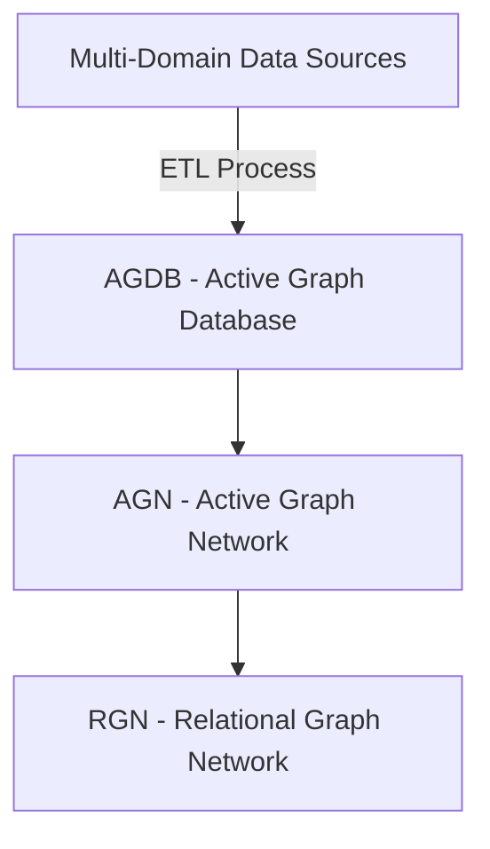
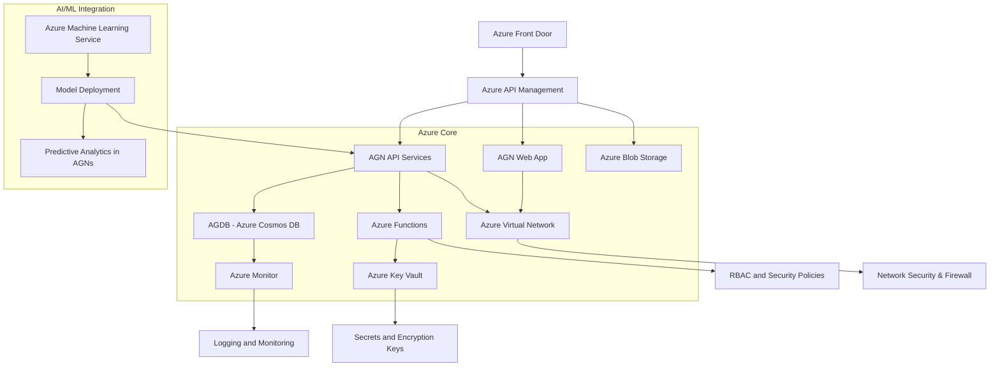
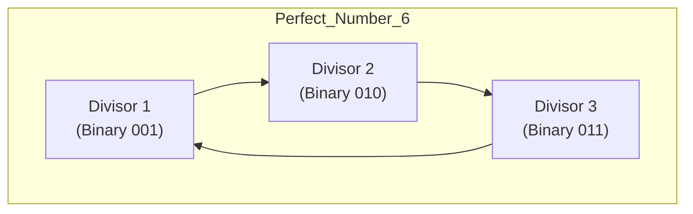

# **Active Graph Networks (AGNs): Revolutionizing AI with Cube4D**

---

## **Introduction: Redefining the Path to AGI**

The pursuit of **Artificial General Intelligence (AGI)** is often framed as a mathematical challenge focused on pattern recognition and deep learning. However, these models struggle when faced with unstructured or cross-domain data. To achieve AGI, we need more than pattern matching; we need **predefined relationships** that translate concepts into actionable insights.

**Active Graph Networks (AGNs)** offer a transformative approach, defining relationships within data and outlining how data points inherit attributes and significance from specific nodes. By integrating **Cube4D (C4D)**—a four-dimensional data structuring model—AGNs provide a structured, adaptable framework that enhances cognitive reasoning and rational analysis. This synergy moves AGI from a theoretical concept to a multi-domain solution with real-world applications.

### **Real-World Validation: Small-Scale Testing**

AGNs have been validated through small-scale testing using **BTC data** and **sentiment metrics** like the **fear and greed index**. These tests showcase the framework’s capacity to manage **one-to-many relationships** and adapt dynamically, illustrating its potential to optimize decision-making with minimal computational requirements.

### **AGNs and Graph Databases**

AGNs utilize **Active Graph Databases (AGDB)**, leveraging graph and relational concepts through the Cube4D model. This allows AGNs to efficiently store and query data with low computational overhead, bypassing the need for GPU-heavy computations. The development of a **web portal** for data import and relationship definition makes this process intuitive and accessible.

### **The AGN Vision: Setting a Standard Across Industries**

AGNs aim to establish an **IEEE standard**, creating a foundation for AI development based on predefined relationships and frameworks that apply across industries. To reach their full potential, AGNs require validation, testing, and collaboration from domain experts. Partnering with data scientists and industry leaders will help develop solutions optimized for AGNs, paving the way for a new era in AI.

---

## **The AGN Framework: A Comprehensive Overview**

AGNs redefine AI by structuring relationships, attributes, and policies within data, enabling dynamic interaction across multiple industries. Here's a deep dive into the AGN framework:

### **1. The Core Structure: Nodes, Edges, and Dimensions**

At the core of AGNs are **nodes** (entities or data points) and **edges** (relationships), structured within the **Cube4D** model's four dimensions:

1. **X-Axis (What)**: Represents raw data nodes.
2. **Y-Axis (Why)**: Captures relational connections.
3. **Z-Axis (How)**: Governs policies and adaptability mechanisms.
4. **Temporal Dimension (When)**: Adds a time-sensitive layer for chronological changes.

**Visual Diagram of Cube4D Structure**:



### **2. Attributes and Policies: Enhancing Context**

AGNs enrich nodes and edges with attributes (e.g., risk level, priority) and policies (e.g., compliance rules), enhancing AI behavior by tailoring decision-making processes based on predefined rules and relationships.

**Example: Financial Trading Policies**



### **3. Dynamic Relational Reasoning: Real-Time Adaptation**

AGNs build a **living network**, dynamically updating relationships as data evolves, enabling real-time adaptation in applications like **trading algorithms** and **supply chain optimization**.

**Example: Real-Time Market Adaptation**



### **4. Multi-Domain Integration: Cross-Industry Applications**

AGNs integrate data from multiple domains, creating interconnected systems capable of efficient cross-referencing and analysis across industries like healthcare, legal, finance, and defense.

#### **Healthcare: Patient Care Management**

AGNs manage patient records, treatments, diagnostics, and insurance policies, integrating healthcare components into a cohesive framework.

**Healthcare Data Relationships**



---

## **Mathematical Foundations and Perfect Number Encoding**

### **Perfect Numbers and Relational Completeness**

AGNs utilize **perfect numbers** (e.g., 6, 28) to achieve relational completeness within the Cube4D structure. Perfect numbers are integers equal to the sum of their proper divisors, ensuring balanced and complete data relationships.

**Perfect Number Encoding Visual**



### **Bit Encoding and Data Retrieval**

#### **Binary Encoding Structure**

Cube4D uses binary sequences to encode data points' attributes, relationships, and policies, optimizing storage and computation.

**Healthcare Data Encoding Example**

```plaintext
[0001][0010][01101110][10101010][0001][1]
```

- **Patient ID**: 0001
- **Data Type**: 0010 (Heart Rate)
- **Value**: 01101110 (110 bpm)
- **Timestamp**: 10101010 (10:42 AM)
- **Policy Flag**: 0001 (Emergency Policy Active)
- **Parity Bit**: 1 (Error Checking)

**Binary Encoding Walkthrough Visual**



#### **Error Checking and Redundancy**

- **Parity Bits**: Detect errors in data transmission.
- **Error Correction Codes**: Correct minor errors without retransmission.

---

## **Advanced Querying and Contextual Interpretation**

### **Contextual Querying Framework**

Cube4D's contextual querying allows for an understanding of data relationships beyond static connections by incorporating situational and historical context.

**Contextual Querying Flowchart**



### **Application in AGI**

- **Dynamic Interpretation**: Enables AGI systems to interpret data relationships dynamically.
- **Adaptive Learning**: Supports AGI's need for continuous learning and adaptation.

---

## **Integrating AGNs with AGDB and RGNs**

AGNs, AGDB, and RGNs work together to create a holistic ecosystem for AI:

### **AGN (Active Graph Network)**

- Manages real-time relationships and data nodes dynamically within the Cube4D structure.
- Adapts based on predefined policies and attributes, ensuring contextual decision-making.

### **AGDB (Active Graph Database)**

- Serves as the storage and query engine, optimized for structured, interconnected data.
- Provides efficient data access and supports AGNs by managing data persistence.

### **RGNs (Relational Graph Networks)**

- Extends AGNs by integrating multiple domains, enabling cross-domain analysis.
- Manages hierarchical structures and relationships, supporting comprehensive data integration.

**AGNs Ecosystem Diagram**



---

## **Leveraging Azure Services for AGNs, AGDB, and RGNs**

To implement AGNs efficiently, leveraging Azure services ensures scalability, security, and integration:

**Azure Integration Diagram**



---

## **Security, Privacy, and Access Control**

### **Data Encryption and Secure Encoding**

- **Encryption Layers**: Data is encrypted at each dimension (X, Y, Z, T) for comprehensive security.
- **Secure Encoding**: Binary encoding includes encryption keys and checksums.

### **Access Control Lists (ACLs) and Policy-Based Access**

- **ACLs**: Define permissions for users and processes at granular levels.
- **Policy-Based Access**: Adjust access rights dynamically based on policies and user roles.

### **Data Privacy Protocols**

- **Compliance**: Adherence to regulations like GDPR and HIPAA.
- **Anonymization**: Techniques to anonymize sensitive data while retaining usability.
- **Audit Trails**: Detailed logs of data access and modifications for accountability.

---

### **Conclusion: AGNs and Cube4D as the Future of AI**

Active Graph Networks (AGNs), powered by the Cube4D model, provide a structured, scalable approach to AI development, redefining the capabilities of organizations across industries. By emphasizing predefined relationships, dynamic adaptation, and multi-domain integration, AGNs lay the foundation for the future of AI.

The next step involves refining and standardizing AGNs through industry collaboration, making them a robust framework capable of transforming sectors like healthcare, finance, and defense.

---

## **Further Reading**

To dive deeper into the concepts presented, explore the detailed whitepapers:

- [AGNs Whitepaper Part 1](https://github.com/ConicuConsulting/ActiveGraphNetworks/blob/main/AGT_Whitepaper_Pt1.md)
- [AGNs Whitepaper Part 2](https://github.com/ConicuConsulting/ActiveGraphNetworks/blob/main/AGT_Whitepaper_Pt2.md)

---

## **Contact and Collaboration**

We invite researchers, data scientists, and industry experts to collaborate on advancing AGNs and Cube4D. Together, we can shape the future of AI.

- **Email**: [contact@conicuconsulting.com](mailto:contact@conicuconsulting.com)
- **GitHub**: [ConicuConsulting/ActiveGraphNetworks](https://github.com/ConicuConsulting/ActiveGraphNetworks)

---

# **Appendix: Additional Visuals and Diagrams**

### **Perfect Number Encoding in Cube4D**

**Visualization of Perfect Number 6 in Cube4D Encoding**



### **Contextual Querying Flowchart**

**Query Processing in Cube4D**


### **Binary Encoding Walkthrough**

**Encoding Example for Patient Data**


---

**Note**: The diagrams have been enhanced to align with the concepts discussed in the whitepapers and this readme, ensuring consistency and clarity. For detailed explanations and additional diagrams, refer to the linked whitepapers.

---

# **License**

This work is licensed under the **Creative Commons Attribution-NonCommercial-ShareAlike 4.0 International License (CC BY-NC-SA 4.0)**.

[](http://creativecommons.org/licenses/by-nc-sa/4.0/)

**You are free to:**

- **Share** — copy and redistribute the material in any medium or format.
- **Adapt** — remix, transform, and build upon the material.

**Under the following terms:**

- **Attribution** — You must give appropriate credit, provide a link to the license, and indicate if changes were made.
- **NonCommercial** — You may not use the material for commercial purposes.
- **ShareAlike** — If you remix, transform, or build upon the material, you must distribute your contributions under the same license.

For more details, see the [Creative Commons License](http://creativecommons.org/licenses/by-nc-sa/4.0/).

---

# **Acknowledgments**

We extend our gratitude to all contributors and collaborators who have supported the development of AGNs and Cube4D.

---

# **Contributing**

We welcome contributions to enhance AGNs and Cube4D. Please read our [contribution guidelines](https://github.com/ConicuConsulting/ActiveGraphNetworks/blob/main/CONTRIBUTING.md) before submitting pull requests.

---

# **Support**

If you have any questions or need assistance, please open an issue on GitHub or contact us via email.

---

# **Stay Connected**

- **LinkedIn**: [Callum Maystone](https://www.linkedin.com/in/callum-maystone-57b00932/)
- **Twitter**: [@CallumConicu](https://x.com/CallumConicu)

---

*This readme has been updated to reflect the latest developments in AGNs and Cube4D, incorporating enhanced diagrams and aligning with our ongoing work.*
