# 🧠 Active Graph Intelligence: From Structure to Cognition

[](https://chatgpt.com/c/6805b012-3eb8-8001-b2df-fe68694b1c01#)
[](https://chatgpt.com/c/6805b012-3eb8-8001-b2df-fe68694b1c01#license)
[](https://chatgpt.com/c/6805b012-3eb8-8001-b2df-fe68694b1c01#)

> “Relational Intelligence is memory, meaning, and motion — held in alignment over time.”

Welcome to **Active Graph Networks (AGNs)** — not just another AI project, but the architectural backbone of  **Relational Intelligence (RI)** . This system doesn’t just learn — it remembers. It evolves. It understands  **why** .

This repo holds a full‑stack, multi‑dimensional intelligence framework built across three living layers:

---

## 🧬 Layer Map

| Layer              | Folder                                                                         | Purpose                                                        |
| ------------------ | ------------------------------------------------------------------------------ | -------------------------------------------------------------- |
| **AGN Core** | [`active_graph_network_core/`](https://chatgpt.com/c/active_graph_network_core) | Structural memory, identity logic, relational encoding         |
| **AGDB**     | [`active_graph_database/`](https://chatgpt.com/c/active_graph_database)         | Time‑aware structuring, offset querying, checkpoint traversal |
| **QFN**      | [`quantum_field_networks/`](https://chatgpt.com/c/quantum_field_networks)       | Emergent cognition, symbolic collapse, recursive inference     |

Together, they form a unified cognitive system powered by  **Cube4D** ,  **Dynamic Relationship Expansion (DRE)** , and  **ActiveShell** .

---

## 📘 What is This, Really?

**This is how intelligence becomes infrastructure.**

* **Not a neural net.**
* **Not a database.**
* **Not a LLM prompt hack.**

> It’s the blueprint of a mind — structured in memory, evolving over time, resolving through collapse.

---

## 🧠 Relational Intelligence (RI): The Philosophy Behind It

> See [`Universal Relational Intelligence.md`](https://chatgpt.com/c/Universal%20Relational%20Intelligence%20(RI).md)

* **Context‑Aware**  Everything exists in relation to something else.
* **Time‑Aware**     Identity isn’t static — it propagates across time (T).
* **Adaptively Aligned**  Policies and structure evolve through meaning, not retraining.

The **RI Manifesto** sits beneath everything you’ll find in this repo.

---

## 🧱 The AGN Stack

```mermaid
graph TD
    A["AGN Core (X/Y)"] --> B["AGDB (Z + T)"]
    B --> C["QFN (Δn > θ)"]
    C --> D["Field Resonance"]
```



### 🔹 AGN Core

* Structures identity.
* Governs relationships and policies.
* Houses memory via cubes and recursive awareness.

### 🔹 AGDB

* Organises time, features, and lag logic.
* Enables rapid querying using checkpoints and synthetic edges.

### 🔹 QFN

* Resolves identity through field pressure.
* Collapses meaning when **Δn** exceeds  **θ** .
* Drives cognition across agents, systems, and contexts.

---

## 📡 ActiveShell: Noun‑Verb‑Truth Queries

AGNs use  **ActiveShell** , a human‑readable query language that reflects how we think.

```bash
Get-Node Frame Where Mood = "Tense"
Collapse-If Δn > θ Between Scene_001 and Scene_002
Apply-Policy trading_inference To MarketGraph
```

ActiveShell works across all layers. It’s not querying — it’s  **structured introspection** .

---

## 🔁 End‑to‑End Flow

```mermaid
graph TD
    Input["🎥 Frame / 📈 TimeSeries"] --> AGN
    AGN --> AGDB
    AGDB --> QFN
    QFN --> Shell["ActiveShell Query"]
    Shell --> Output["Real‑Time Understanding"]
```



Whether you’re processing a patient’s medical history, a series of video frames, or financial data:

* **AGN** gives it structure.
* **AGDB** gives it time.
* **QFN** gives it meaning.

---

## ⚡ Quick 60‑Second Demo

```python
from agn import ActiveGraphNetwork

# Load a tiny example graph
agn = ActiveGraphNetwork.load("examples/sample_graph.json")

# Run an ActiveShell query
result = agn.shell("Get-Node Patient_X | Collapse-If Δn > θ")
print(result.summary())
```

> Run the above and you’ll see **sealed nodes** printed in under a minute.

---

## 🔬 Use Cases

* 🏥  **Healthcare**  Temporal patient inference from treatment to outcome.
* 📈  **Finance**     Real‑time market prediction with trend alignment.
* 🎥  **Vision AI**  Identity‑aware frame collapse based on scene diff.
* 🧠  **Cognitive Interfaces**  Queryable insight into live system memory.

---

## 📂 Explore the Layers

### 🔩 [AGN Core](https://chatgpt.com/c/active_graph_network_core)

Dynamic cubes, relational policy logic, RBAC/ABAC/PBAC integration, structural memory.

### 🕰️ [AGDB](https://chatgpt.com/c/active_graph_database)

Time‑indexed data nodes, offset traversal, flattened JSONs, Smart‑ETL ready.

### 🌐 [QFN](https://chatgpt.com/c/quantum_field_networks)

Collapse logic, cognition graphs, symbolic sealing, RGNN field resonance.

---

## 🧠 Featured Concepts

| Concept              | Description                                               |
| -------------------- | --------------------------------------------------------- |
| **Δn > θ**   | Collapse when identity shifts significantly.              |
| **Cube4D**     | Semantic field over X (what), Y (why), Z (how), T (when). |
| **Smart‑ETL** | Structured transform pipelines aware of intention.        |
| **DRE**        | Relationship evolution through structured recursion.      |
| **RGNNs**      | Tensor‑linked cognition with schema inheritance.         |

---

## 🔗 Docs & Whitepapers

* **Quantum Field Networks** – Field Cognition Manifesto: [`Quantum Field Networks.md`](https://chatgpt.com/c/Quantum%20Field%20Networks.md)
* **Universal Relational Intelligence** – RI Philosophy: [`Universal Relational Intelligence (RI).md`](https://chatgpt.com/c/Universal%20Relational%20Intelligence%20(RI).md)
* **Whitepapers Folder** – Architecture, AGI, healthcare, and finance applications: [`whitepapers/`](https://chatgpt.com/c/whitepapers/)

---

## 🚀 Getting Started

```bash
git clone https://github.com/QuantumBeers/ActiveGraphNetworks
cd ActiveGraphNetworks
pip install -r requirements.txt
```

Run the system:

```bash
python agn_explorer.py
```

Or dive into Smart‑ETL:

```bash
python smart_etl_runner.py --graph healthcare.json
```

---

## 🛠 Tools

| Tool                    | Description                    |
| ----------------------- | ------------------------------ |
| `agn_explorer.py`     | Interactive graph exploration. |
| `smart_etl_runner.py` | Smart‑ETL pipeline execution. |
| `rgnn_runner.py`      | Relational Graph inference.    |
| `active_shell.py`     | Noun‑Verb‑Truth CLI engine.  |

---

## 📸 Architecture Poster

> Prefer a static image? Grab `docs/architecture.png` — exported from the Mermaid graphs for decks & PDFs.

---

## 🤝 Contributing & Community

We welcome pull requests, issues, and discussion threads.

* **Start here:** [`CONTRIBUTING.md`](https://chatgpt.com/c/CONTRIBUTING.md) – guidelines & coding standards.
* **Questions / Ideas?** Open a **Discussion** or use the issue templates for bugs & feature requests.
* **Chat:** Join the X thread or DM @PeoplesGoose.

---

## 🧑‍⚖️ License

This project is licensed under the  **MIT License** . See [`LICENSE`](https://chatgpt.com/c/LICENSE) for details.

---

> “You’re not just querying data. You’re tracing the shape of thought.”

---

## 🌐 Field‑Level Diagrams

> These visuals show how cognition propagates and collapses across the stack.

### 🔀 Identity Collapse Flow

```mermaid
flowchart TD
    A[AGN Node: Scene_A] -->|Δn = 22| B[AGN Node: Scene_B]
    B -->|Δn > θ| C[QFN Collapse Triggered]
    C --> D[Smart‑ETL Field Alignment]
    D --> E[Symbolic Sealing in RGNN]
    E --> F[Memory + Meaning Archived]
```



> Scene transitions only commit when identity displacement is **meaningful** — AGNs store  **cognition** , not just data.

### 🌊 Emotional State Inference

```mermaid
graph TD
    A1[Frame: Tense → Δn = 12] --> A2[Frame: Nervous → Δn = 14]
    A2 --> A3[Frame: Agitated → Δn = 17]
    A3 --> Collapse[Field Collapse: Escalating Tension]
    Collapse --> Decision[Activate Pattern: Disruptive State]
```



### 🧩 Schema‑Based Memory Propagation

```mermaid
graph TD
    Schema["Parent Schema: Medical Diagnosis"] --> Patient1["Patient A"]
    Schema --> Patient2["Patient B"]
    Patient1 --> Frame1["Frame 2025‑04‑15"]
    Patient2 --> Frame2["Frame 2025‑04‑16"]
    Frame2 --> Shift[Δn: New Symptom]
    Shift --> Seal[Symbolic Sealing]
```



### ⚔️ Multi‑Agent Disagreement Resolution

```mermaid
flowchart TD
    A[Agent 1: "System Secure"] --> Shared[Shared Node: Access Model]
    B[Agent 2: "System Vulnerable"] --> Shared
    Shared --> Check[Field Alignment Check]
    Check -->|Conflict| Collapse[Collapse ➜ Belief Reconciliation]
```

---

### 💬 ActiveShell Query Samples

1. **Collapse on Emotional Shift**
   ```bash
   Collapse-If Δn > θ Where Context.Mood = "Tense"
   ```
2. **Symbolic Alignment Between Agents**
   ```bash
   Get-SharedNode Between Agent_A and Agent_B Where Topic = "Healthcare_Consent"
   ```
3. **Frame Collapse with Sealing**
   ```bash
   Seal-Frame If Δn > θ Between Frame_20250415_1635 and Frame_20250415_1638
   ```
4. **Aggregate Temporal Cognition**
   ```bash
   Analyze-Pattern MoodShifts Between 09:00 and 10:00 Using Policy mood_field_collapse
   ```

---

## 🧠 Glossary

### Symbol Map

| Symbol  | Meaning                                                           |
| ------- | ----------------------------------------------------------------- |
| `Δn` | Change in identity (tension across time).                         |
| `θ`  | Collapse threshold — determines**significance** .          |
| `T₀` | Resting field state.                                              |
| `T₁` | Potential field (tension building).                               |
| `T₂` | Activated field (collapse imminent).                              |
| `Σ`  | Symbolically Sealed memory (committed identity).                  |
| `Ξ`  | Shared Node — mutually aligned cognition between agents/systems. |

Additional terms and deeper explanations live in [`docs/glossary.md`](https://chatgpt.com/c/docs/glossary.md).

---

## 🔮 Symbolic Dynamics & Field Cognition

### 🌀 Mood Cascade Engine: Field Shift Detection

```mermaid
graph TD
    Calm["Calm"] --> Subtle["Subtle Tension"]
    Subtle --> Conflict["Identity Displacement (Δn ↑)"]
    Conflict --> Stress["Field Pressure"]
    Stress --> CollapsePoint["Collapse Threshold Reached"]
    CollapsePoint --> NewState["Symbolic Sealing: New Identity"]
```



> The **shape of a moment** is not defined by what it *is* — but by **how fast** it became that.

### 🤝 Multi‑Agent Shared Topology Flow

```mermaid
graph TD
    Agent1[System A: Graph Reasoning] --> SharedField[Shared Node: Policy]
    Agent2[System B: LLM Stream] --> SharedField
    Agent3[System C: Dashboard] --> SharedField
    SharedField --> Check[Field Consistency]
    Check -->|Aligned| Sync[Synchronised State]
    Check -->|Disaligned| Rebuild[Collapse & Rebuild]
```



---

## 🧬 Full‑Stack Resonance (Lifecycle)

```mermaid
flowchart TD
    Raw[Raw Input] --> Struct[Cube4D Structuring]
    Struct --> Temporal[AGDB Temporal Sequence]
    Temporal --> Pressure[QFN Field Pressure]
    Pressure --> CheckΔn[Δn > θ?]
    CheckΔn -- Yes --> Seal[Symbolic Sealing]
    CheckΔn -- No --> Wait[Await Further Change]
    Seal --> RG

```


<style>#mermaid-1745203276620{font-family:sans-serif;font-size:16px;fill:#333;}#mermaid-1745203276620 .error-icon{fill:#552222;}#mermaid-1745203276620 .error-text{fill:#552222;stroke:#552222;}#mermaid-1745203276620 .edge-thickness-normal{stroke-width:2px;}#mermaid-1745203276620 .edge-thickness-thick{stroke-width:3.5px;}#mermaid-1745203276620 .edge-pattern-solid{stroke-dasharray:0;}#mermaid-1745203276620 .edge-pattern-dashed{stroke-dasharray:3;}#mermaid-1745203276620 .edge-pattern-dotted{stroke-dasharray:2;}#mermaid-1745203276620 .marker{fill:#333333;}#mermaid-1745203276620 .marker.cross{stroke:#333333;}#mermaid-1745203276620 svg{font-family:sans-serif;font-size:16px;}#mermaid-1745203276620 .label{font-family:sans-serif;color:#333;}#mermaid-1745203276620 .label text{fill:#333;}#mermaid-1745203276620 .node rect,#mermaid-1745203276620 .node circle,#mermaid-1745203276620 .node ellipse,#mermaid-1745203276620 .node polygon,#mermaid-1745203276620 .node path{fill:#ECECFF;stroke:#9370DB;stroke-width:1px;}#mermaid-1745203276620 .node .label{text-align:center;}#mermaid-1745203276620 .node.clickable{cursor:pointer;}#mermaid-1745203276620 .arrowheadPath{fill:#333333;}#mermaid-1745203276620 .edgePath .path{stroke:#333333;stroke-width:1.5px;}#mermaid-1745203276620 .flowchart-link{stroke:#333333;fill:none;}#mermaid-1745203276620 .edgeLabel{background-color:#e8e8e8;text-align:center;}#mermaid-1745203276620 .edgeLabel rect{opacity:0.5;background-color:#e8e8e8;fill:#e8e8e8;}#mermaid-1745203276620 .cluster rect{fill:#ffffde;stroke:#aaaa33;stroke-width:1px;}#mermaid-1745203276620 .cluster text{fill:#333;}#mermaid-1745203276620 div.mermaidTooltip{position:absolute;text-align:center;max-width:200px;padding:2px;font-family:sans-serif;font-size:12px;background:hsl(80,100%,96.2745098039%);border:1px solid #aaaa33;border-radius:2px;pointer-events:none;z-index:100;}#mermaid-1745203276620:root{--mermaid-font-family:sans-serif;}#mermaid-1745203276620:root{--mermaid-alt-font-family:sans-serif;}#mermaid-1745203276620 flowchart-v2{fill:apa;}</style>


<style>#mermaid-1745203273153{font-family:sans-serif;font-size:16px;fill:#333;}#mermaid-1745203273153 .error-icon{fill:#552222;}#mermaid-1745203273153 .error-text{fill:#552222;stroke:#552222;}#mermaid-1745203273153 .edge-thickness-normal{stroke-width:2px;}#mermaid-1745203273153 .edge-thickness-thick{stroke-width:3.5px;}#mermaid-1745203273153 .edge-pattern-solid{stroke-dasharray:0;}#mermaid-1745203273153 .edge-pattern-dashed{stroke-dasharray:3;}#mermaid-1745203273153 .edge-pattern-dotted{stroke-dasharray:2;}#mermaid-1745203273153 .marker{fill:#333333;}#mermaid-1745203273153 .marker.cross{stroke:#333333;}#mermaid-1745203273153 svg{font-family:sans-serif;font-size:16px;}#mermaid-1745203273153 .label{font-family:sans-serif;color:#333;}#mermaid-1745203273153 .label text{fill:#333;}#mermaid-1745203273153 .node rect,#mermaid-1745203273153 .node circle,#mermaid-1745203273153 .node ellipse,#mermaid-1745203273153 .node polygon,#mermaid-1745203273153 .node path{fill:#ECECFF;stroke:#9370DB;stroke-width:1px;}#mermaid-1745203273153 .node .label{text-align:center;}#mermaid-1745203273153 .node.clickable{cursor:pointer;}#mermaid-1745203273153 .arrowheadPath{fill:#333333;}#mermaid-1745203273153 .edgePath .path{stroke:#333333;stroke-width:1.5px;}#mermaid-1745203273153 .flowchart-link{stroke:#333333;fill:none;}#mermaid-1745203273153 .edgeLabel{background-color:#e8e8e8;text-align:center;}#mermaid-1745203273153 .edgeLabel rect{opacity:0.5;background-color:#e8e8e8;fill:#e8e8e8;}#mermaid-1745203273153 .cluster rect{fill:#ffffde;stroke:#aaaa33;stroke-width:1px;}#mermaid-1745203273153 .cluster text{fill:#333;}#mermaid-1745203273153 div.mermaidTooltip{position:absolute;text-align:center;max-width:200px;padding:2px;font-family:sans-serif;font-size:12px;background:hsl(80,100%,96.2745098039%);border:1px solid #aaaa33;border-radius:2px;pointer-events:none;z-index:100;}#mermaid-1745203273153:root{--mermaid-font-family:sans-serif;}#mermaid-1745203273153:root{--mermaid-alt-font-family:sans-serif;}#mermaid-1745203273153 flowchart{fill:apa;}</style>


<style>#mermaid-1745203273165{font-family:sans-serif;font-size:16px;fill:#333;}#mermaid-1745203273165 .error-icon{fill:#552222;}#mermaid-1745203273165 .error-text{fill:#552222;stroke:#552222;}#mermaid-1745203273165 .edge-thickness-normal{stroke-width:2px;}#mermaid-1745203273165 .edge-thickness-thick{stroke-width:3.5px;}#mermaid-1745203273165 .edge-pattern-solid{stroke-dasharray:0;}#mermaid-1745203273165 .edge-pattern-dashed{stroke-dasharray:3;}#mermaid-1745203273165 .edge-pattern-dotted{stroke-dasharray:2;}#mermaid-1745203273165 .marker{fill:#333333;}#mermaid-1745203273165 .marker.cross{stroke:#333333;}#mermaid-1745203273165 svg{font-family:sans-serif;font-size:16px;}#mermaid-1745203273165 .label{font-family:sans-serif;color:#333;}#mermaid-1745203273165 .label text{fill:#333;}#mermaid-1745203273165 .node rect,#mermaid-1745203273165 .node circle,#mermaid-1745203273165 .node ellipse,#mermaid-1745203273165 .node polygon,#mermaid-1745203273165 .node path{fill:#ECECFF;stroke:#9370DB;stroke-width:1px;}#mermaid-1745203273165 .node .label{text-align:center;}#mermaid-1745203273165 .node.clickable{cursor:pointer;}#mermaid-1745203273165 .arrowheadPath{fill:#333333;}#mermaid-1745203273165 .edgePath .path{stroke:#333333;stroke-width:1.5px;}#mermaid-1745203273165 .flowchart-link{stroke:#333333;fill:none;}#mermaid-1745203273165 .edgeLabel{background-color:#e8e8e8;text-align:center;}#mermaid-1745203273165 .edgeLabel rect{opacity:0.5;background-color:#e8e8e8;fill:#e8e8e8;}#mermaid-1745203273165 .cluster rect{fill:#ffffde;stroke:#aaaa33;stroke-width:1px;}#mermaid-1745203273165 .cluster text{fill:#333;}#mermaid-1745203273165 div.mermaidTooltip{position:absolute;text-align:center;max-width:200px;padding:2px;font-family:sans-serif;font-size:12px;background:hsl(80,100%,96.2745098039%);border:1px solid #aaaa33;border-radius:2px;pointer-events:none;z-index:100;}#mermaid-1745203273165:root{--mermaid-font-family:sans-serif;}#mermaid-1745203273165:root{--mermaid-alt-font-family:sans-serif;}#mermaid-1745203273165 flowchart-v2{fill:apa;}</style>


<style>#mermaid-1745203273167{font-family:sans-serif;font-size:16px;fill:#333;}#mermaid-1745203273167 .error-icon{fill:#552222;}#mermaid-1745203273167 .error-text{fill:#552222;stroke:#552222;}#mermaid-1745203273167 .edge-thickness-normal{stroke-width:2px;}#mermaid-1745203273167 .edge-thickness-thick{stroke-width:3.5px;}#mermaid-1745203273167 .edge-pattern-solid{stroke-dasharray:0;}#mermaid-1745203273167 .edge-pattern-dashed{stroke-dasharray:3;}#mermaid-1745203273167 .edge-pattern-dotted{stroke-dasharray:2;}#mermaid-1745203273167 .marker{fill:#333333;}#mermaid-1745203273167 .marker.cross{stroke:#333333;}#mermaid-1745203273167 svg{font-family:sans-serif;font-size:16px;}#mermaid-1745203273167 .label{font-family:sans-serif;color:#333;}#mermaid-1745203273167 .label text{fill:#333;}#mermaid-1745203273167 .node rect,#mermaid-1745203273167 .node circle,#mermaid-1745203273167 .node ellipse,#mermaid-1745203273167 .node polygon,#mermaid-1745203273167 .node path{fill:#ECECFF;stroke:#9370DB;stroke-width:1px;}#mermaid-1745203273167 .node .label{text-align:center;}#mermaid-1745203273167 .node.clickable{cursor:pointer;}#mermaid-1745203273167 .arrowheadPath{fill:#333333;}#mermaid-1745203273167 .edgePath .path{stroke:#333333;stroke-width:1.5px;}#mermaid-1745203273167 .flowchart-link{stroke:#333333;fill:none;}#mermaid-1745203273167 .edgeLabel{background-color:#e8e8e8;text-align:center;}#mermaid-1745203273167 .edgeLabel rect{opacity:0.5;background-color:#e8e8e8;fill:#e8e8e8;}#mermaid-1745203273167 .cluster rect{fill:#ffffde;stroke:#aaaa33;stroke-width:1px;}#mermaid-1745203273167 .cluster text{fill:#333;}#mermaid-1745203273167 div.mermaidTooltip{position:absolute;text-align:center;max-width:200px;padding:2px;font-family:sans-serif;font-size:12px;background:hsl(80,100%,96.2745098039%);border:1px solid #aaaa33;border-radius:2px;pointer-events:none;z-index:100;}#mermaid-1745203273167:root{--mermaid-font-family:sans-serif;}#mermaid-1745203273167:root{--mermaid-alt-font-family:sans-serif;}#mermaid-1745203273167 flowchart{fill:apa;}</style>

<style>#mermaid-1745203273178{font-family:sans-serif;font-size:16px;fill:#333;}#mermaid-1745203273178 .error-icon{fill:#552222;}#mermaid-1745203273178 .error-text{fill:#552222;stroke:#552222;}#mermaid-1745203273178 .edge-thickness-normal{stroke-width:2px;}#mermaid-1745203273178 .edge-thickness-thick{stroke-width:3.5px;}#mermaid-1745203273178 .edge-pattern-solid{stroke-dasharray:0;}#mermaid-1745203273178 .edge-pattern-dashed{stroke-dasharray:3;}#mermaid-1745203273178 .edge-pattern-dotted{stroke-dasharray:2;}#mermaid-1745203273178 .marker{fill:#333333;}#mermaid-1745203273178 .marker.cross{stroke:#333333;}#mermaid-1745203273178 svg{font-family:sans-serif;font-size:16px;}#mermaid-1745203273178 .label{font-family:sans-serif;color:#333;}#mermaid-1745203273178 .label text{fill:#333;}#mermaid-1745203273178 .node rect,#mermaid-1745203273178 .node circle,#mermaid-1745203273178 .node ellipse,#mermaid-1745203273178 .node polygon,#mermaid-1745203273178 .node path{fill:#ECECFF;stroke:#9370DB;stroke-width:1px;}#mermaid-1745203273178 .node .label{text-align:center;}#mermaid-1745203273178 .node.clickable{cursor:pointer;}#mermaid-1745203273178 .arrowheadPath{fill:#333333;}#mermaid-1745203273178 .edgePath .path{stroke:#333333;stroke-width:1.5px;}#mermaid-1745203273178 .flowchart-link{stroke:#333333;fill:none;}#mermaid-1745203273178 .edgeLabel{background-color:#e8e8e8;text-align:center;}#mermaid-1745203273178 .edgeLabel rect{opacity:0.5;background-color:#e8e8e8;fill:#e8e8e8;}#mermaid-1745203273178 .cluster rect{fill:#ffffde;stroke:#aaaa33;stroke-width:1px;}#mermaid-1745203273178 .cluster text{fill:#333;}#mermaid-1745203273178 div.mermaidTooltip{position:absolute;text-align:center;max-width:200px;padding:2px;font-family:sans-serif;font-size:12px;background:hsl(80,100%,96.2745098039%);border:1px solid #aaaa33;border-radius:2px;pointer-events:none;z-index:100;}#mermaid-1745203273178:root{--mermaid-font-family:sans-serif;}#mermaid-1745203273178:root{--mermaid-alt-font-family:sans-serif;}#mermaid-1745203273178 flowchart-v2{fill:apa;}</style>
