# Active Graph Networks (AGNs): Data That Remembers


> 🔁 **“X (structure), Y (purpose), Z (meaning) define n (identity) across T (time).”**  
> The foundation of AGNs: what something is, why it matters, and how it behaves — held in memory through time.

---

## Executive Summary

**Active Graph Networks (AGNs)** redefine artificial intelligence by giving data a sense of identity across time. Built on the **Cube4D** model, AGNs structure relationships, meaning, and context into a living network that adapts and reasons like a mind, not a database.

From real-time video analytics to cross-domain reasoning, AGNs power applications in healthcare, finance, and beyond, with a scalable stack integrating PyTorch, FastAPI, and React.

### What’s Inside:
- 🎥 **Temporal Memory Recorder**: .pt frame capture for video and time-series data
- 🧠 **Relational Engine**: Cube4D + dynamic reasoning
- 📡 **ActiveShell**: Queryable interface for real-time insights
- 🧬 **RGNN Integration**: Hierarchical reasoning across domains
- ☁️ **Infra-Ready**: Azure, FastAPI, React for enterprise deployment

---

## Introduction: Solving the Memory Problem

Today’s AI systems excel at static patterns but falter when context shifts. They don’t remember — they retrain. **Active Graph Networks** solve this by assigning relational meaning to every data point: what it is, why it matters, and how it evolves over time.

Powered by the **Cube4D** model, AGNs create a structured framework for temporal cognition, enabling systems to reason, adapt, and query without endless retraining.

### Why AGNs Matter
- 🕰️ **Real-Time Cognition**: Structured memory for dynamic environments
- 🔍 **Queryable State**: Access insights without recomputation
- 🌐 **Cross-Domain Power**: From video to markets, AGNs scale across use cases

> “This system is how we make data remember. Not with weight updates — but with structure, identity, and context held across time.” — *Callum Maystone*

---

## The Visual Cortex: Frame-by-Frame Identity

AGNs start with perception, capturing data as temporal snapshots stored in **.pt (PyTorch)** tensors. The **Visual Cortex** processes video, time-series, or sensor data, encoding each frame as a **relational node with temporal metadata**.

### How It Works
- 📸 **Frame Capture**: .pt tensors store raw data + metadata (e.g., location, mood)
- 🔄 **Scene Detection**: Dynamic policies identify shifts (e.g., calm to intense)
- 🗄️ **Storage**: Nodes link to Cube4D for relational context
- 🖼️ **Explorer UI**: React-based viewer for frame diffs and metadata

### Example Metadata
```json
{
  "frame_id": "20250415_1635",
  "source": "camera_0",
  "context": { "location": "Brisbane", "mood": "reflective" },
  "timestamp": "2025-04-15T16:35:00",
  "policy": "scene_shift"
}
```

---

## Cube4D: The Semantic Field

**Cube4D** is the heart of AGNs, structuring data across four dimensions:

1. **X (What)**: Raw nodes (e.g., frames, trades)
2. **Y (Why)**: Relationships (e.g., cause, influence)
3. **Z (How)**: Policies (e.g., risk, compliance)
4. **T (When)**: Time for context evolution

> Cube4D is not just storage — it’s a semantic field. Data points aren’t rows in a table. They’re moments in meaning.

### Cube4D Diagram


> AGNs use **perfect numbers** (e.g., 6, 28) to balance node-edge relationships, ensuring relational completeness and system harmony.

---

## AGN + AGDB: The Relational Backbone

AGNs store data in **Active Graph Databases (AGDB)**, where `.pt` frames and metadata become graph nodes with low-latency querying. This makes AGNs ideal for enterprise IT.

### Code Example
```python
AGN.add_node("frame_20250415_1635", {
    "source": "camera_0",
    "context": { "location": "Brisbane", "mood": "reflective" },
    "timestamp": "2025-04-15T16:35:00",
    "policy": "scene_shift"
})
```

### Why It’s Fast
- 🗂️ Graph structure avoids linear scanning
- ⚡ Low-latency, in-memory AGDB queries
- 🔒 Dynamic policy enforcement for secure access

---

## ActiveShell: Query Like a Mind

**ActiveShell** is AGNs’ interface, letting users query the system like a living brain. It supports **Noun-Verb-Truth** queries, pulling insights from temporal and relational data.

### Query Example
```bash
Get-Node Frame Where Context.Mood = "calm"
```

### API Endpoints
- `GET /frame/{id}`: Retrieve frame data
- `GET /diff/{id1}/{id2}`: Compare frames
- `GET /metadata/{scene}`: Fetch scene context

> ActiveShell democratizes relational AI for analysts, researchers, and IT architects.

---

## RGNN Integration: Reasoning Across Time

**Relational Graph Neural Networks (RGNNs)** extend AGNs, maintaining **identity hierarchies** and **schema inheritance** across time.

### Diagram: Scene-to-Pattern Reasoning

```mermaid
graph TD
    FrameA["Scene A - \"calm beach\""] --> InferenceEngine
    FrameB["Scene B - \"intense storm\""] --> InferenceEngine
    InferenceEngine --> Pattern["Mood Shift: Calm → Intense"]
```


### Key Applications
- 🧠 Memory-injected AI
- 📊 Market trend reasoning
- 🧬 Patient health trajectory tracking

---

## Practical Use Cases
- 🎥 Temporal video analytics
- 🧠 Frame-aware AI systems
- 📈 Live market adaptation
- 🏥 Patient behavior monitoring

> Anywhere vision, memory, and meaning intersect — AGNs shine.

---

## The Balance of Perfect Numbers

> In nature, intelligence is balanced. Perfect numbers guide how we structure nodes, edges, and relationships — so the system itself holds harmony over time.

AGNs mirror this principle by using perfect-number-based structures to optimize connectivity and context balance.

---

## The AGN Stack: From Perception to Prediction

```mermaid
graph TD
    A["🎥 Visual Cortex"] --> B[".pt Memory System"]
    B --> C["Cube4D Relational Engine"]
    C --> D["ActiveShell Query Interface"]
    D --> E["RGNN Reasoning Engine"]
    E --> F["Real-Time Decision Layer"]
```



---

## Getting Started

1. **Clone the Repo**:
```bash
git clone https://github.com/ConicuConsulting/ActiveGraphNetworks
```

2. **Install Dependencies**:
```bash
pip install -r requirements.txt
```

3. **Run the Explorer**:
```bash
python agn_explorer.py
```

4. **Query with ActiveShell**:
```bash
Get-Node Frame Where Timestamp > "2025-04-15"
```

---

## Links
- [Live Demo (coming soon)]()
- [Frame Explorer]()
- [Whitepapers]()
- [ActiveShell Docs]()

---

## Contact and Collaboration

Join us in shaping the future of AI:
- 📧 Email: [contact@youmatter.systems](mailto:contact@youmatter.systems)
- 🐙 GitHub: [TheGuyFromTheApprentice/ActiveGraphNetworks](https://github.com/TheGuyFromTheApprentice/ActiveGraphNetworks/)
- 🕊️ X / Twitter: [@CallumConicu](https://x.com/PeoplesGoose)

---

## License

This work is licensed under the **Creative Commons Attribution-NonCommercial-ShareAlike 4.0 International License (CC BY-NC-SA 4.0)**.

[](http://creativecommons.org/licenses/by-nc-sa/4.0/)

---

## Acknowledgments

Thanks to all contributors pushing AGNs toward a new standard in AI.

> _Updated April 15, 2025 to reflect the latest AGN advancements._

