# 📎 AGN Field Mechanics: Blueprint for Emergent Intelligence

This document expands on the architectural, logical, and semantic foundations of **Active Graph Networks (AGNs)**. It is a reference point for developers, architects, and researchers building systems that remember, reason, and evolve.

---

## A1. The Core Law: Identity Across Time

> **"X (structure), Y (purpose), Z (meaning) define n (identity) across T (time)."**

### Identity Equation:
```text
n(t) = f(X, Y, Z, T)
```

### Interpretation:
- **X (What)** → Structural form (e.g., raw data, frame, symbol)
- **Y (Why)** → Relational purpose (e.g., link, edge, intent)
- **Z (How)** → Policy or behavioral logic
- **n(t)** → Identity as a function of context over time
- **T** → Temporal axis: defines rate and sequence of transformation

> Identity is **relational context over time**, not a static tag.

---

## A2. Frame Lifecycle (Visual Cortex Logic)


Each frame becomes a **relational node**, stored **only when identity meaning shifts** beyond a threshold (`Δn > θ`).

---

## A3. Relational Query Flow (ActiveShell)


### Noun-Verb-Truth (NVT) Query Model
```bash
Get-Node Frame Where Mood = "Calm"
Create-Edge Influences Between SceneA and SceneB
Analyze-Pattern MoodShifts Between 12:00 and 12:30
```

> ActiveShell interacts with **structured identity**, not just flat data.

---

## A4. RGNN Reasoning Topology


**Relational Graph Neural Networks**:
- Extend AGNs with memory-injected reasoning
- Traverse time-aware structures
- Carry forward schema and policy inheritance

---

## A5. Pattern Inference and Scene Transitions

```python
def is_scene_shift(prev_frame, current_frame, threshold=30):
    diff = np.mean(cv2.absdiff(prev_gray, current_gray))
    return diff > threshold

if is_scene_shift(prev_frame, current_frame):
    flush_tensor()
    update_identity(n, timestamp=T)
```

- Scene shifts = Identity transitions
- AGNs flush & commit frames when change (Δn) exceeds significance

> **Memory forms when meaning changes.**

---

## A6. Semantic Inheritance Model (Schema Flow)


> **Schemas propagate meaning** to child nodes unless explicitly overridden.

---

## A7. Visualizing Identity Shift

```mermaid
graph TD
    A["n₀ = Calm, Structured"] -->|Scene Shift| B["n₁ = Chaotic, Distorted"]
    B --> C["n₂ = Reflective, Stabilized"]
```



> Identity is the shape data takes through change.

---

## A8. From Perception to Prediction

```mermaid
graph TD
    Input["🎥 Camera Frame"] --> Cortex["Visual Cortex"]
    Cortex --> Tensor["Tensor Stream"]
    Tensor --> AGN["AGN Node"]
    AGN --> Query["ActiveShell"]
    Query --> RGNN["RGNN Inference"]
    RGNN --> Action["Decision / Prediction"]
```



---

## AGN Runtime Glossary

| Term       | Meaning                                                                 |
|------------|-------------------------------------------------------------------------|
| `n`        | Identity (node) formed from structure, purpose, and policy              |
| `Δn`       | Identity shift between states (used in scene transitions)              |
| `θ`        | Collapse threshold (defines significance of a change)                 |
| `T`        | Time: rate and sequence of identity propagation                        |
| `Cube4D`   | Dimensional semantic field (X, Y, Z, T)                                 |
| `ActiveShell` | Query interface using Noun-Verb-Truth model                            |
| `RGNN`     | Reasoning engine for field-based identity inference                    |
| `flush_tensor()` | Commit meaningful frame to memory based on context delta              |

---

## Appendix Summary

- AGNs structure **temporal memory and meaning**
- Identity evolves through **structured relationships and time**
- Scene shifts, frame diffs, and policy inheritance are **first-class** operations
- Querying the system means **traversing living memory**

> _You’re not just modeling data anymore. You’re modeling **becoming**._

