# 📎 Appendix: System Mapping

This appendix expands on key architectural, logical, and semantic patterns underpinning **Active Graph Networks (AGNs)**. It is designed to provide researchers, architects, and advanced developers with deeper context and visuals.

---

## A1. The Core Law: Identity Across Time

> **“X (structure), Y (purpose), Z (meaning) define n (identity) across T (time).”**

### Identity Equation:
```text
n = f(X, Y, Z)
T = time, defining the rate and sequence of propagation
```

### Interpretation:
- **X (What)** → Structural form (raw data, node)
- **Y (Why)** → Relational purpose (edge, link)
- **Z (How)** → Policy or interpretation (behavioral logic)
- **n** → The entity or node formed from those relations
- **T** → How and when that entity evolves

> Identity is not static. It's **relational context held over time**.

---

## A2. Frame Lifecycle (Visual Cortex Logic)


Each frame becomes a **relational node**, only stored when **meaningful change** occurs.

---

## A3. Relational Query Flow (ActiveShell)


### Noun-Verb-Truth (NVT) Query Model
```bash
Get-Node Frame Where Mood = "Calm"
Create-Edge Influences Between SceneA and SceneB
Analyze-Pattern MoodShifts Between 12:00 and 12:30
```

> ActiveShell lets users interact with **identity**, not just data.

---

## A4. RGNN Reasoning Topology


**Relational Graph Neural Networks (RGNNs)** ingest structured Cube4D outputs and compute temporal inferences. They track:
- Behavior over time
- Schema inheritance
- Policy propagation

---

## A5. Pattern Inference and Scene Transitions

```python
def is_scene_shift(prev_frame, current_frame, threshold=30):
    diff = np.mean(cv2.absdiff(prev_gray, current_gray))
    return diff > threshold

if is_scene_shift(prev_frame, current_frame):
    flush_tensor()
    update_identity(n, timestamp=T)
```

Scene shifts in AGNs trigger:
- **Flush & save** meaningful frames
- **Re-index identity node**
- **Track delta across Cube4D**

> Scene changes are identity deltas. This is how memory forms.

---

## A6. Semantic Inheritance Model (Schema Flow)


This shows **schema inheritance**: changes to a parent propagate to all children unless overridden.

---

## A7. Visualizing Identity Shift

```mermaid
graph TD
    A["n₀ = Calm, Structured"] -->|Scene Shift| B["n₁ = Chaotic, Distorted"]
    B --> C["n₂ = Reflective, Stabilized"]
```



This shows how identity evolves over T (time), triggered by perceptual shifts.

> Memory is formed at the intersection of **change** and **continuity**.

---

## A8. From Perception to Prediction

```mermaid
graph TD
    Input["🎥 Camera Frame"] --> Cortex["Visual Cortex"]
    Cortex --> Tensor["Tensor Stream"]
    Tensor --> AGN["AGN Node"]
    AGN --> Query["ActiveShell"]
    Query --> RGNN["RGNN Inference"]
    RGNN --> Action["Decision / Prediction"]
```



This is the full AGN processing pipeline.

---

## Appendix Summary

This appendix outlined:
- The **relational math of memory**
- How identity is **structured across time**
- The visual, semantic, and cognitive stack underlying AGNs

Use this appendix to:
- Build temporal cognition engines
- Implement dynamic scene tracking
- Extend AGNs with symbolic or neuro-symbolic models

> _You’re not just modeling data anymore. You’re modeling **becoming**._

