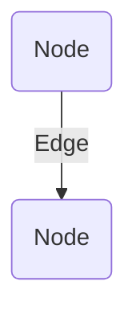
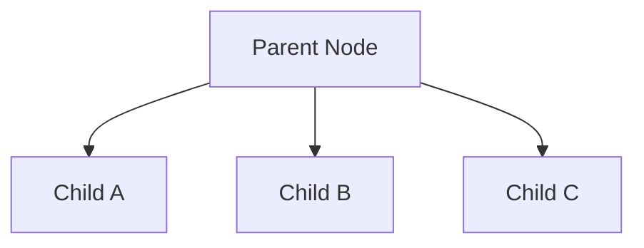
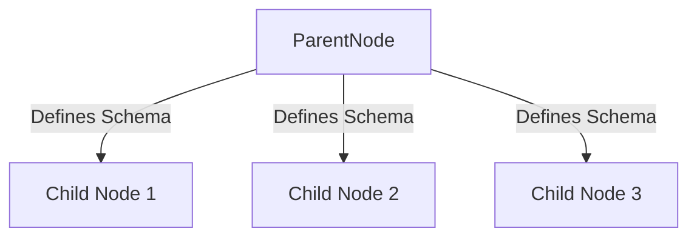

# Relational Graph Neural Networks with Tensor-Based Parent Node Schemas

This whitepaper outlines the design and implementation of a Relational Graph Neural Network (RGNN) framework leveraging tensor structures for hierarchical and lightweight data storage. This approach utilizes parent nodes as schemas that define the dimensions and relationships for child nodes, enabling efficient querying, flexibility, and structured data management.

## Introduction

Relational Graph Neural Networks (RGNNs) aim to organize data hierarchically while maintaining the ability to traverse, query, and analyze relationships dynamically. Traditional approaches often suffer from data bloat and inefficiency when scaling to large datasets or complex relationships. By leveraging a parent-child relationship model with tensor-based structures, this framework addresses scalability and usability challenges, making it suitable for applications like patient records, asset management, or relational knowledge graphs.

### Key Concepts:

- **Node:** Represents a cell in an Excel-like structure.
- **Edge:** Represents connections between nodes, akin to links between spreadsheet cells or entities in a database.
- **Parent Node:** Acts as a schema that defines the structure (dimensions) for its child nodes.
- **Child Nodes:** Lightweight data entries that inherit structure from the parent node, mapped along the Z-axis.
- **Schema Mapping:** Defines X and Y dimensions of the data (e.g., columns and rows in a table).

---

## Overview of Nodes and Edges

Nodes and edges form the foundation of RGNNs:

- Nodes: Serve as individual data points.
- Edges: Define relationships between nodes.

Nodes can be visualized as cells in a spreadsheet, with edges forming the connections that establish relationships between cells. This model enables flexibility in defining relationships, traversing the graph, and querying nodes.

### Diagram: Overview of Nodes and Edges

Overview of Nodes and Edges

---

## Hierarchical Node Mapping

The RGNN framework maps nodes hierarchically, allowing child nodes to inherit properties and structure from parent nodes. This approach keeps child nodes lightweight and reduces redundancy by centralizing schema definitions in the parent node.

### Example:
- **Parent Node:** Defines schema (columns and structure).
- **Child Nodes:** Contain specific data, mapped along a temporal or contextual Z-axis.

### Diagram: Hierarchical Mapping

Web of Nodes and edges

---

## Tensor-Based Schema Representation

Parent nodes use tensor-based schemas to define X and Y dimensions (e.g., column headers). Child nodes store only the data, mapped across the Z-axis. This ensures consistent structure and allows efficient queries while minimizing storage requirements.

### Example Schema Mapping:

#### Parent Node Schema (X, Y Dimensions):
| Patient ID | Name  | First | Last |
|------------|-------|-------|------|
| Synthetic  | Field | Data  | Data |

#### Child Node Data (Z Dimension):
| Patient ID | Name         | First | Last    |
|------------|--------------|-------|---------|
| 1          | {Callum Maystone} | Callum| Maystone|
| 2          | {John Doe}        | John  | Doe     |
| 3          | {Jane Doe}        | Jane  | Doe     |

### Diagram: Tensor-Based Mapping

Hierarchical mapping of nodes, where child nodes inherit properties or structure from parent node

Schema for parent node, defining the structure for child nodes

Lightweight data storage stored where needed, Synthetic nodes generated from data, ensuring structure remains intact yet extensible

Table padded with whitespace to ensure that structure remains consistent throughout

ID mapped across Z dimension for indexing and is used as a temporal dimension

---

## Query Mechanisms

The framework supports querying at various levels:
1. **Child Node Level:** Retrieve specific data points using the schema for context.
2. **Parent Node Level:** Traverse relationships and dependencies between nodes.
3. **Global Level:** Analyze entire subgraphs using hierarchical mappings.

### Benefits of This Approach:
- **Scalability:** Lightweight child nodes enable handling large datasets.
- **Flexibility:** Schema-based inheritance allows dynamic updates.
- **Efficiency:** Queries focus only on relevant nodes, reducing computational overhead.

---

## Applications

The RGNN framework is well-suited for:
- **Healthcare:** Organizing patient records with schema-based hierarchies.
- **Asset Management:** Tracking relationships between assets, locations, and services.
- **Knowledge Graphs:** Structuring dynamic relational data for AI and ML models.

---

## Future Enhancements

1. **Interactive Front-End:**
   - Visualization tools to filter nodes and edges.
   - Color-coded nodes by type and relationship.
2. **Integration with AI Models:**
   - Dynamic metadata generation using ChatGPT or similar tools.
   - Automated schema updates based on data analysis.
3. **Temporal Analysis:**
   - Tracking changes and relationships over time using Z-axis indexing.

---

## Conclusion

This whitepaper introduces a novel approach to structuring relational data using tensor-based schemas in a graph neural network framework. By combining hierarchical mappings, efficient queries, and lightweight data storage, the RGNN framework provides a robust foundation for relational intelligence and scalable applications.

For more details and implementation resources, contact: callum@youmatter.systems.

