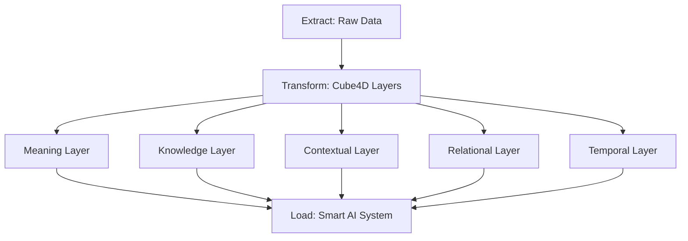
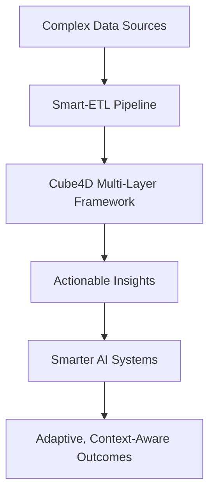

## **Breaking the AI Ceiling: Why LLMs Aren’t Enough & How Smart-ETL Pipelines Unlock True Intelligence**

### **Introduction: A Shift in Perspective**
AI today feels stuck. We’re so focused on the outputs of **Large Language Models (LLMs)** that we’ve forgotten to ask:  
- What happens when the data gets messy?  
- How do systems adapt when new information comes in?  
- Are we solving surface-level problems, or are we building intelligence that truly evolves?

Here’s the reality:  
**LLMs are like looking at a car and seeing only the paint job, ignoring the engineering, innovation, and systems that make it work.**

---

### **The Limitations of LLMs**
While LLMs have revolutionized AI, their limitations are becoming clearer:
1. **Static Learning:** LLMs require retraining to adapt to new data, making them expensive and inflexible.  
2. **Flat Data Processing:** They process inputs at face value, ignoring the **temporal**, **relational**, and **contextual** layers that make data meaningful.  
3. **Output Over Understanding:** They excel at generating outputs but fail to grasp the “why” behind the data.

---

### **The Smart-ETL Solution**
To move past these limitations, I’ve developed a methodology rooted in **Smart-ETL Pipelines**. Here’s how they work:

- **Extract:** Pull data from diverse sources (structured, unstructured, real-time).  
- **Transform:** Break data into **multi-dimensional layers**:  
  - **Temporal:** When did it happen?  
  - **Relational:** How is it connected to other data?  
  - **Meaning:** Why does it matter?  
- **Load:** Feed clean, contextualized, and evolving data into AI systems, making them smarter and more adaptive.

---

### **My Methodology: Cube4D and AUI in Action**
The Smart-ETL approach is built on my **Cube4D framework** and **Artificial Universal Intelligence (AUI)**. Here’s how they fit together:

#### **1. Multi-Dimensional Data Processing with Cube4D**
Cube4D organizes data into five layers:
- **T0: Temporal Layer:** Captures when events occur and how they evolve over time.  
- **R0: Relational Layer:** Maps connections and dependencies between data points.  
- **C0: Contextual Layer:** Adds meaning to data based on its environment.  
- **K0: Knowledge Layer:** Stores structured information for reasoning.  
- **M0: Meaning Layer:** Highlights the purpose or intent behind data.

#### **2. Active Graph Networks**
Active Graph Networks (AGNs) form the backbone of Smart-ETL, dynamically linking nodes (data points) and recalculating relationships as new information arrives. This ensures:
- Real-time adaptability.  
- Queryability across temporal, relational, and contextual dimensions.

---

### **Mermaid Diagram: Smart-ETL Workflow**
Here’s a visualization of the process:

**Explanation:**  
- Raw data flows into the system, where Cube4D layers process it into actionable insights.  
- The **Smart AI System** (powered by AUI) dynamically adapts based on these insights.

---

### **Use Cases for Smart-ETL Pipelines**
#### **Healthcare:**
- Problem: Fragmented patient data.  
- Solution:  
  - **Temporal Layer:** Tracks symptoms over time.  
  - **Relational Layer:** Links symptoms to environmental factors.  
  - **Meaning Layer:** Identifies patterns that lead to early diagnosis.  

#### **Finance:**
- Problem: Surface-level market predictions.  
- Solution:  
  - **Contextual Layer:** Correlates market movements with macroeconomic events.  
  - **Knowledge Layer:** Stores historical trends for predictive modeling.  
  - **Meaning Layer:** Guides risk management strategies.

#### **Public Sector:**
- Problem: Data silos across departments.  
- Solution:  
  - **Relational Layer:** Integrates cross-departmental data.  
  - **Temporal Layer:** Tracks the impact of policy changes.  
  - **Meaning Layer:** Measures outcomes to optimize services.

---

### **Mermaid Diagram: How Smart-ETL Simplifies Complexity**

**Key Takeaway:**  
Smart-ETL doesn’t just clean data—it makes it **contextual, relational, and meaningful**, enabling AI to produce smarter outcomes.

---

### **The Bigger Picture: Moving Beyond LLMs**
LLMs have given us a great start, but they’re not the endgame. To truly unlock the potential of AI, we need systems that:
- Adapt to **new data in real-time.**  
- Contextualize relationships and meaning.  
- Simplify complexity into actionable intelligence.

**That’s where Smart-ETL pipelines, Cube4D, and AUI come in.**

---

### **Conclusion: Building the Future**
AI should be more than output generation. It should be about **understanding**. By focusing on **Smart-ETL pipelines**, we can build systems that:
- Simplify complexity.  
- Adapt and evolve.  
- Unlock the next level of intelligence.

**The question is: Are we ready to move beyond static data?ethodology, and practicality?