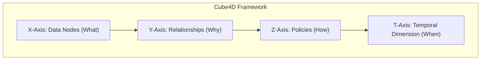
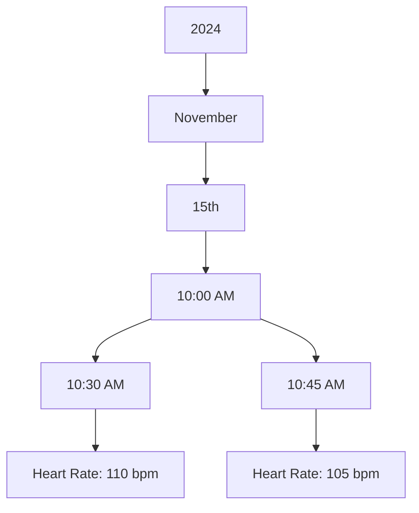
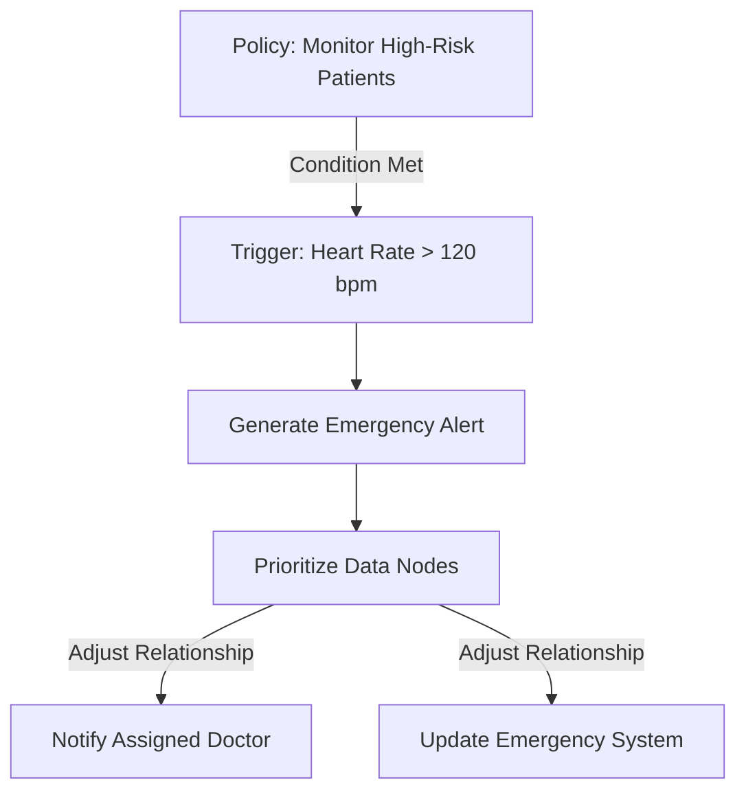
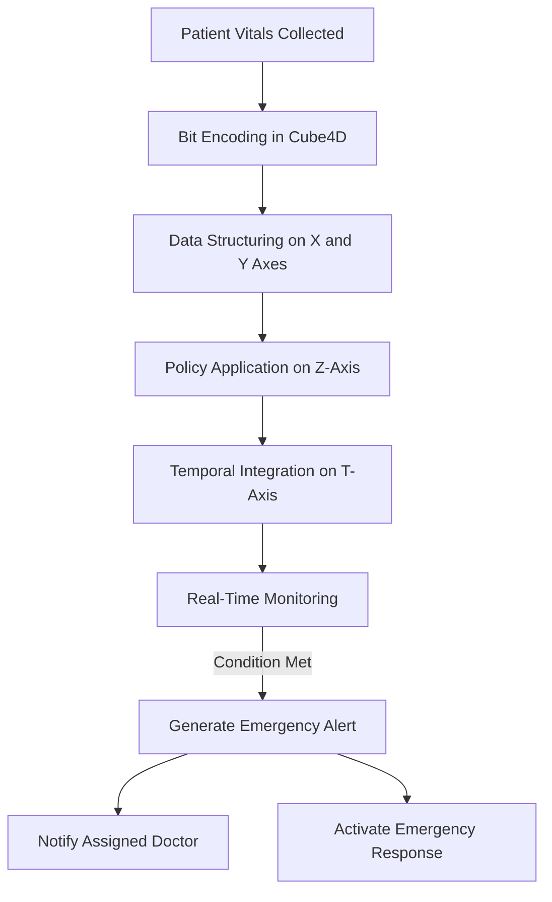
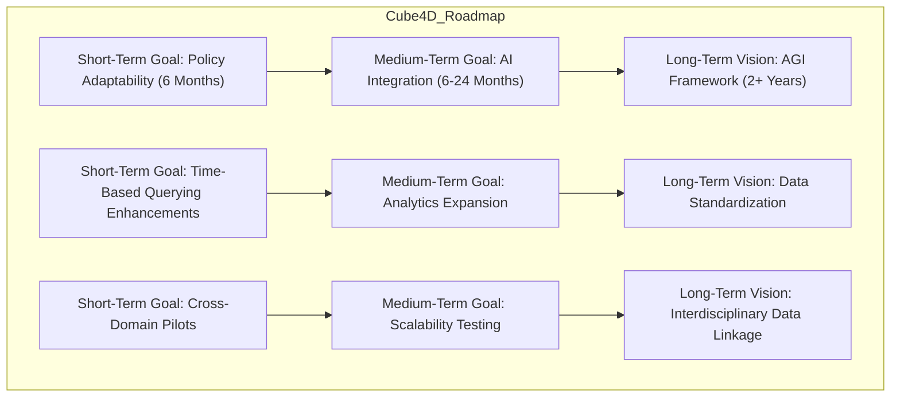
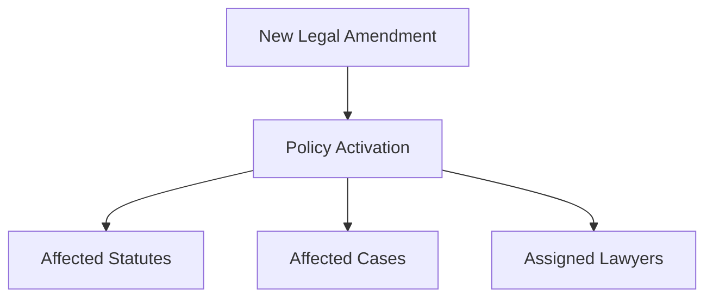
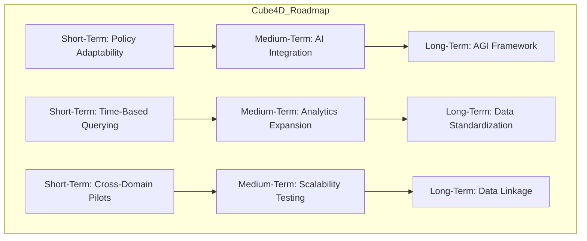

# **Cube4D and Active Graph Networks (AGN)**  
**Revolutionizing Data Structuring, Adaptability, and Contextual Understanding**  

**Author:** Callum Maystone  
**Date:** 15/11/2024  
**Location:** Adelaide, Australia  

---

## **Table of Contents**  
1. Introduction  
2. Background and Motivation  
3. Objective of Cube4D and AGN  
4. Key Components and Structure  
   - Four Dimensions of Cube4D  
   - Visual Diagram of Cube4D Structure  
   - In-Depth Breakdown of the Temporal Dimension  
5. Mathematical Foundations and Perfect Number Encoding  
6. Innovation and Contributions  
   - Policy-Driven Relationships  
   - Bit Encoding and Data Retrieval  
7. Advanced Querying and Contextual Interpretation  
8. Synthetic Nodes and Temporal Data Structuring  
9. Policy-Driven Adaptability and Real-Time Relationships  
10. Security, Privacy, and Access Control  
11. Performance Metrics and Comparative Analysis  
12. Use Cases and Real-World Impact  
13. Roadmap and Future Vision  
14. Conclusion  
15. Glossary  
16. Appendix  

---

## **Introduction**

In today's data-driven world, the exponential growth of information presents both opportunities and challenges. Traditional data structures and processing models struggle to handle the complexity, interconnectedness, and real-time adaptability required by modern applications. **Cube4D (C4D)** and **Active Graph Networks (AGN)** offer an innovative solution to these challenges by introducing a multi-dimensional, context-aware framework that redefines data interaction and management.

By leveraging advanced mathematical principles, policy-driven adaptability, and temporal dynamics, Cube4D and AGN enable a new level of data intelligence. This framework not only enhances current data processing capabilities but also lays the groundwork for future advancements in fields like **Artificial General Intelligence (AGI)** and **quantum data structures**.

---

## **Background and Motivation**

The limitations of existing data structures become apparent when dealing with dynamic, multi-dimensional datasets that require relational integrity and adaptability. Industries such as healthcare, finance, and AI research demand systems that can understand context, adapt in real-time, and scale efficiently.

Cube4D addresses these needs by modeling data relationships dynamically and adapting to evolving contexts. By incorporating the temporal dimension and policy-driven adaptability, Cube4D provides a framework capable of handling complex data interactions, paving the way for innovations in emerging fields.

---

## **Objective of Cube4D and AGN**

The objective of Cube4D and AGN is to create an all-encompassing framework for real-time data analysis and dynamic relationship management. By enabling data to self-organize, adapt, and respond to changing contexts, Cube4D and AGN aim to revolutionize data structuring and processing.

**Core Aims**:
- **Adaptive Relational Intelligence**: Allow data to interpret and adapt to relational contexts, enabling meaningful and context-sensitive interactions.
- **Scalability and Real-Time Responsiveness**: Achieve computational efficiency and adaptability as datasets grow, with projected improvements of up to **70% in query speed** over traditional models.
- **Cross-Domain Applications**: Provide a universal structure supporting various industries, including healthcare, legal analysis, finance, AI, and more.

---

## **Key Components and Structure**

### **Four Dimensions of Cube4D**

1. **X-Axis (What)**: Represents raw data nodes, individual data points, or knowledge bases.
2. **Y-Axis (Why)**: Captures relational connections, indicating the purpose behind data interactions.
3. **Z-Axis (How)**: Governs policies and adaptability mechanisms for real-time relational adjustments.
4. **Temporal Dimension (When)**: Adds a time-sensitive layer, enabling data structures to adapt based on chronological changes.

**Visual Diagram of Cube4D Structure**:



---

### **In-Depth Breakdown of the Temporal Dimension**

The Temporal Dimension is crucial for real-time adaptability. It allows Cube4D to:
- **Manage Time-Sensitive Data**: Handle data that changes over time, such as stock prices or patient vitals.
- **Enable Temporal Querying**: Retrieve data from specific time points or intervals.
- **Support Historical Analysis**: Analyze trends and patterns over time for predictive insights.

**Temporal Data Structuring Visual**:



---

## **Mathematical Foundations and Perfect Number Encoding**

Cube4D uses perfect numbers to create complete and balanced data structures, ensuring relational integrity and scalability.

**Perfect Number Encoding Walkthrough**:

```mermaid
graph TD
    subgraph Encoding_Process [Binary Encoding Process]
        ID[Patient ID: 0001] --> DataType[Data Type: Heart Rate ((0010))]
        DataType --> Value[Value: 110 bpm ((01101110))]
        Value --> Timestamp[Timestamp: 10:42 AM ((10101010))]
        Timestamp --> Policy[Policy: Emergency Active ((0001))]
        Policy --> Parity[Parity Bit: 1]
    end
    Encoding_Process --> EncodedData[Combined Binary: 0001 0010 01101110 10101010 0001 1]
```

---

## **Policy-Driven Relationships**

Cube4D dynamically adjusts data relationships based on pre-defined policies.

**Policy-Driven Relationships Visual**:



---

## **Advanced Querying and Contextual Interpretation**

**Contextual Querying Flowchart**:

```mermaid
flowchart TD
    Query[User Query] --> XAxis[Identify Data Nodes (What)]
    XAxis --> YAxis[Map Relationships ((Why))]
    YAxis --> ZAxis[Apply Policies ((How))]
    ZAxis --> TAxis[Add Temporal Context ((When))]
    TAxis --> Response[Provide Contextual Response]
```

---

## **Use Cases and Real-World Impact**

### **Healthcare Emergency Workflow**

**Emergency Workflow Visual**:



---

## **Roadmap and Future Vision**

**Future Roadmap Diagram**:



## **Conclusion**

Cube4D and Active Graph Networks (AGN) represent a groundbreaking approach to data structuring and dynamic relationship management. By introducing multi-dimensional adaptability and temporal integration, Cube4D not only addresses the limitations of traditional systems but also establishes a foundation for future advancements in Artificial General Intelligence (AGI), data-driven industries, and scientific research.

Key innovations such as policy-driven relationships, perfect number encoding, and advanced contextual querying make Cube4D a universal framework for tackling real-world challenges across domains. Whether it is improving patient outcomes in healthcare, optimizing market analysis in finance, or enabling intelligent legal systems, Cube4D demonstrates immense potential for transformative impact.

By refining the roadmap, engaging stakeholders, and validating its use cases, Cube4D and AGN can shape the future of data interaction and revolutionize how intelligence is structured and applied.

---

## **Glossary**

- **Access Control Lists (ACLs)**: Permissions attached to objects specifying which users or systems can access them.  
- **Active Graph Networks (AGN)**: A data framework designed to manage dynamic relationships using policy-driven adaptability.  
- **Artificial General Intelligence (AGI)**: AI systems with human-like cognitive abilities, capable of general reasoning and learning across domains.  
- **Bit Encoding**: A binary encoding method to represent data attributes and relationships efficiently.  
- **Contextual Querying**: A querying approach that considers data's context and conditions to deliver relevant results.  
- **Cube4D (C4D)**: A four-dimensional data structuring model incorporating spatial and temporal dynamics.  
- **Mersenne Primes**: Primes of the form \( M_p = 2^p - 1 \), used in mathematical foundations of relational completeness.  
- **Perfect Numbers**: Numbers equal to the sum of their proper divisors, used in Cube4D for balanced data representation.  
- **Policy-Driven Relationships**: Dynamic data relationships defined by user-defined policies for adaptability.  
- **Role-Based Access Control (RBAC)**: Restricting data access based on user roles.  
- **Temporal Dimension**: A fourth dimension in Cube4D that accounts for time-sensitive data changes.  
- **Synthetic Nodes**: Logical nodes that represent hierarchical units like time layers or domain-specific groupings.  

---

## **Appendix**

### **Appendix A: Perfect Number Encoding in Cube4D**

Perfect numbers ensure balanced and complete relationships in Cube4D’s encoding process. For example, the perfect number **28** (binary **11100**) can represent:
- **Patient ID**: 0001
- **Data Type**: 0010 (Heart Rate)
- **Value**: 01101110 (110 bpm)
- **Timestamp**: 10101010 (10:42 AM)
- **Policy Flag**: 0001 (Emergency Active)

**Combined Binary Sequence**:
```plaintext
0001 0010 01101110 10101010 0001
```

### **Appendix B: Policy-Based Adaptability in AGN**

Example Policy:
```plaintext
Policy ID: 003
Trigger Conditions:
- Legal Amendment Published
Actions:
- Update relationships between affected statutes and cases
- Notify assigned legal professionals
Affected Nodes:
- Statute Nodes
- Case Nodes
- User Nodes (Legal Professionals)
```

**Policy Flow Visual**:


### **Appendix C: Temporal Data Structuring and Synthetic Nodes**

Temporal layers allow precise data retrieval and analysis over time. 

**Hierarchy Example**:
- Year: **2024**
  - Month: **November**
    - Day: **15th**
      - Hour: **10:00 AM**
        - Minute: **30**
        - Second: **45**

**Offset Query Example**:
- Query: Retrieve patient vitals from **10:30 AM to 10:45 AM**.
- Process:
  - Navigate to **Hour 10:00 AM** node.
  - Apply **offset** to retrieve data between **Minutes 30 to 45**.

**Hierarchy Visual**:


### **Appendix D: Roadmap Summary**

**Roadmap Diagram**:


---

## **Final Remarks**

The completed whitepaper showcases Cube4D and AGN as innovative frameworks addressing the evolving needs of data structuring, adaptability, and intelligence. The integrated diagrams, mathematical rigor, and contextual adaptability highlight the framework’s capability to revolutionize data handling across domains. By engaging collaborators and validating its applications, Cube4D can pave the way for transformative advancements, including AGI.
