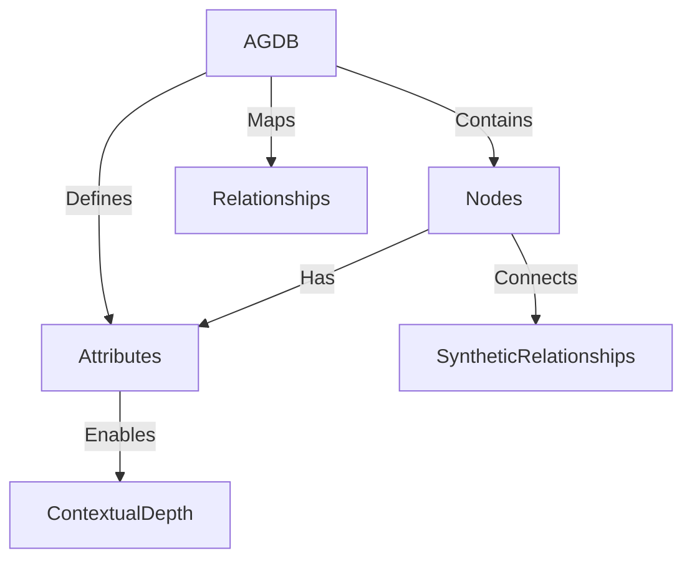
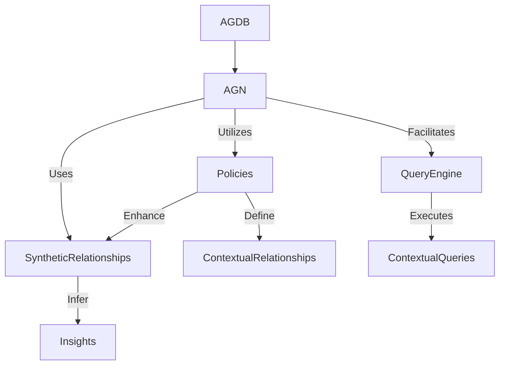

### Enhanced AGDB Framework: Generalized for Flexible Data Types

The **Active Graph Database (AGDB)** is designed to be a highly efficient, flexible framework for structuring data in a way that makes it intuitively queryable and contextually rich. Whether dealing with small, straightforward tables or large, intricate datasets with multiple layers of context, AGDB enables users to explore and analyze their data by defining structured relationships and employing policies that enrich these connections.

### Core Concept

1. **Generalized Data Handling**:
   - AGDB is not limited to time series data; it can adapt to any tabular data structure by organizing rows as nodes and creating edges based on predefined relationships or synthetic (inferred) connections.
   - This structure allows for quick and efficient navigation of simple single tables (e.g., customer records) or complex multi-dimensional datasets (e.g., healthcare or financial data with interrelated metrics).

2. **Single Table or Multi-Dimensional Relationships**:
   - AGDB can serve as a standalone model for a single table where each record or row is a node, and each attribute or column can be either a feature or a relationship marker.
   - In more complex applications, multiple tables or sources can be mapped together, with relationships drawn from shared features, policies, or inferred attributes. This flexibility allows AGDB to capture complex data relationships without requiring an extensive machine-learning backend.

3. **Scalability and Efficiency**:
   - Designed to be efficient, AGDB handles small datasets seamlessly, while also scaling up for larger, complex datasets. This versatility makes it an ideal solution for everything from basic exploratory data analysis to deep, contextual insights in massive datasets.
   - With policy-driven synthetic relationships, AGDB can identify nuanced patterns by dynamically creating context based on predefined attributes. This approach is resource-efficient, minimizing the need for GPU-intensive model training.

### Structural Elements

1. **Nodes**:
   - Each row or data record in the table becomes a node in the AGDB. The data points in each row (attributes or features) are mapped as either node properties or as edges to other nodes.
   - Nodes can represent entities (e.g., a patient, a transaction) or categories (e.g., demographics, financial attributes), based on the schema defined by the user.

2. **Attributes and Relationships**:
   - **Predefined Relationships**: These are ground-truth relationships based on the data schema. For instance, if a dataset includes patients and treatments, the AGDB could predefine relationships where each patient node is connected to their treatment history.
   - **Synthetic Relationships**: These are dynamically generated based on policies that define context between attributes. For example, if two patients have similar attributes (age, diagnosis), a synthetic relationship might infer a "similar condition" connection between them. This inference is contextually driven and doesn’t require additional training data.

3. **Policies for Contextual Depth**:
   - Policies are rules that govern how synthetic relationships are generated. They can be used to define which attributes or combinations of attributes create contextual relationships.
   - Examples:
     - "Link customers who share similar purchasing behaviors."
     - "Identify related healthcare cases with overlapping demographic and diagnostic factors."
   - These policies can be adjusted to fine-tune the sensitivity of relationships, enabling the identification of nuanced patterns without explicit machine learning.

### Query Structure for AGDB

AGDB's query language is designed to be intuitive, providing access to specific nodes, relationships, or attributes. Here’s how it works across different data contexts:

1. **Basic Queries**:
   - Retrieve a specific node or attribute:
     - `get-node CustomerData/{CustomerID}`
     - This query fetches the node associated with a particular customer ID.
   - Retrieve relationships:
     - `get-related-nodes Healthcare/{PatientID}`
     - This query retrieves all nodes related to a specific patient, including treatments, conditions, and similar cases if policies are in place.

2. **Contextual Queries**:
   - Leverage synthetic relationships for nuanced insights:
     - `get-similar-nodes Finance/{CustomerID}`
     - This query could identify customers with similar financial profiles based on policy-defined attributes (e.g., income level, spending patterns).
   - Time-agnostic queries (for non-time-series data):
     - `get-nodes-by-attribute SalesData/{ProductType}/"Electronics"`
     - Returns all nodes (sales entries) related to "Electronics" within the SalesData table.

3. **Policy-Driven Synthetic Queries**:
   - Query based on policies for inferred relationships:
     - `apply-policy RelatedHealthcareCases/{PatientID}`
     - Using policies, this query identifies healthcare cases related to the specified patient, taking into account similar demographic and health factors.
   - Example for rule-based trading strategy:
     - `apply-policy TradingRules/{MarketCondition}`
     - In a trading context, this query applies predefined rules (e.g., buy or sell strategies) to nodes that represent market conditions, allowing for real-time decision-making based on inferred relationships in the trading dataset.

### Example Applications

1. **Single Table Analysis**:
   - Use AGDB to structure a dataset like customer data, with predefined attributes (name, age, spending) and relationships (e.g., similarity in spending behavior).
   - Synthetic relationships could then identify clusters of customers with similar spending habits without explicit clustering models.

2. **Multi-Table or Domain-Spanning Analysis**:
   - In healthcare, AGDB could combine patient demographics, diagnostics, and treatment histories across multiple datasets, providing a structured view of how each patient’s journey connects with others through inferred similarities.

3. **Trading and Financial Analysis**:
   - For a trading bot, AGDB could structure time-agnostic or sequential trading data, applying predefined rules and strategies through policy-driven synthetic relationships.
   - Instead of requiring retraining, AGDB can dynamically apply rules to new data, creating an efficient, policy-driven decision-making framework for financial analysis.

### Visualizing the AGDB and AGN Architecture (Mermaid Diagrams)

#### AGDB Structure

#### Integration with AGN and Policy-Based Inference

---

### Next Steps for Building Out AGDB

1. **Schema Definition within JSON**:
   - Define the schema in JSON format to map attributes and relationship policies clearly. This allows for dynamic import from structured sources like CSV or SQL databases.
   - Attributes can be tagged as nodes, features, or contextual relationships within the JSON schema.

2. **Define Relationship Policies**:
   - Establish basic policies for synthetic relationships and test their outcomes on different datasets to ensure meaningful insights. Policies should be modular, so users can add, adjust, or remove them as needed.

3. **Iterate Querying Logic**:
   - Expand the querying framework to handle complex queries that leverage both AGDB and AGN, enabling cross-domain analysis and quick querying of inferred relationships.

4. **Create User Interface**:
   - The UI should support defining, modifying, and querying AGDBs and AGNs. It should provide visualization tools to explore predefined and synthetic relationships in a structured, layered view.

---

### Conclusion

This approach to AGDB as a generalized framework maximizes flexibility and efficiency, making it suitable for both small, single-table datasets and large, complex datasets that require contextual depth. By integrating policy-driven synthetic relationships, AGDB allows users to uncover nuanced insights with minimal computational resources, positioning it as an invaluable tool across domains like healthcare, finance, and beyond. This framework lays the foundation for future applications where data-driven decision-making can be intuitive, scalable, and cost-effective.
