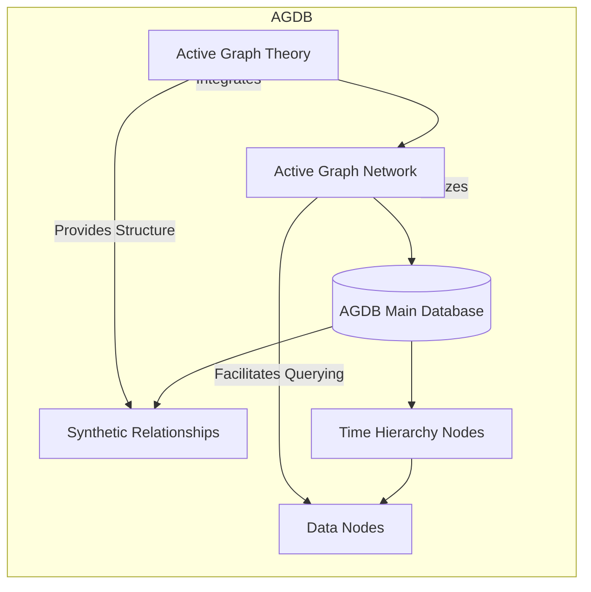
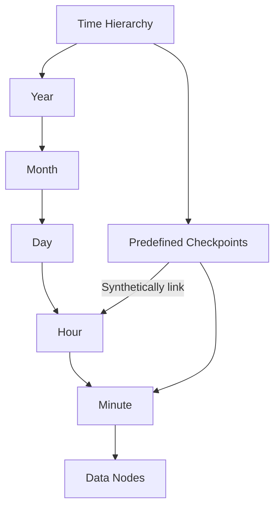
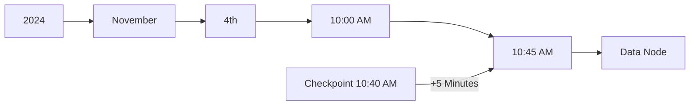
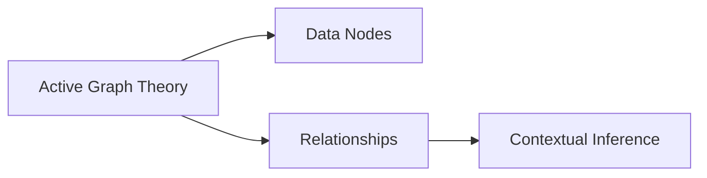
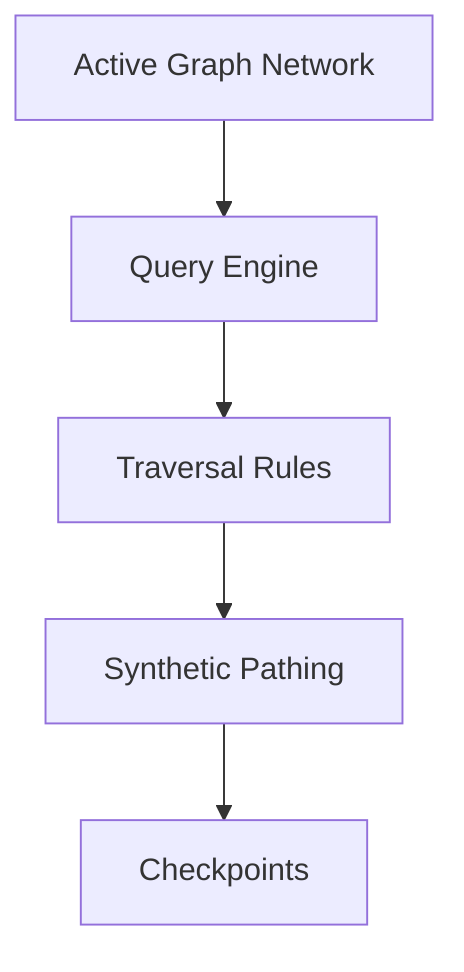

# AGDB Time Series Graphs and Query Structure

Active Graph Databases (AGDBs) are an innovative framework designed for efficiently managing and querying time-series data. By leveraging **Active Graph Theory (AGT)** and **Active Graph Networks (AGN)**, AGDBs enable the creation of structured and synthetic relationships that can scale across various domains while maintaining efficiency in both small and large datasets.

## Overview of AGDB Architecture

AGDB utilizes a hierarchical time-based structure combined with synthetic relationships to enable efficient querying and scalable handling of complex data. This design facilitates cross-domain contextual relationships, supporting advanced data interactions, rule-based querying, and scalable, efficient processing.

### Architecture Diagram



---

## Structure of AGDB Time Series Graphs

AGDB structures time-series data through hierarchical **Time Nodes** and **Data Nodes**. Synthetic relationships within the database enable efficient traversal and retrieval of specific time points or patterns, allowing AGDB to act as a powerful framework for scalable time-series querying.

### AGDB Structure Diagram



- **Hierarchical Structure**: Organized from Year down to Minute, each node level enables efficient time-based navigation.
- **Checkpoints**: Serve as reference points within the hierarchy, allowing quicker access to relevant data via synthetic pathing.
- **Data Nodes**: Store attributes for each time interval, making each data point easily accessible.

---

## Query Structure for AGDB

The query structure for AGDBs supports flexible access to data across predefined and synthetic relationships. Using a path-based syntax, AGDB queries are intuitive and efficient for time-series and context-rich data.

### Example Query Structure



- **Direct Navigation**: Queries traverse through the year, month, day, hour, and minute levels until reaching the target node.
- **Synthetic Pathing**: Checkpoints at predefined intervals enable rapid traversal, allowing queries to skip to approximate points and increment from there.

---

## Definitions and Components

### AGT (Active Graph Theory)

AGT provides the foundational logic for defining and managing relationships within AGDB, modeling data as interconnected nodes with contextual relationships.



- **Nodes**: Represent data entries or entities.
- **Relationships**: Define connections between nodes.
- **Contextual Inference**: Adds depth to data by inferring relationships based on contextual cues.

### AGN (Active Graph Networks)

AGN utilizes AGT’s principles to support querying and interaction within AGDB. Through rules and policies, AGN automates and simplifies navigation through AGDB.



- **Query Engine**: Processes requests by applying AGN’s traversal rules.
- **Traversal Rules**: Define how nodes are accessed based on AGDB structure.
- **Synthetic Pathing**: Creates shortcuts between nodes, improving query efficiency.

---

## Example JSON Structure for AGDB

This structure organizes AGDB data, relationships, and policies into a flexible format that allows for easy traversal and analysis.

```json
{
    "metadata": {
        "title": "BTC-USD Time Series Data",
        "source": "AGT Platform",
        "description": "Time-series AGDB for BTC-USD trading data with predefined checkpoints",
        "created_at": "2024-11-04",
        "timezone": "UTC"
    },
    "schema": {
        "entity": "BTC_USD_Data",
        "type": "TimeSeriesNode",
        "domain": "TradingData",
        "attributes": ["Time", "Node_ID", "Open", "High", "Low", "Close", "Volume"]
    },
    "data": [
        ["2024-10-14 07:30:00", "node_0001", 50, 52, 48, 51, 5000],
        ["2024-10-14 07:31:00", "node_0002", 51, 55, 43, 55, 3000]
    ],
    "relationships": [
        {
            "type": "temporal_sequence",
            "from": "node_0001",
            "to": "node_0002",
            "relationship": "next"
        }
    ],
    "policies": {
        "AGN": {
            "trading_inference": {
                "rules": {
                    "time_series_trend": {
                        "relationship": "temporal_sequence",
                        "weight_threshold": 0.5
                    },
                    "volatility_correlation": {
                        "attributes": ["High", "Low"],
                        "relationship": "correlates_with",
                        "weight_threshold": 0.3
                    }
                }
            }
        }
    }
}
```

---

## Sample Queries and Structure

### Basic Queries

1. **Get Specific Time Node**: Retrieve data at a particular time.

   ```plaintext
   get-node-type ts-path {domain}/2024/11/04/10/45
   ```
2. **Use Checkpoint for Efficiency**:

   ```plaintext
   get-node-type ts-path {domain}/2024/11/04/10/40 +5
   ```

### Rule-Based Strategy Example

1. **Apply Trading Strategy**:

   ```plaintext
   get-node-type ts-path TRADING/2024/11/04/11/45
   ```

   This query fetches data at `11:45 AM` for trading strategies.

---

## Unified Command Structure

### Core Commands and Syntax Structure

1. **Graph Creation and Initialization**

   - `create-graph -name "financial_time_series" -type "AGDB"`
2. **Node and Relationship Management**

   - `create-node -id "node_001" -type "TimeSeriesNode" -attributes {...}`
   - `create-relationship -from "node_001" -to "node_002" -type "next"`
3. **Setting Edges, Attributes, and Domains**

   - `set-edge -from "node_001" -to "node_002" -weight 0.8`
   - `set-attribute -node "node_001" -attributes {...}`
   - `set-domain -graph "financial_time_series" -name "Trading"`
4. **Retrieving Nodes, Relationships, and Domains**

   - `get-node.attribute -name "node_001"`
   - `get-relationship -node "node_001"`
   - `get-domain -node "node_001"`
5. **AGN/AGDB Specific Commands**

   - `get-AGN -policy "trading_inference"`
   - `set-AGN -policy "trading_inference" -rules {...}`

---

## Example JSON Query Logic

To optimize queries, AGDB uses a hierarchical time-based navigation structure with checkpoints for faster traversal.

1. **Query Example for Time Range**:

   ```json
   {
       "command": "get-node",
       "start": "2024-10-14 08:00:00",
       "end": "2024-10-14 08:30:00"
   }
   ```
2. **Relationship-Based Query for Correlation**:

   ```json
   {
       "command": "get-relationship",
       "type": "correlates_with",
       "attributes": ["High", "Low"]
   }
   ```

---

### Conclusion

This README provides a high-level overview of AGDB architecture, query structure, and example usage. By integrating **AGT** and **AGN**, AGDB offers a powerful, scalable framework for time-series and complex data management, making it ideal for various fields, including finance and healthcare. The unified query structure allows users to access and manipulate data efficiently, making AGDB a versatile and user-friendly database solution.
