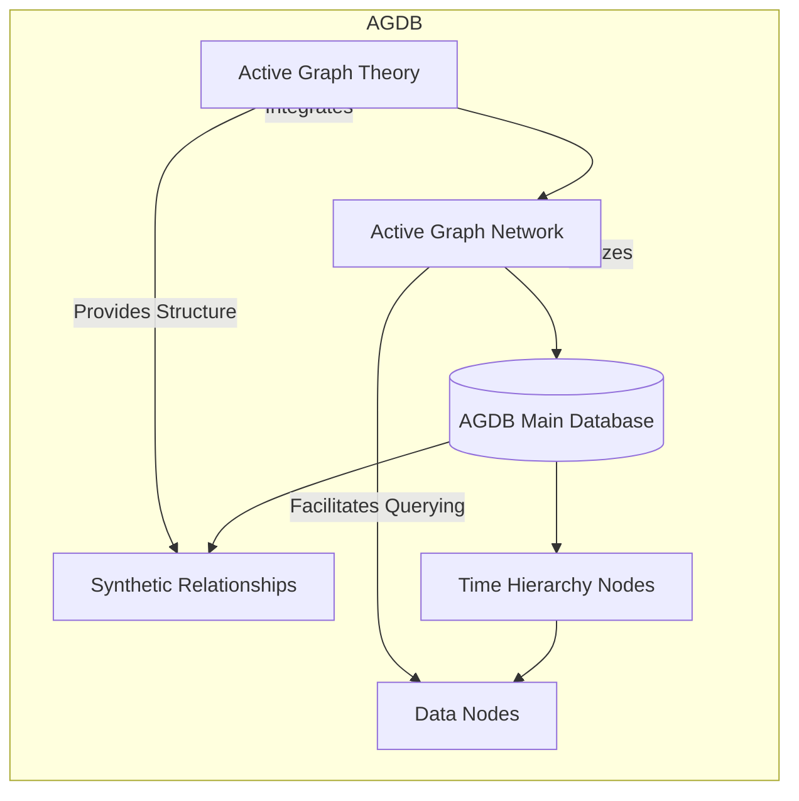
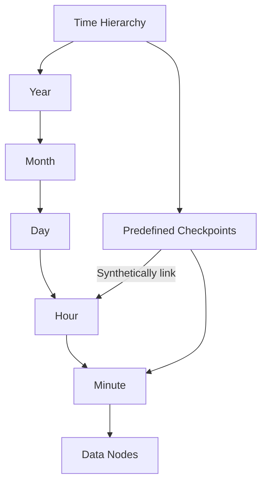
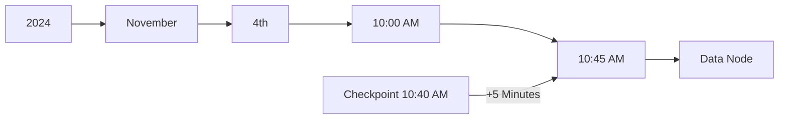
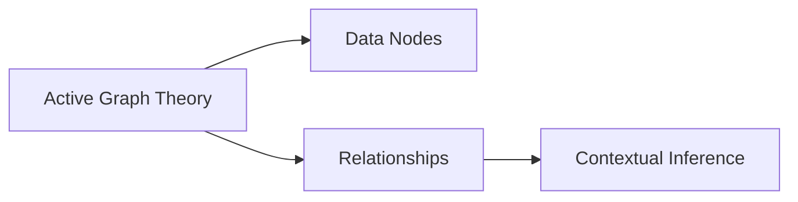
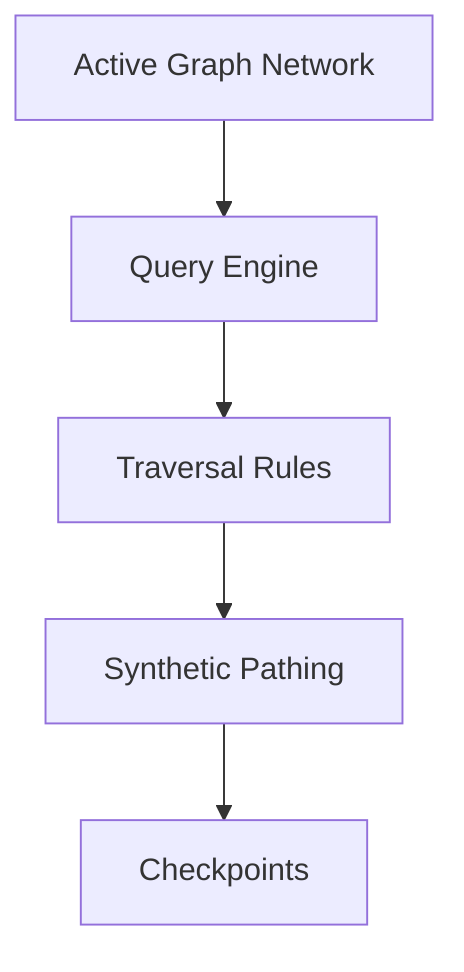

# AGDB Time Series Graphs and Query Structure

Active Graph Databases (AGDBs) are a groundbreaking framework for efficiently handling time-series data. They are structured to facilitate quick querying and contextual relationships, integrating with **Active Graph Theory (AGT)** and **Active Graph Networks (AGN)** for advanced data interactions across domains.

## Overview of AGDB Architecture

AGDB leverages predefined hierarchical relationships in time-series data, with **synthetic relationships** enabling efficient traversal across time. This architecture allows for efficient querying, rule-based operations, and scalable handling of massive datasets.

### Architecture Diagram



**Explanation:**
- **AGT**: Provides the underlying theory of dynamic relationships and contextual inference.
- **AGN**: Builds on AGT by allowing queries to traverse nodes in the AGDB using both predefined and synthetic relationships.
- **AGDB Main Database**: Houses all structured data, including temporal nodes and synthetic relationships.
- **Synthetic Relationships**: Enable faster traversal by inferring paths across temporal checkpoints.
- **Time Hierarchy Nodes**: Represent time intervals (Year, Month, Day, etc.).
- **Data Nodes**: Store the actual data points, connected to the relevant time nodes.

---

## Structure of AGDB Time Series Graphs

In AGDB, time-series data is structured through hierarchical **Time Nodes** and **Data Nodes**, facilitating fast querying by navigating time intervals. Synthetic relationships allow jumping between nodes based on predefined checkpoints.

### AGDB Structure Diagram



**Explanation:**
- **Year > Month > Day > Hour > Minute**: AGDB uses a hierarchical structure to navigate time.
- **Checkpoints**: Act as shortcuts within the hierarchy for faster traversal.
- **Data Nodes**: Store information linked to each specific time, accessible via traversal through the hierarchy or checkpoints.

---

## AGDB Query Logic and Traversal

AGDB queries use a path-based syntax that references temporal nodes and synthetic relationships. The path-based approach allows efficient querying through hierarchical relationships.

### Example Query Structure



**Explanation:**
1. Start at `2024`, navigate through each hierarchical node until reaching the `10:45 AM` data node.
2. The checkpoint at `10:40 AM` enables quicker access to `10:45 AM` by adding a synthetic relationship of `+5 Minutes`.

---

## Definitions and Components

To understand how AGDB integrates with AGT and AGN, let's break down some of the main components:

### AGT (Active Graph Theory)

AGT provides the foundation for contextual relationships, visualizing data as interconnected nodes where each relationship holds meaning. It enables AGDB to model data similarly to how the human brain understands context and relationships.



**Explanation**:
- **Nodes** represent data points.
- **Relationships** store the connections between nodes.
- **Contextual Inference** allows the system to derive meaning from node relationships, adding depth to data interactions.

### AGN (Active Graph Networks)

AGN is the operational framework that uses AGT’s relational logic to make querying intuitive and efficient within AGDB. By applying policies and rules, AGN automates navigation through AGDB’s structure.



**Explanation**:
- **Query Engine**: Processes queries using AGN’s traversal logic.
- **Traversal Rules**: Define how queries move through the graph.
- **Synthetic Pathing**: Allows queries to jump to checkpoints or infer paths, improving efficiency.

---

## Sample Queries and Structure

### Basic Query Example

To retrieve data at `10:45 AM` on `2024-11-04`:

```plaintext
get-node-type ts-path {domain}/2024/11/04/10/45
```

This query moves hierarchically through each node (Year > Month > Day > Hour > Minute) to reach the target.

### Checkpoint-Based Query

If there’s a checkpoint at `10:40 AM`, the query can reach `10:45 AM` using synthetic pathing:

```plaintext
get-node-type ts-path {domain}/2024/11/04/10/40 +5
```

This query accesses the `10:40` checkpoint and increments by `5 minutes`.

### Rule-Based Trading Strategy Example

For a trading decision at `11:45 AM` on `2024-11-04`:

```plaintext
get-node-type ts-path TRADING/2024/11/04/11/45
```

This command pulls trading data for the specified time, which can be processed by AGN rules for pattern recognition and decision-making.

---

## Summary and Conclusion

The AGDB system offers a structured approach to time-series data by leveraging AGT and AGN. With hierarchical nodes, synthetic relationships, and checkpoint-based pathing, AGDB provides a highly efficient way to query and analyze time-series data across various domains.

AGDB allows users to:
1. **Query Time-Series Data Efficiently**: Use synthetic relationships and checkpoints to quickly retrieve relevant data.
2. **Apply Cross-Domain Context**: AGT provides context to relationships, while AGN enables effective query processing.
3. **Execute Rule-Based Strategies**: AGN’s rules and policies allow for actionable insights in real time, making it suitable for domains like finance, healthcare, and more.

