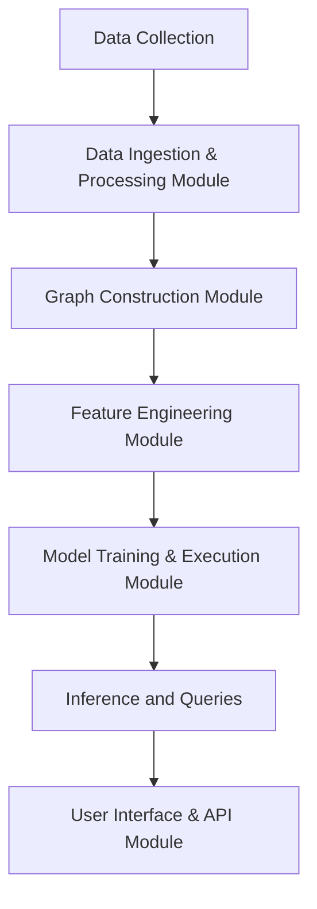
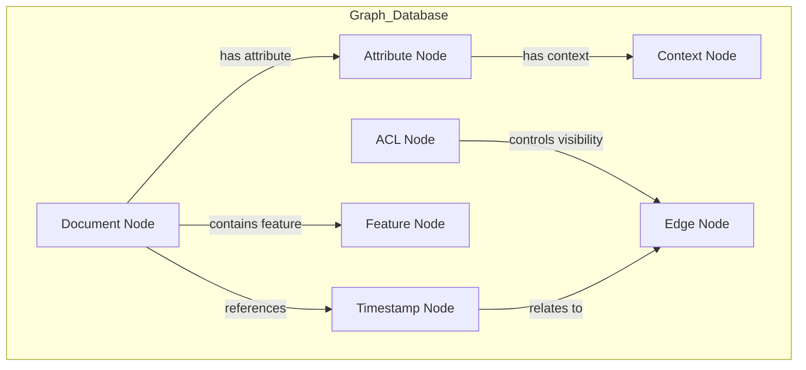
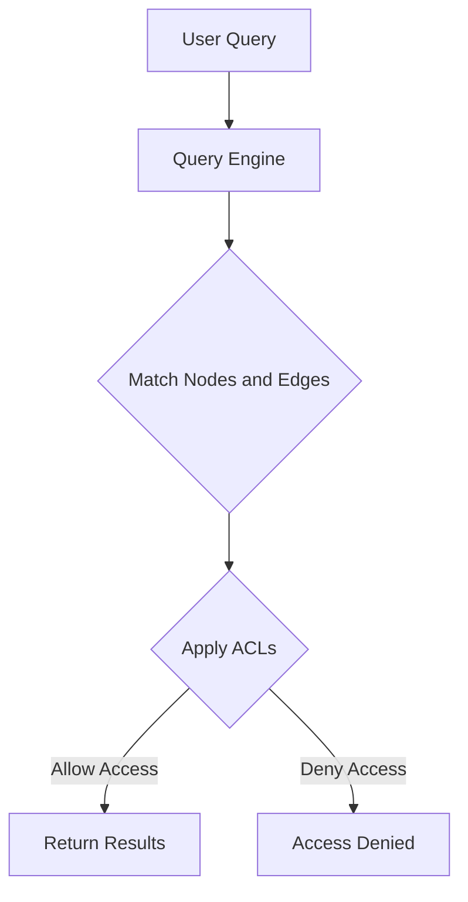
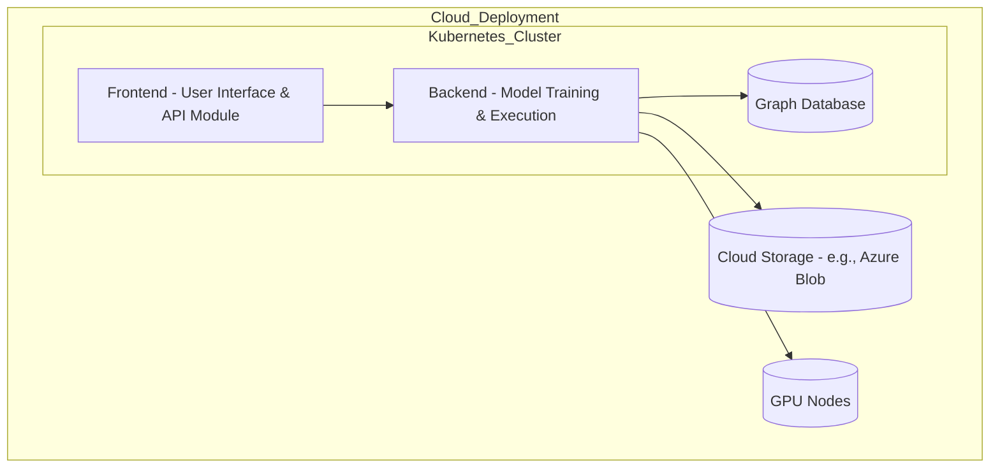

# 01_Architectural_Documentation.md

## **AGN Architectural Documentation**

### **1. Introduction**

This document outlines the architecture of the Active Graph Neural Network (AGN) framework, detailing the structure, components, and interactions necessary for implementing and deploying the system. It serves as a guide for developers, data scientists, and system architects to understand the design and flow of data and processes within the AGN framework.

### **2. System Overview**

The AGN architecture is designed to handle complex, structured data relationships by leveraging graph theory and neural network capabilities. The primary components of the AGN system include:

- **Data Ingestion and Processing Module**: Responsible for collecting, cleaning, and processing data inputs from various sources, transforming them into a structured format suitable for graph representation.
- **Graph Construction Module**: Builds and maintains graph structures, defining nodes, edges, and attributes based on the input data.
- **Feature Engineering and Contextualization Module**: Enriches nodes and edges with attributes that provide context and relevance, enabling more advanced analysis and reasoning capabilities.
- **Model Training and Execution Module**: Implements the neural network training and inference process, leveraging GPU acceleration and cloud resources for scalability.
- **Query Engine and ACL Management Module**: Manages structured queries and enforces Access Control Lists (ACLs) to control visibility and access to different parts of the graph.
- **User Interface and API Module**: Provides an interface for users to interact with the AGN framework and an API for external integration.

### **3. Architectural Components**

#### **3.1 Data Ingestion and Processing Module**

- **Description**: Collects and pre-processes data from various sources (e.g., time series data, documents, web scrapers).
- **Functions**:
  - Data transformation: Converts raw data into a graph-compatible format.
  - Cleaning: Removes anomalies and ensures data consistency.
  - Integration: Combines data from multiple domains.

#### **3.2 Graph Construction Module**

- **Description**: Responsible for constructing and maintaining the graph database, defining nodes, edges, and relationships.
- **Functions**:
  - Node creation: Defines entities (e.g., documents, time series entries) as nodes.
  - Edge creation: Defines relationships between nodes.
  - Attribute assignment: Adds contextual data to nodes and edges.

#### **3.3 Feature Engineering and Contextualization Module**

- **Description**: Enriches the graph by adding attributes and context, enhancing the model's ability to make inferences.
- **Functions**:
  - Feature extraction: Derives key features from raw data.
  - Contextualization: Adds information relevant to the domain (e.g., financial indicators, legal references).

#### **3.4 Model Training and Execution Module**

- **Description**: Manages the training and inference of the neural network models based on graph data.
- **Functions**:
  - Training: Uses GPU resources to accelerate model training.
  - Inference: Applies the trained model to new data, generating predictions and insights.
  - Monitoring: Tracks model performance and accuracy.

#### **3.5 Query Engine and ACL Management Module**

- **Description**: Manages query operations and enforces ACLs for security and visibility.
- **Functions**:
  - Structured query processing: Allows users to perform advanced queries on the graph.
  - ACL enforcement: Controls access and visibility based on user roles and graph policies.
  - Inheritance management: Supports hierarchical visibility rules.

#### **3.6 User Interface and API Module**

- **Description**: Provides a web-based interface and API for users and systems to interact with AGN.
- **Functions**:
  - Frontend: User-friendly interface for visualization and exploration.
  - API: RESTful API for programmatic access to AGN features.

### **4. Data Flow**

Here’s a visual representation of the AGN data flow:



This diagram illustrates the sequential flow of data through the AGN system, highlighting how each module interacts with the next to transform raw data into meaningful insights.

### **5. Graph Database Structure**

The AGN graph database stores data in a structured format using nodes and edges. Below is a diagram showing the database structure:



This diagram shows the relationships between different types of nodes within the graph database. It highlights how documents, timestamps, attributes, features, contexts, and ACLs interact and are connected through edges.

### **6. Proposed Query Language for AGN**

The AGN framework features a structured query language designed for extracting and manipulating data within the graph. The language supports complex queries based on node types, relationships, and attributes.

**Example Query Syntax:**

```sql
MATCH (d:Document)-[:REFERENCES]->(t:Timestamp)
WHERE d.type = 'Legal' AND t.year = 2024
RETURN d.title, t.date, d.features
```

- **`MATCH`**: Finds patterns in the graph, linking nodes (e.g., documents and timestamps).
- **`WHERE`**: Filters nodes based on conditions (e.g., type of document and year).
- **`RETURN`**: Specifies which attributes or relationships to display as results.

#### **Query Flow Diagram**

The following diagram shows how queries interact with the AGN database:



This diagram illustrates the flow of a user query through the system. The query engine matches nodes and edges based on the user’s request, applies ACLs for access control, and either returns the results or denies access based on the user’s permissions.

### **7. Deployment Architecture**

Below is a visual representation of the cloud deployment architecture for AGN:



This diagram shows the cloud components, including the Kubernetes cluster, storage, and GPU nodes. It highlights how the different modules interact within the cloud infrastructure for scalability and performance.

### **8. Security Considerations**

AGN incorporates security measures such as:

- **Data Encryption**: Encrypts data at rest and in transit.
- **ACL Enforcement**: Ensures that only authorized users can access or modify graph data.
- **Logging and Monitoring**: Monitors system activities and logs access for auditing.

### **9. Scalability and Performance**

The AGN architecture is designed to scale horizontally by:

- **Using Cloud Resources**: Leveraging cloud services for GPU acceleration and large-scale data processing.
- **Auto-scaling**: Dynamically adjusting resources based on load and usage patterns.
- **Distributed Training**: Distributing model training across multiple nodes for faster processing.

### **10. Future Enhancements**

Potential enhancements to the AGN architecture include:

- **Integration with External AI Models**: Incorporating pretrained models for specific domains like NLP or sentiment analysis.
- **Edge Computing Capabilities**: Extending processing to edge devices for real-time, localized analysis.
- **Dynamic Graph Updates**: Implementing mechanisms for updating the graph structure in real-time as new data is ingested.

### **11. Conclusion**

This architectural documentation provides a comprehensive view of the AGN system's components, deployment strategy, and query language. It includes interactive diagrams to visualize data flow, the graph database structure, and the query mechanism. The architecture is modular, secure, and scalable, designed for handling complex data relationships and advanced queries.

The current architectural documentation provides a comprehensive overview of the AGNN system and its components, including data flow, query processing, and security measures. However, to fully explain how **reasoning** and **contextual awareness** are calculated and integrated within AGNN, it would benefit from additional sections that detail these aspects explicitly.

Here are a few proposed enhancements to ensure the document adequately covers how reasoning and contextual awareness are achieved:

### **12. Reasoning Mechanism in AGNN**

AGNN utilizes reasoning through a combination of structured queries, graph traversal algorithms, and attribute evaluation. Here's an expanded section to explain the process:

#### **12.1 Graph Traversal for Inference**

- **Breadth-First Search (BFS)** and **Depth-First Search (DFS)**: AGNN employs these traversal algorithms to explore relationships within the graph, identify connections between nodes, and infer information based on proximity and type of connection.
- **Weighted Relationships**: Edges between nodes are assigned weights that represent the strength or importance of their connection (e.g., precedence level in legal documents or correlation in time series). These weights influence the reasoning process by prioritizing stronger relationships during traversal.

#### **12.2 Attribute Evaluation and Contextual Awareness**

- **Node Attributes**: Each node (e.g., document, feature) is enriched with domain-specific attributes (e.g., jurisdiction, type, impact level). The model evaluates these attributes to infer the significance and context of the node in relation to others.
- **Edge Attributes**: Edges carry information that defines the nature of the relationship (e.g., amendment, citation, causality). These attributes help determine the context and reasoning path when nodes are connected.
- **Attribute Aggregation**: During traversal, AGNN aggregates attributes from connected nodes and edges to build a contextual profile for each node being queried. This profile is used to make informed predictions or decisions based on the collective information.

#### **12.3 Domain-Specific Rules and Policies**

- **Rule-Based Systems**: AGNN integrates rule-based engines to apply domain-specific rules (e.g., legal statutes, trading regulations). These rules are represented as policies linked to nodes and edges, ensuring that the reasoning aligns with real-world constraints and logic.
- **Policy-Driven Reasoning**: Nodes and edges can carry policies that dictate how they influence neighboring nodes (e.g., inheritance of legal precedence). The model uses these policies to derive insights that respect these structured relationships.

### **13. Contextual Awareness Mechanism**

Contextual awareness is achieved by dynamically adjusting node and edge attributes based on new information or updates. AGNN continuously enriches its graph database to enhance its understanding of domain relationships.

#### **13.1 Real-Time Feature Updates**

- **Dynamic Feature Engineering**: AGNN supports real-time feature updates, such as changes in financial data, new amendments to laws, or recent precedents in court cases. These updates ensure that the model's contextual awareness remains current.
- **Contextual Nodes**: Nodes representing context-specific elements (e.g., economic indicators, legal citations) are dynamically updated and influence the graph’s reasoning based on these updates.

#### **13.2 Contextual Inference Engine**

- **Cross-Domain Correlation**: AGNN calculates contextual relevance by correlating data across different domains (e.g., financial and legal) to identify patterns and insights that span multiple fields.
- **Adaptive Learning**: AGNN incorporates feedback loops to adjust and learn from past inferences, ensuring that the contextual relevance adapts over time.

#### **13.3 Visualization of Contextual Awareness**

```mermaid
flowchart TD
    subgraph Contextual_Awareness
        A[Data Update (e.g., new legal precedent)]
        B[Node Attribute Update]
        C[Contextual Node Update]
        D[Cross-Domain Correlation]
        E[Contextual Inference Engine]
    end

    A --> B
    A --> C
    B --> D
    C --> D
    D --> E
```

This diagram demonstrates how contextual updates flow through the AGNN framework, highlighting how new information is processed, correlated, and integrated into the reasoning mechanism.

### **14. Query Language Extensions for Contextual Queries**

To support reasoning and contextual awareness, the AGNN query language allows for more advanced expressions that take these factors into account:

- **Weighted Queries**: Users can specify the importance of certain relationships or attributes when querying.
- **Contextual Filters**: Queries can filter nodes based on dynamic attributes (e.g., relevance score, impact level).

**Example Query Syntax:**

```sql
MATCH (d:Document)-[:REFERENCES {type: 'Amendment'}]->(t:Timestamp)
WHERE d.type = 'Legal' AND t.year = 2024 AND d.relevance > 0.8
RETURN d.title, t.date, d.contextual_profile
```

This query showcases how contextual relevance (e.g., `relevance > 0.8`) is factored into the query, providing a dynamic and flexible querying mechanism.

### **15. Future Work on Reasoning and Contextual Awareness**

Potential improvements to further enhance AGNN’s reasoning capabilities include:

- **Integration of NLP Models**: Incorporating NLP models to parse and understand unstructured text, converting it into structured graph data for better contextual awareness.
- **Enhanced Temporal Contextualization**: Improving how AGNN manages and reasons about time-based events, ensuring that temporal sequences are accounted for accurately.
- **Deep Reinforcement Learning (DRL)**: Incorporating DRL to optimize the decision-making and reasoning process by continuously learning from complex, multi-dimensional data.

### **16. Conclusion**

This extended architectural documentation provides an in-depth view of AGNN's mechanisms for reasoning and contextual awareness. It explains how data, attributes, policies, and rules are combined within the graph framework to derive meaningful insights. The enhancements proposed ensure AGNN is capable of dynamic, multi-domain reasoning that aligns with real-world complexities.

