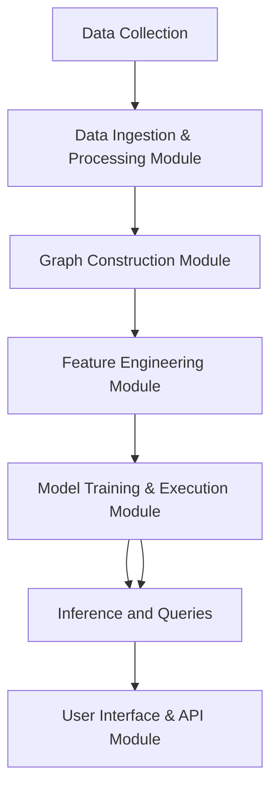
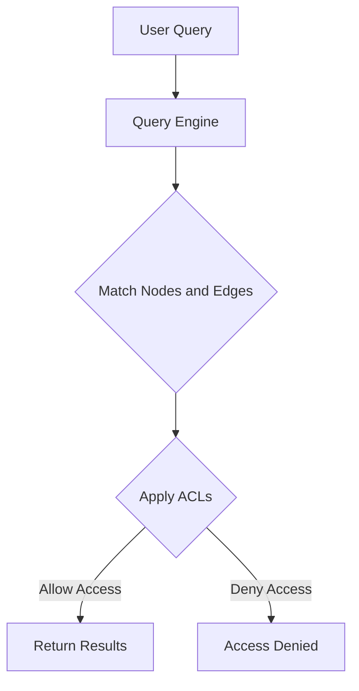

# 1_Architectural_Documentation.md

## **AGNN Architectural Documentation**

### **1. Introduction**

This document outlines the architecture of the Active Graph Neural Network (AGNN) framework, detailing the structure, components, and interactions necessary for implementing and deploying the system. It serves as a guide for developers, data scientists, and system architects to understand the design and flow of data and processes within the AGNN framework.

### **2. System Overview**

The AGNN architecture is designed to handle complex, structured data relationships by leveraging graph theory and neural network capabilities. The primary components of the AGNN system include:

- **Data Ingestion and Processing Module**
- **Graph Construction Module**
- **Feature Engineering and Contextualization Module**
- **Model Training and Execution Module**
- **Query Engine and ACL Management Module**
- **User Interface and API Module**

### **3. Architectural Components**

#### **3.1 Data Ingestion and Processing Module**
*(Details as in the initial version)*

#### **3.2 Graph Construction Module**
*(Details as in the initial version)*

#### **3.3 Feature Engineering and Contextualization Module**
*(Details as in the initial version)*

#### **3.4 Model Training and Execution Module**
*(Details as in the initial version)*

#### **3.5 Query Engine and ACL Management Module**
*(Details as in the initial version)*

#### **3.6 User Interface and API Module**
*(Details as in the initial version)*

### **4. Data Flow**

Here’s a visual representation of the AGNN data flow:



This diagram illustrates the sequential flow of data through the AGNN system, highlighting how each module interacts with the next to transform raw data into meaningful insights.

### **5. Graph Database Structure**

The AGNN graph database stores data in a structured format using nodes and edges. Below is a Mermaid diagram showing the database structure:


This diagram shows the relationships between different types of nodes within the graph database. It highlights how documents, timestamps, attributes, features, contexts, and ACLs interact and are connected through edges.

### **6. Proposed Query Language for AGNN**

The AGNN framework features a structured query language designed for extracting and manipulating data within the graph. The language supports complex queries based on node types, relationships, and attributes.

**Example Query Syntax:**

```sql
MATCH (d:Document)-[:REFERENCES]->(t:Timestamp)
WHERE d.type = 'Legal' AND t.year = 2024
RETURN d.title, t.date, d.features
```

- **`MATCH`**: Finds patterns in the graph, linking nodes (e.g., documents and timestamps).
- **`WHERE`**: Filters nodes based on conditions (e.g., type of document and year).
- **`RETURN`**: Specifies which attributes or relationships to display as results.

#### **Query Flow Diagram**

The following Mermaid diagram shows how queries interact with the AGNN database:



This diagram illustrates the flow of a user query through the system. The query engine matches nodes and edges based on the user’s request, applies ACLs for access control, and either returns the results or denies access based on the user’s permissions.

### **7. Deployment Architecture**

Below is a visual representation of the cloud deployment architecture for AGNN:

```mermaid
flowchart TD
    subgraph Cloud Deployment
        subgraph Kubernetes Cluster
            FE[Frontend (User Interface & API Module)]
            BE[Backend (Model Training & Execution)]
            DB[Graph Database]
        end
        Storage[Cloud Storage (e.g., Azure Blob)]
        GPU[GPU Nodes]
    end

    FE --> BE
    BE --> DB
    BE --> Storage
    BE --> GPU
```

This diagram shows the cloud components, including the Kubernetes cluster, storage, and GPU nodes. It highlights how the different modules interact within the cloud infrastructure for scalability and performance.

### **8. Security Considerations**

*(Details as in the initial version)*

### **9. Scalability and Performance**

*(Details as in the initial version)*

### **10. Future Enhancements**

Potential future enhancements could include:

- **Dynamic Query Optimization**: Optimizing the query engine for faster processing based on query patterns and usage analytics.
- **Integration with AI Services**: Incorporating AI models for automatic query generation and context-aware recommendations.

### **11. Conclusion**

This architectural documentation provides a comprehensive view of the AGNN system's components, deployment strategy, and query language. It includes interactive diagrams to visualize data flow, the graph database structure, and the query mechanism. The architecture is modular, secure, and scalable, designed for handling complex data relationships and advanced queries.
