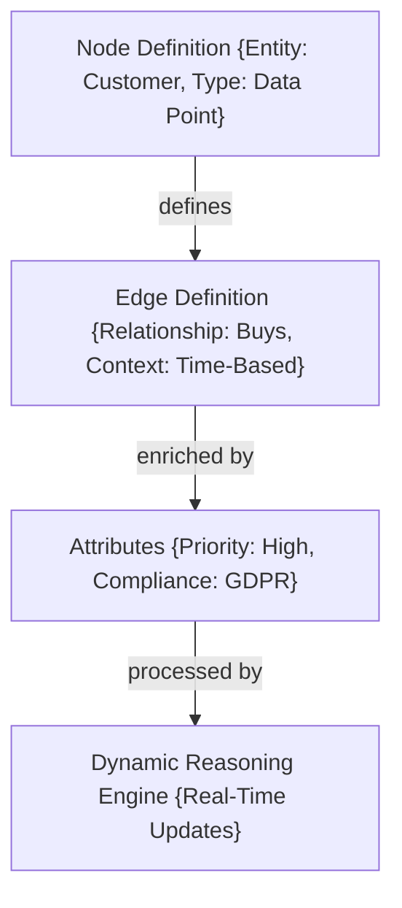
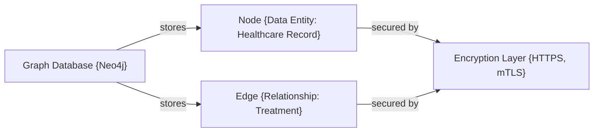
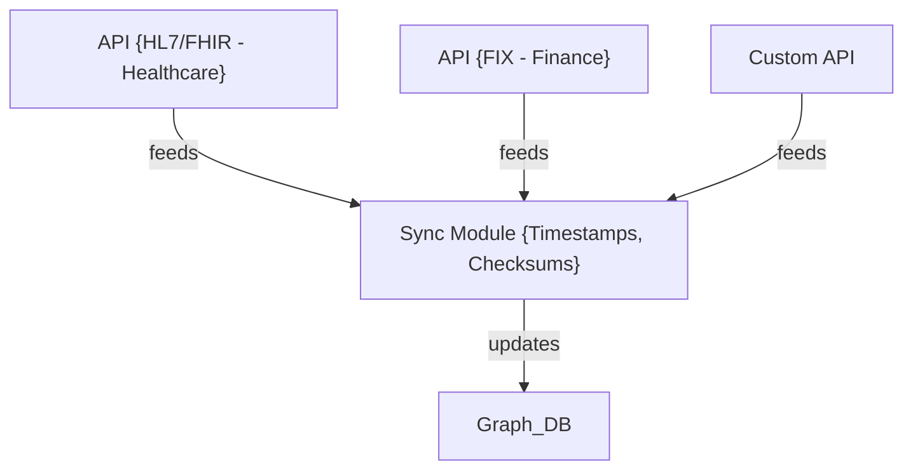
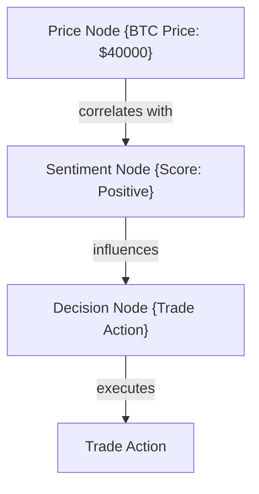
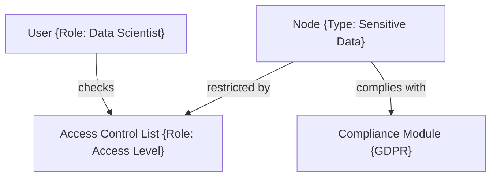
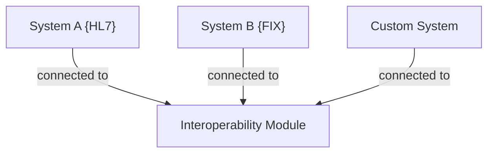
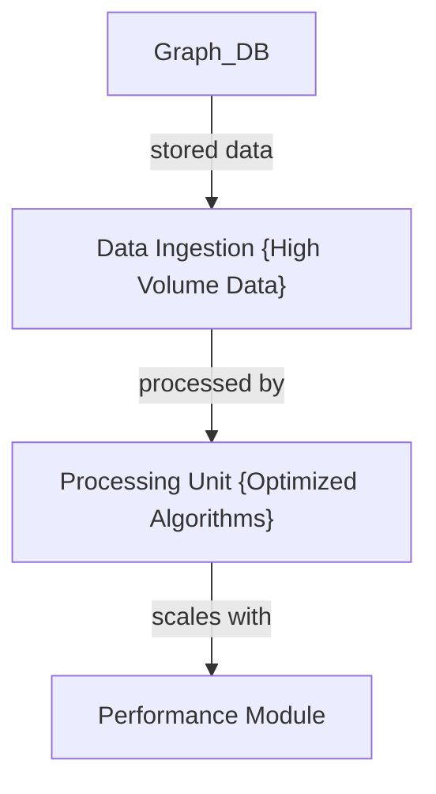
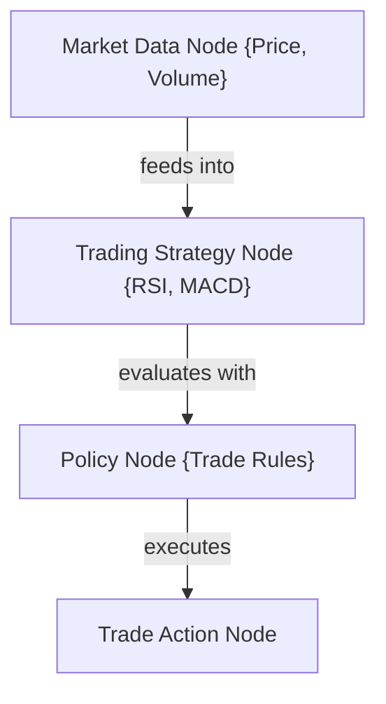

### 02_Technical_Specifications

---

### Overview

The technical specifications of Active Graph Networks (AGNs) focus on a robust and scalable architecture designed for multi-domain applicability, including healthcare, finance, defense, and other industries. The AGN framework leverages a graph database to establish nodes, edges, attributes, and policies, dynamically updating in real time to provide contextual understanding and advanced data analysis.

The following sections break down the key technical components and workflows of AGNs.

### 1. Core Architecture

The AGN architecture comprises four main components:

1. **Node Definition**: Represents entities or data points.
2. **Edge Definition**: Represents the relationships between nodes.
3. **Attributes and Policies**: Contextualize and enrich nodes and edges.
4. **Dynamic Reasoning Engine**: Processes real-time updates and adapts relationships.

### 2. Data Structure and Storage

AGNs utilize a graph database, such as Neo4j, to store and manage structured data. The storage mechanism is designed for scalability, allowing dynamic updates with minimal latency. The system also incorporates security features, including encryption for data in transit and at rest, using HTTPS and mTLS.

### 3. Data Ingestion and Integration

AGNs integrate with various data sources through APIs, including HL7 and FHIR for healthcare, FIX for finance, and custom APIs for other domains. Data ingestion is governed by a synchronization method that uses timestamps and checksums to ensure data consistency across nodes and edges.

### 4. Dynamic Updates and Real-Time Analysis

AGNs have a dynamic reasoning engine that continuously monitors and updates relationships based on data changes. For instance, in trading, when new data points (e.g., price fluctuations, sentiment scores) enter the system, the reasoning engine dynamically adjusts the relationships and nodes.

### 5. Security and Access Control

Security is built into the AGN framework through **Access Control Lists (ACLs)** and compliance policies, ensuring only authorized entities can access or modify specific nodes and edges. Policies are defined at multiple levels, such as user roles and data compliance (e.g., GDPR).

### 6. Interoperability and API Design

AGNs are designed for interoperability, allowing integration with various systems and data sources. The framework supports industry-standard APIs while allowing for custom APIs tailored to specific environments.

### 7. Scalability and Performance Optimization

AGNs utilize efficient data processing methods to reduce computational overhead. The use of timestamps, checksums, and efficient algorithms ensures that the AGN system performs well even in high-load environments, such as trading bots and healthcare applications.

### 8. Application in Trading and Financial Analysis

AGNs have a built-in decision-making matrix tailored for financial applications. The system integrates real-time data from trading APIs, such as FIX, and adjusts trading strategies based on predefined policies, including moving averages, RSI, MACD, and more.

### Conclusion

This detailed specification outlines the technical framework of AGNs, demonstrating how the system is designed for flexibility, scalability, and real-time adaptability. By leveraging this structured approach, AGNs can be applied across diverse domains, such as finance, healthcare, and defense, to provide deep insights and drive informed decision-making.
