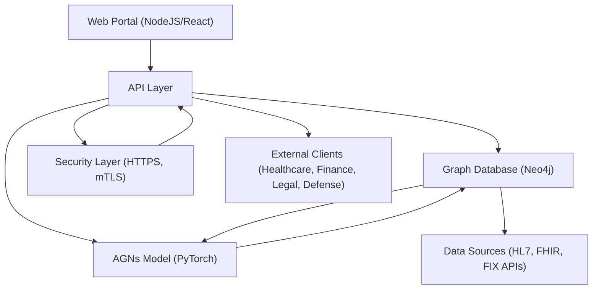
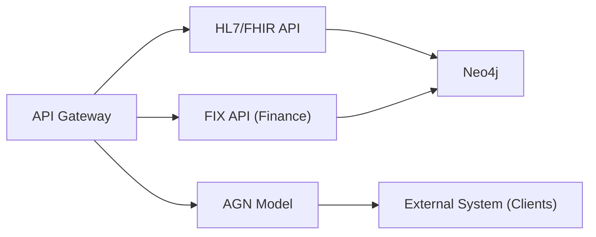
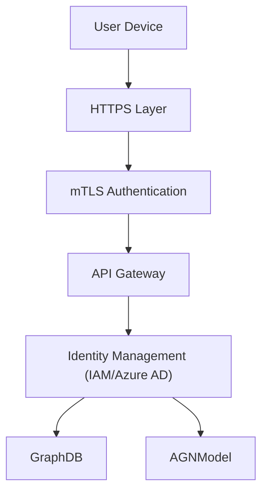
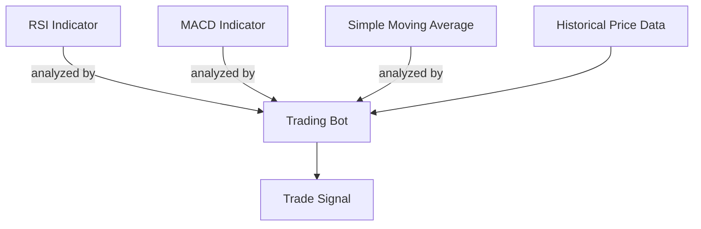
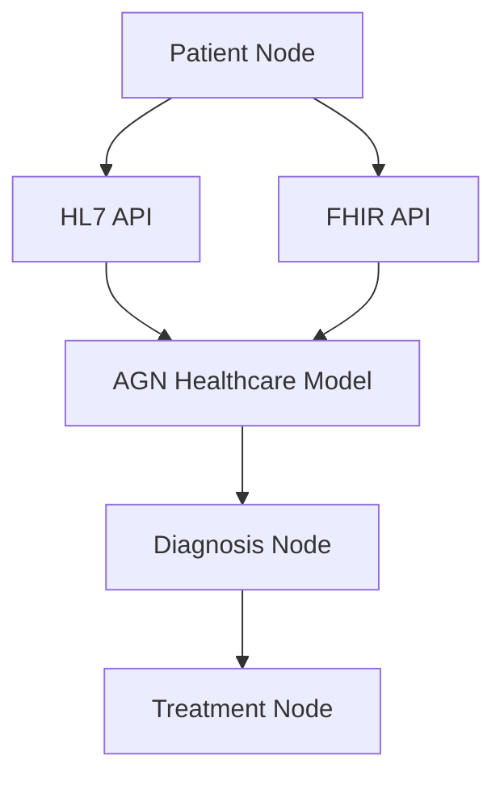

# Implementation Guide for Active Graph Networks (AGNs)

This guide covers the overall structure, technical setup, and step-by-step instructions for implementing AGNs in various environments:

## 1. Overview

Active Graph Networks (AGNs) provide a robust framework for dynamic, context-aware AI and data-driven insights. The AGN architecture is designed to be scalable and adaptable across multiple domains, including finance, healthcare, defense, and legal applications. This guide walks through the process of implementing AGNs, covering technical setup, configuration, and deployment strategies.

## 2. Prerequisites

Before setting up AGNs, ensure you have the following:

- A working knowledge of Python and JavaScript (NodeJS/React).
- Access to Azure, AWS, or GCP for cloud deployment.
- Experience with Graph Databases, specifically Neo4j.
- Familiarity with AI frameworks such as PyTorch or TensorFlow.
- An understanding of secure protocols like HTTPS, TLS, and IAM systems.

## 3. Technical Architecture

The AGN system is built on a modular architecture that integrates the following components:

1. Web Portal (NodeJS/React) for user interactions and data visualization.
2. Graph Database (Neo4j) for storing and querying structured relationships and data nodes.
3. AI Model (PyTorch/TensorFlow) implementing AGNs to analyze relationships and predict outcomes.
4. APIs for data integration (e.g., HL7, FIX) and secure communication.
5. Security Layer with HTTPS and mTLS for data encryption and identity management.

## 4. System Diagram



This diagram highlights the overall AGN architecture and data flow, showcasing how components interconnect to form a cohesive system.

## 5. Setting Up the Environment

### 5.1. Web Portal Setup

1. Install NodeJS and required packages:

   ```bash
   npm install express react react-dom
   ```

2. Configure the Web Portal:
   - Use React for the front-end interface and Express for backend services.
   - Set up HTTPS for secure communication.
3. Deploy:
   - Deploy the portal on Azure Static Web Apps or AWS Amplify.

### 5.2. Graph Database Configuration

1. Install Neo4j:
   - Use Docker to quickly set up Neo4j:

   ```bash
   docker run -p 7474:7474 -p 7687:7687 -d neo4j
   ```

2. Define Nodes and Relationships:
   - Create nodes (e.g., Patients, Transactions, Signals) and edges representing relationships.
   - Import data using Neo4j’s CSV import feature.
3. Connect the Graph Database:
   - Use Neo4j’s Bolt protocol to connect your database to the API.

### 5.3. AI Model (AGN) Deployment

1. Install PyTorch:

   ```bash
   pip install torch torchvision
   ```

2. Load Pre-trained AGN Model or train from scratch using available datasets (e.g., historical stock prices, patient records, legal documents).
3. Integrate the Model with the API for real-time predictions:
   - Set up API endpoints that interact with the AGN model to provide real-time insights.
4. Deploy:
   - Use Azure Functions or AWS Lambda for serverless deployment of the AI model.

## 6. Data Sources and API Integration

AGNs rely on integrating various data sources and APIs for contextual understanding. Below is an example workflow for API integration using the HL7 and FIX standards.



## 7. Security and Compliance

### 7.1. Implementing HTTPS and mTLS

1. Enable HTTPS:
   - Obtain and install an SSL certificate for your web portal.
   - Set up mTLS for mutual authentication.
2. Identity Management:
   - Integrate with Azure Active Directory or AWS IAM for secure access management.
   - Define access policies based on roles (e.g., Admin, User) and set up authorization rules.



## 8. Deployment Strategies

AGNs can be deployed in various environments to meet enterprise needs:

- Cloud Deployment: Ideal for scalability using services like Azure App Services or AWS EC2.
- Hybrid Deployment: Deploy core components on-premises and extend capabilities with cloud services for added flexibility.
- On-Premises Deployment: Secure and isolated deployment for environments that require strict data control, such as defense and healthcare applications.

## 9. Performance Optimization

1. Horizontal Scaling:
   - Scale API instances and Neo4j clusters across multiple nodes.
   - Use load balancers (e.g., Azure Load Balancer) to distribute traffic.
2. Data Sharding:
   - Divide the dataset across multiple database instances.
   - Implement partitioning strategies based on data type or region.
3. Latency Reduction:
   - Cache frequent queries using Redis.
   - Deploy instances closer to the data sources for reduced response time.

## 10. Real-World Use Cases

### 10.1. Financial Trading System

AGNs can be applied to build advanced trading bots that leverage multiple data sources and perform in-depth analysis in real-time. Nodes represent various indicators (RSI, MACD, Moving Averages) and assets, while edges define relationships like crossover events or divergence signals.



### 10.2. Healthcare Patient Management

Implement AGNs for dynamic patient record analysis, integrating with HL7 and FHIR APIs to predict health outcomes or suggest treatments based on historical and real-time data.



## 11. Maintenance and Updating

- Model Updates: Retrain AGNs using the latest data to refine accuracy and insights.
- Database Maintenance: Monitor Neo4j for performance and ensure data consistency.
- Security Patching: Regularly update SSL certificates, HTTPS configurations, and IAM policies.

## 12. Conclusion

AGNs are a transformative solution for enterprise-level AI, providing a scalable, secure, and dynamic framework for building intelligent systems that can adapt to various domains. By following this implementation guide, organizations can deploy AGNs effectively to harness the power of structured and dynamic data relationships.

This guide should serve as a thorough introduction and blueprint for implementing AGNs in different domains, focusing on dynamic, secure, and adaptable structures. Let me know if you’d like any adjustments or further details!
