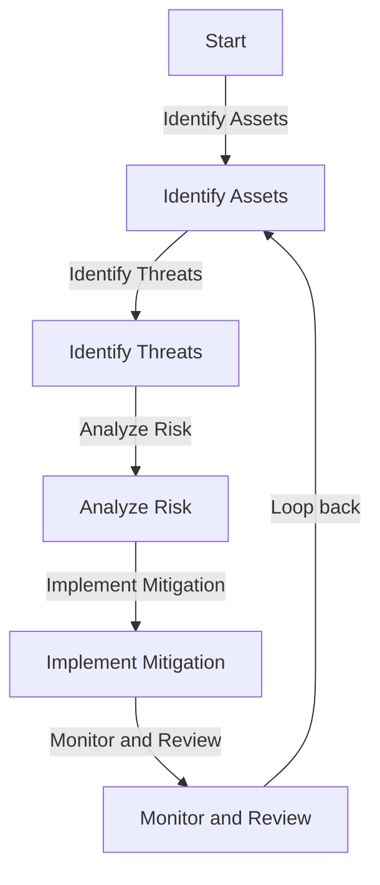
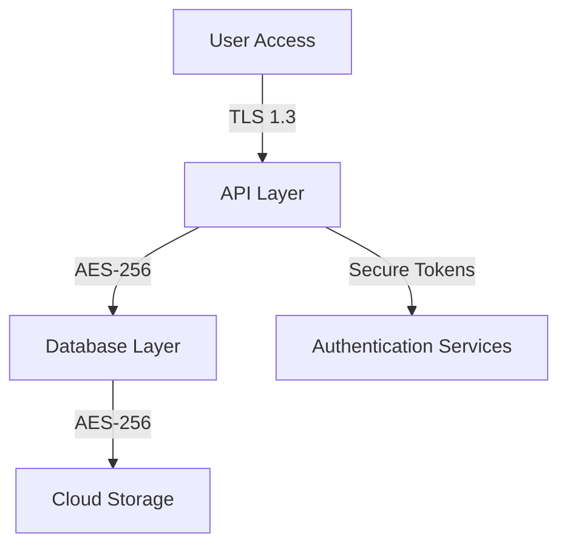
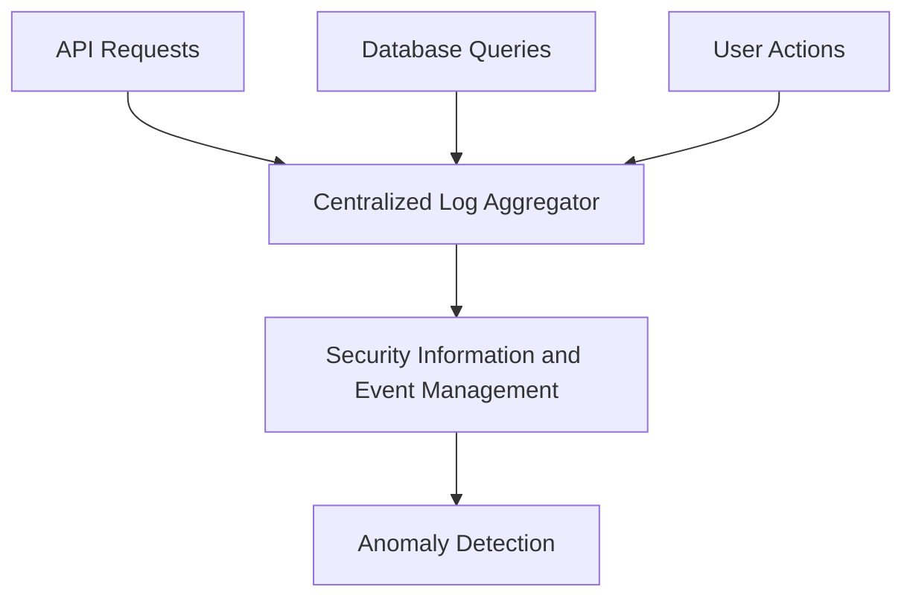
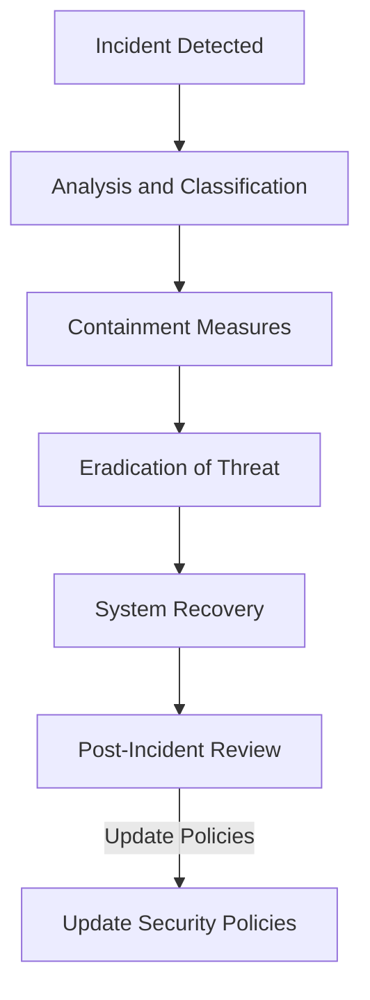

# Security Assessment Document

## 1. Overview

This document assesses the security requirements and measures for implementing Active Graph Networks (AGNs) within enterprise and cloud environments. It outlines the potential vulnerabilities, the mitigation strategies, and the steps taken to ensure the secure deployment and operation of AGNs.

## 2. Security Objectives

- **Confidentiality:** Ensure data remains confidential through encryption and access control mechanisms.
- **Integrity:** Safeguard data integrity during storage, processing, and transmission.
- **Availability:** Maintain uptime and reliability through redundancy and resilience strategies.
- **Access Control:** Implement Identity and Access Management (IAM) policies to control user permissions.

## 3. Threat Modeling and Risk Analysis

## 4. Assets and Threats Identification

- **Assets:** Graph database, API endpoints, user data, encryption keys, cloud storage.
- **Threats:**
  - Unauthorized access
  - Data leakage
  - SQL/Graph injection attacks
  - Distributed Denial of Service (DDoS)
  - Insider threats

## 5. Security Controls

### 5.1. Access Control

- **Multi-Factor Authentication (MFA):** Enforced for all user and administrator accounts.
- **Role-Based Access Control (RBAC):** Defined based on roles such as admin, data scientist, researcher, etc.
- **API Key Management:** APIs require secure keys and tokens for access, managed through Azure Key Vault.

### 5.2. Data Encryption

- **Encryption at Rest:** All graph data encrypted using AES-256.
- **Encryption in Transit:** TLS 1.3 for secure API communications and data transfer over networks.

### 5.3. Logging and Monitoring

- **Centralized Logging:** Aggregation of logs from API calls, database queries, and user actions.
- **Anomaly Detection:** Real-time monitoring for unusual patterns and potential breaches using AI-based detection models.

## 6. Vulnerability Management

- **Regular Patching:** Continuous updates and patches for all infrastructure components.
- **Vulnerability Scanning:** Automated tools scan for vulnerabilities in code and cloud infrastructure.
- **Penetration Testing:** Periodic third-party tests to identify security loopholes.

## 7. Incident Response Plan

- **Response Team:** A dedicated team with roles defined for incident response.
- **Backup and Recovery:** Regular backups and a disaster recovery plan to restore data and services.

## 8. Compliance and Best Practices

- **Industry Standards:** Follows compliance frameworks such as ISO 27001, GDPR, and HIPAA (for healthcare data).
- **Best Practices:** Regular training sessions for staff, secure development practices (DevSecOps), and strict IAM policies.

This security assessment provides a comprehensive overview of the strategies and controls to secure AGNs across multiple environments. If this aligns with your expectations, I can continue with the next document.
