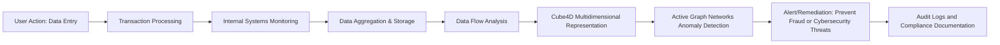
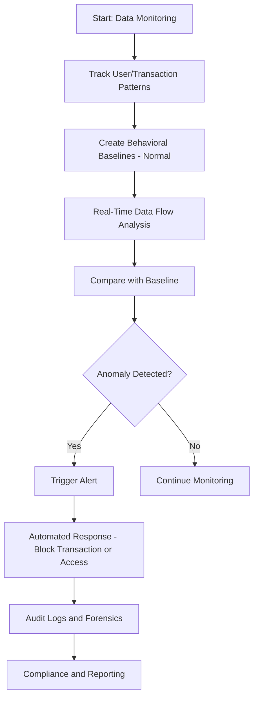

### **Enhancing Fraud Detection and Cybersecurity with Cube4D and Active Graph Networks (AGN)**

In the digital age, safeguarding sensitive data and defending against cyber threats have become essential yet challenging tasks for organizations. Traditional systems often struggle to handle the massive data flows and the sophisticated nature of modern cyber-attacks. **Cube4D** and **Active Graph Networks (AGN)** bring a transformative approach to fraud detection and cybersecurity by adding a multidimensional perspective and real-time anomaly detection, empowering organizations to proactively address security concerns before they escalate.

**Cube4D** utilizes a **4-dimensional data structure**, capturing not just the data itself but also the context, history, and relationships around each data point. When paired with **Active Graph Theory (AGT)**—a framework that detects anomalous patterns in real time—this combination enables a deeply contextual, proactive security layer. Cube4D and AGT redefine security monitoring, allowing for data flow visualization and anomaly detection that adapt dynamically to evolving threats, thereby creating a robust defense mechanism across all stages of the data lifecycle.

---

### **The Power of Cube4D and AGT in Managing Data Pipelines**

Cube4D extends beyond traditional databases by structuring data into a multidimensional format. This structure tracks not only where the data is at a given time but also its context within multiple dimensions, such as **temporal, relational, and hierarchical** factors. This dynamic and comprehensive model supports both **real-time tracking and retrospective analysis**, enabling organizations to analyze their data pipeline with unprecedented granularity.

In this structure:
- **Temporal Layers** capture data changes over time, creating a historical context that is vital for identifying abnormal patterns or behaviors.
- **Relational Layers** track the associations between data entities, such as user actions across different systems.
- **Hierarchical Layers** organize data based on roles or access levels, integrating with AGT's access control mechanisms for layered security.

By combining these dimensions, Cube4D constructs a **data matrix** where every interaction and transaction is contextually mapped and assessed for anomalies, creating a security framework that is always aware and contextually intelligent.

---

### **How Cube4D and AGT Facilitate Fraud Detection and Cybersecurity**

**Fraud detection** and **cybersecurity** require systems that can detect anomalies in real time. Unlike traditional systems that rely on preset rules or historical logs, Cube4D and AGT apply a **dynamic and adaptive approach**. Here’s how they achieve this:

1. **Behavioral Mapping**: AGT establishes baselines of "normal" user behaviors by mapping historical transaction patterns, access levels, and timing. For instance, if a user with no history of high-value transactions initiates a large transfer, AGT detects this deviation from the established baseline.
   
2. **Access Anomaly Detection**: AGT monitors when and where users access data. For example, if an employee accesses restricted files outside their usual scope or from an unapproved location, AGT flags this behavior for immediate review. By combining these detections with Cube4D's multidimensional data, it becomes easier to correlate multiple anomalies, providing a more holistic view of the potential threat.

3. **Network Flow Monitoring**: AGT examines network data flows and applies relational insights from Cube4D to detect unusual interactions or unauthorized data flows. For instance, communication between previously unrelated network segments could indicate lateral movement by an intruder.

Together, Cube4D and AGT create a **security layer that not only responds to known threats but also detects potential threats** by observing and learning from normal data interactions. This way, organizations can spot suspicious behaviors and preemptively shut down vulnerabilities.

---

### **Visualizing the Data Pipeline and Anomaly Detection Flow**

To illustrate Cube4D and AGT's function in fraud detection, let’s break down the **data pipeline** and **anomaly detection** using **Mermaid diagrams**:

#### **1. The Data Pipeline: From Start to End**

The following diagram demonstrates the path data follows within an organization and how Cube4D and AGT interact at each stage to maintain a secure flow:

---

### **Anomaly Detection Flow: How AGT Works with Cube4D**

Here’s a breakdown of the **Active Graph Theory (AGT)** detection flow, utilizing Cube4D’s dimensions to provide context:

This flow is what gives Cube4D and AGT their proactive edge. **Anomaly detection** based on multidimensional baselines means the system can catch unusual behavior before it escalates into fraud or a breach. By combining **AGT’s real-time anomaly detection** with **Cube4D’s enriched data perspective**, organizations can proactively tackle security challenges that traditional systems might miss.

---

### **Real-World Example: Fraud Detection in Financial Services**

Imagine a scenario in which a user typically conducts small, regular transactions with a predictable pattern. Suddenly, the user initiates a **high-value transaction** to an unfamiliar recipient account.

1. **AGT** captures this change as it deviates from the **user’s baseline transaction behavior**.
2. **Cube4D** then leverages its multidimensional architecture to track how this transaction intersects with the user's profile, access rights, and the transaction's temporal aspects.
3. The **Active Graph Network** flags the behavior and triggers an alert, potentially blocking the transaction or escalating it for manual review.
4. The **audit logs** provide a complete historical record, assisting with compliance and further investigation if needed.

This approach demonstrates Cube4D and AGT’s ability to anticipate and prevent potentially fraudulent activities before they impact the organization.

---

### **Conclusion: The Future of Fraud Detection and Cybersecurity**

With **Cube4D** and **Active Graph Networks (AGN)**, organizations are no longer limited to reactive security measures. The multidimensional capabilities of Cube4D, combined with AGT’s real-time analysis, enable **proactive fraud detection and cybersecurity**. These tools provide a framework that grows smarter over time, continuously adapting to new threats and maintaining a high standard of security and efficiency.

As digital environments become increasingly complex, frameworks like Cube4D and AGT will be essential for keeping organizations a step ahead of potential threats. By bringing multidimensional insight to security, Cube4D and AGT pave the way for **domain-agnostic, future-proof fraud detection and cybersecurity solutions**, capable of safeguarding data pipelines in real-time.

