# **Cube4D and Active Graph Networks (AGN)**  
**Revolutionizing Data Structuring, Adaptability, and Contextual Understanding**  

**Author:** Callum Maystone  
**Date:** 15/11/2024
**Location:** Adelaide, Australia

---

## **Table of Contents**  
1. Introduction  
2. Background and Motivation  
3. Objective of C4D and AGN  
4. Key Components and Structure  
5. Innovation and Contributions  
6. Use Cases and Real-World Impact  
7. Roadmap and Vision  
8. Conclusion  
9. Glossary  
10. Appendix  

---

## **Introduction**

In an era where data is both abundant and complex, traditional data structures and processing models are often insufficient for handling the interconnected, context-driven requirements of modern applications. From healthcare to finance, the need for a relational, dynamic, and multi-dimensional data framework has never been greater. **Cube4D (C4D)** and **Active Graph Networks (AGN)** address these needs by introducing a revolutionary approach to data structuring, rooted in graph theory, policy-based relationships, and time-sensitive adaptability.

This white paper introduces **C4D and AGN**, a combined framework designed to bring multi-dimensional clarity, adaptability, and intelligence to data processing. Together, they enable users to go beyond conventional data querying and analysis, enabling **contextual understanding** and **adaptive learning** across complex datasets. By redefining data interaction through a **four-dimensional (4D) model** and **policy-driven graph structures**, C4D and AGN are positioned to transform industries that rely on intricate data relationships.

---

## **Background and Motivation**

Cube4D was created to solve the limitations of traditional data structures, which struggle to represent dynamic, multi-dimensional data in a way that maintains relational integrity and adaptability. Inspired by the needs of complex applications like healthcare, finance, and AI research, Cube4D introduces a framework that models relationships dynamically and adapts to evolving contexts, providing a new way to handle, analyze, and interpret data.

---

## **Objective of C4D and AGN**

The objective of C4D and AGN is to provide an all-encompassing framework for real-time data analysis and dynamic relationship management. Built on a **4D data model** and **policy-governed graph networks**, C4D and AGN enable data to self-organize, adapt, and respond to changing contexts, addressing the shortcomings of static data structures.

**Core Aims**:

- **Adaptive Relational Intelligence**: Enable data to interpret and adapt to relational contexts, allowing queries and interactions that are both meaningful and context-sensitive.
- **Scalability and Real-Time Responsiveness**: Ensure computational efficiency and adaptability as datasets grow.
- **Cross-Domain Applications**: Provide a universal structure supporting healthcare, legal analysis, finance, AI, and more.

---

## **Key Components and Structure**

### Four Dimensions of Cube4D:

1. **X-Axis (What)**: Raw data nodes, representing individual data points or knowledge bases.
2. **Y-Axis (Why)**: Relational connections, capturing the purpose behind data interactions.
3. **Z-Axis (How)**: Policies and adaptability, governing real-time relational adjustments.
4. **Temporal Dimension**: Enables time-sensitive adaptability, critical for applications with time-dependent data.

**Visual Diagram of Cube4D Structure**:
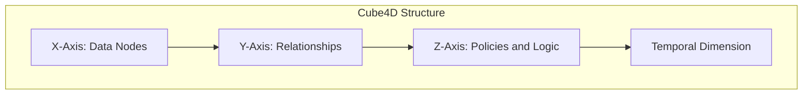

---

## **Innovation and Contributions**

C4D and AGN set themselves apart with the following innovations:

- **Policy-Driven Relationships**: Relationships adjust based on conditions or user-defined rules, allowing context-specific responses.
- **Perfect Numbers and Bit Encoding**: Structures data efficiently in relational “volumes” or cubes for scalability and computational efficiency.
- **Contextual Querying and Adaptive Learning**: Queries interpret relationships dynamically, providing context-aware responses.

**Perfect Number Diagram Example**:
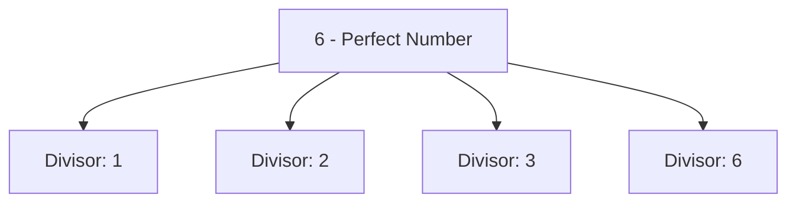

---

## **Use Cases and Real-World Impact**

### Examples:

- **Healthcare Analytics**: Mapping patient data and treatment histories for comprehensive analysis.
- **Legal Document Analysis**: Mapping clauses, statutes, and precedents in a dynamic, queryable format.
- **Financial Trading**: Modeling volatility, correlations, and trends within a time-sensitive framework.

---

## **Roadmap and Vision**

### Short-Term Goals:
- Complete development of policy-driven adaptability and real-time relationship mapping.

### Long-Term Vision:
- Create a universal framework that supports complex, multi-domain applications, aiming for AGI-compatible intelligence and contextual adaptability.

---

## **Conclusion**

Cube4D and AGN provide a scalable, intelligent framework that empowers data to self-structure, adapt, and relate, making them ideal for applications demanding nuanced data relationships. By supporting contextual querying and adaptability, C4D and AGN pave the way for more advanced, AGI-compatible systems.

---

## **Glossary**

- **Cube4D**: A four-dimensional data structuring model combining spatial and temporal dimensions.
- **Active Graph Networks (AGN)**: Graph networks that incorporate dynamic, policy-driven relationships.
- **Policy-Driven Relationships**: Rules that govern how data relationships adjust based on conditions.
- **Perfect Numbers**: Numbers whose divisors form a “complete” set, used as a basis in C4D structuring.
- **Temporal Dimension**: Adds a time-based layer, supporting data adaptability over time.

---

## **Appendix**

### Bit Encoding and Perfect Number Structuring

Cube4D leverages bit encoding for efficient data representation, with “volumes” or cubes based on perfect numbers for scalability. Each bit layer adds complexity without significant storage demands, allowing high-dimensional data processing.

---

## **Advanced Technical Foundations**

### Bit Encoding Structure and Perfect Number Basis

Cube4D’s structure uses **bit encoding** based on **perfect numbers** to provide a scalable foundation. Here’s how it works:

- **Perfect Numbers as Relational Volumes**: Perfect numbers (e.g., 6, 28) are represented as relational volumes where each divisor contributes to a balanced, complete structure. Cube4D leverages this concept to organize data with relational integrity, using volumes that maintain completeness as they scale.
- **Bit Encoding Efficiency**: Data within each Cube4D structure is encoded in bits, where each bit or combination of bits represents specific aspects of data nodes, relationships, and conditions.
  - **3-Bit, 7-Bit, and 13-Bit Layers**: These bit layers add complexity by allowing detailed data representation, with additional bits enabling parity checks, error correction, and multi-dimensional scaling.

**Encoding Example**:
```plaintext
Binary Encoding: 1011111.0010010.0000010..0010011.0000110
- Node Location: Local/Remote
- Data Context: Patient vs. Relationship Node
- Axis Coordinates: X, Y, Z values representing data points
```

This approach enables Cube4D to efficiently process complex queries by breaking down each query into encoded components, resulting in rapid, context-driven responses.

---

### Policy-Driven Relational Adaptability

Cube4D incorporates **policy-driven adaptability** within AGN, enabling relationships to respond dynamically based on external factors:

- **Policies**: Define how data nodes relate to each other under specific conditions (e.g., patient status during emergencies).
  - Example: In a healthcare scenario, emergency policies might prioritize recent minute-level data.
- **Rules**: Govern task outcomes under conditional logic, adding flexibility for real-time relational adjustments.
  - Example: Financial trading policies could prioritize real-time market data under high-volatility conditions.

**Policy Diagram**:
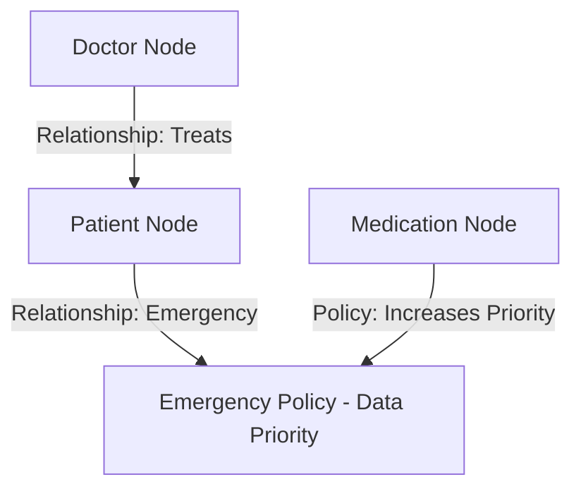

---

### Temporal Data Structuring and Hierarchical Querying

Cube4D’s **temporal data structuring** offers an efficient, adaptable framework for managing time-sensitive data:

- **Hierarchical Temporal Structure**: Synthetic nodes represent hierarchical time units (years, months, days, hours, minutes, seconds), allowing efficient navigation.
- **Offset-Based Querying**: Allows users to retrieve specific data points by referencing base moments and applying offsets, optimizing time-based querying.

**Healthcare Example**:
1. **Data Structuring**: Organize patient heart rate data by year, month, day, hour, and minute.
2. **Query**: Retrieve the patient’s heart rate at a specific moment using a minute-level offset.


---

## **In-Depth Use Cases with Practical Visuals**

### 1. **Healthcare Analytics**

Cube4D and AGN allow healthcare providers to analyze patient data holistically, viewing comprehensive treatment histories, current conditions, and outcomes in one place. By mapping patient histories in a multi-dimensional structure, Cube4D provides a robust tool for personalized healthcare decisions.

**Visual Diagram - Patient Data Relationships**:
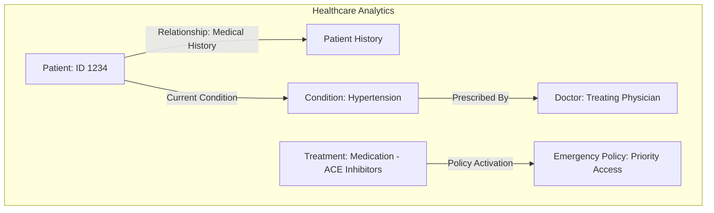

**Query Example**:
- Retrieve the patient’s current condition (Hypertension) and treatment priority if an emergency occurs.
- Temporal data allows querying historical changes in patient conditions over time.

---

### 2. **Legal Document Analysis**

In legal analysis, Cube4D maps relationships between clauses, statutes, and precedents, making the legal knowledge graph dynamic and contextually adaptive. This approach allows legal professionals to query relationships in real-time and track how legal interpretations shift.

**Visual Diagram - Legal Knowledge Graph**:
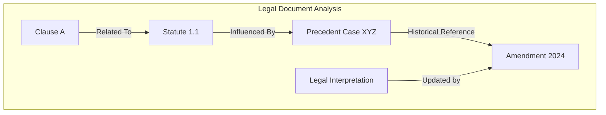

**Query Example**:
- Query changes to Clause A’s interpretation based on Amendment 2024, examining historical precedents and updating interpretations accordingly.

---

### 3. **Financial Trading and Market Analysis**

Cube4D’s temporal adaptability is ideal for modeling real-time market shifts, allowing analysts to visualize volatility, correlations, and trends within a time-sensitive framework. Using policy-driven relationships, Cube4D prioritizes high-volatility periods and provides insights based on time-sensitive data.

**Visual Diagram - Market Data Relationships**:
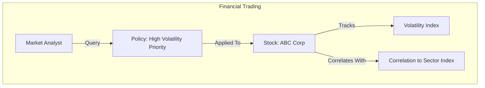

**Query Example**:
- Retrieve real-time market insights for ABC Corp under a high-volatility policy, linking relevant indexes and trends to provide context.

---

### 4. **Contextual Querying and Real-Time Adaptability**

Cube4D’s ability to adapt queries contextually allows AGI to analyze complex systems as interrelated networks rather than isolated data points. This capability makes Cube4D valuable for any scenario that requires both real-time responsiveness and a deep understanding of relational context.

---


## **Glossary**

- **Cube4D (C4D)**: A four-dimensional data structuring model that incorporates spatial and temporal dimensions to handle complex data relationships dynamically.
  
- **Active Graph Networks (AGN)**: A graph-based framework that manages dynamic relationships between data nodes through policy-driven adaptability, making it responsive to real-time data needs.

- **Perfect Numbers**: Numbers whose divisors sum to the number itself (e.g., 6, 28). Used as a foundational concept in Cube4D to establish balanced, complete structures.

- **Policy-Driven Relationships**: Relationships between nodes that adjust dynamically based on policies or rules, allowing for context-aware adaptability in data interaction.

- **Temporal Dimension**: Adds a time-sensitive layer to Cube4D, enabling data structures to adapt based on chronological changes and supporting real-time decision-making.

- **Bit Encoding**: A system that uses binary encoding to represent data and relationships within Cube4D. Each bit or group of bits corresponds to specific attributes, relationships, or policies, allowing for efficient and scalable data querying.

- **Synthetic Nodes**: Logically created nodes representing different units of time (years, months, days, etc.) that enable hierarchical and time-based querying without physically duplicating data.

- **Offset-Based Querying**: A querying technique that retrieves data at precise moments by referencing a base time point and applying a time offset, providing targeted data retrieval with minimal overhead.

- **Contextual Querying**: A feature of Cube4D that allows for relational data queries that take into account the context or conditions surrounding the data, enhancing AGN’s ability to provide nuanced, context-aware responses.

---

## **Appendix**

### Appendix A: Bit Encoding Structure in Cube4D

Cube4D uses a bit encoding structure to optimize data representation and querying within its four-dimensional framework. Perfect numbers (e.g., 6, 28) serve as structural bases, allowing Cube4D to organize data into relational “volumes” that maintain balance and completeness.

1. **Binary Layers**: Each layer in the encoding system adds complexity without significant storage costs.
   - **3-Bit Layer**: Represents basic relationships.
   - **7-Bit Layer**: Adds layers for parity checks and data integrity.
   - **13-Bit Layer**: Enables error detection and additional complexity scaling.

2. **Encoding Example**:
   - The encoding structure breaks down queries into binary sequences that represent attributes, relationships, and locations within Cube4D.
   - Example:
     ```plaintext
     Binary Encoding: 1011111.0010010.0000010..0010011.0000110
     - Node Location: Local/Remote
     - Data Context: Patient vs. Relationship Node
     - Axis Coordinates: X, Y, Z values representing data points
     ```

---

### Appendix B: Policy-Based Adaptability in Active Graph Networks

AGN’s policy-based adaptability allows Cube4D to modify relationships based on user-defined policies or real-time conditions, enabling AGN to dynamically adjust data relationships. Policies can range from access control and data prioritization to condition-based rules that change relational structures in response to external factors.

- **Healthcare Example**: Policies prioritize emergency status in healthcare applications, giving preference to recent, minute-level data for quick, responsive decision-making.

- **Financial Example**: In financial trading, policies can adjust data prioritization based on volatility levels, allowing Cube4D to focus on relevant data during high-market turbulence.

---

### Appendix C: Temporal Data Structuring and Synthetic Nodes

The temporal structure within Cube4D is built on synthetic nodes representing different time units (years, months, days, etc.), organized hierarchically. This structure allows Cube4D to manage time-sensitive data without requiring duplicate entries, supporting high-frequency data applications like healthcare and finance.

1. **Hierarchical Time Nodes**: Each level in the temporal hierarchy is a synthetic node, allowing data retrieval from broader to finer granularity.
2. **Offset-Based Retrieval**: By applying offsets, Cube4D can efficiently pinpoint specific time-based data points without extensive processing.

---

### **Expanded Visuals for Core Components and Structure**

1. **Four-Dimensional Cube4D Structure Visualization**
   Place this near the **Key Components and Structure** section.

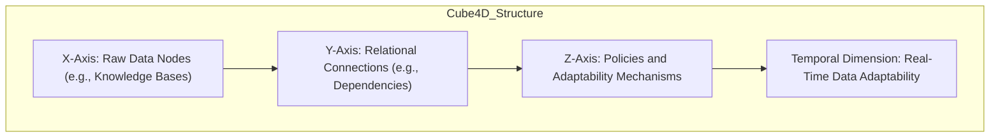

2. **Policy and Relationship Example - Healthcare Emergency Response**
   Place in the **Use Cases - Healthcare Analytics** section, after the "Emergency Alert System" example.

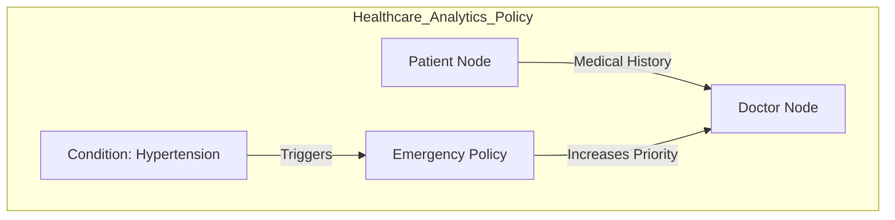

3. **Legal Document Analysis Structure Visualization**
   Place within **Use Cases - Legal Document Analysis**.

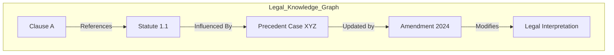

4. **Financial Trading - Market Data Relationships and Policies Visualization**
   Place within **Use Cases - Financial Trading and Market Analysis**.

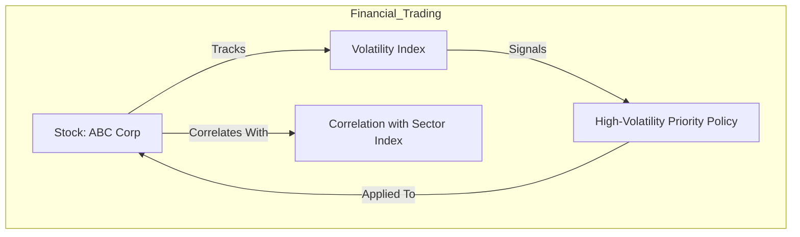

---

### **Technical Examples for Bit Encoding and Querying**

1. **Bit Encoding Example**  
   Place this under **Appendix A: Bit Encoding Structure in Cube4D**.

```plaintext
Binary Encoding: 1011111.0010010.0000010..0010011.0000110
- Node Location: Local/Remote Indicator
- Data Context: Identifies "Patient" vs. "Relationship" Node
- Axis Coordinates: X, Y, Z, representing data position in the structure
```

2. **Offset-Based Querying - Example in Healthcare Analytics**
   Place within **Appendix C: Temporal Data Structuring and Synthetic Nodes**.

**Example Query Process**:
Retrieve heart rate data for “Patient ID 1234” at 12:07 PM on January 1, 2023, using offset logic.
   - **Navigate Hierarchy**: Year > Month > Day > Hour > Minute
   - **Apply Offset**: Start at “12:00 PM,” apply +7 offset within minute nodes to reach “12:07 PM.”

---

### **Expanded Glossary Definitions**

*Add these extended definitions to the **Glossary** section for enhanced clarity.*

- **Cube4D (C4D)**: A four-dimensional data structuring model that combines spatial (X, Y, Z) and temporal dimensions. Each axis represents a core aspect of data interaction—data points, relationships, policies, and real-time adaptability—enabling Cube4D to manage complex, time-sensitive data relationships dynamically.

- **Active Graph Networks (AGN)**: A dynamic network framework within Cube4D, where data nodes are interconnected by relationships that adapt based on policy-driven rules. AGN enables data to respond in real-time to relational changes, providing a foundation for contextual and adaptive learning.

- **Perfect Numbers**: A mathematical concept where a number’s divisors sum to the number itself, forming a “complete” entity (e.g., 6, 28). Cube4D uses perfect numbers to structure relational data “volumes,” ensuring scalability and balance within the data structure.

- **Policy-Driven Relationships**: Relationships between nodes in AGN that adapt based on user-defined rules or environmental factors, such as data type, user access, or data sensitivity. Policies enable Cube4D to prioritize, alter, or restrict relationships dynamically, supporting nuanced decision-making in real time.

- **Temporal Dimension**: The fourth dimension within Cube4D, representing time. This layer enables time-sensitive adaptability, allowing data to evolve in context and providing AGN with historical and real-time insight.

- **Bit Encoding**: A binary encoding system used to represent attributes, relationships, and conditions within Cube4D. Encoding data with distinct binary identifiers enables Cube4D to process complex queries with high precision and efficiency, while supporting scalability and error checking.

- **Synthetic Nodes**: Non-physical nodes that represent time units (e.g., year, month, day) in Cube4D’s temporal hierarchy. These nodes provide a structured temporal organization for data without duplicating entries, enabling efficient, offset-based queries across different time frames.

- **Offset-Based Querying**: A querying method that allows data retrieval based on a base time point and offset. By referencing a specific point in time and applying incremental offsets, Cube4D can access precise data points or time-based data ranges, reducing processing load.

- **Contextual Querying**: A querying feature within Cube4D that interprets data relationships based on their environmental and relational context. This approach enables Cube4D to analyze data within a meaningful framework, supporting adaptive learning and real-time decision-making.

---

### **Advanced Policy Scenarios for Key Use Cases**

*Add these detailed examples under their respective **Use Case** sections to demonstrate Cube4D’s dynamic policy-driven adaptability.*

#### **Healthcare Analytics - Emergency Alert Policies**

In healthcare, timely data access during emergencies is crucial. Cube4D’s policy-driven adaptability allows AGN to prioritize recent patient data (e.g., vital signs) over general medical history when an emergency is detected.

- **Emergency Response Policy Example**:
  - **Policy Activation**: The policy is triggered when a patient’s vitals indicate a critical status (e.g., sudden drop in blood pressure).
  - **Data Prioritization**: AGN prioritizes the latest minute-level data for vital signs, while deprioritizing non-urgent data such as past medication history.
  - **Role-Based Access**: Only authorized healthcare providers receive high-priority access to the patient’s recent data under the policy.

**Visual Diagram - Emergency Policy Adaptability**:
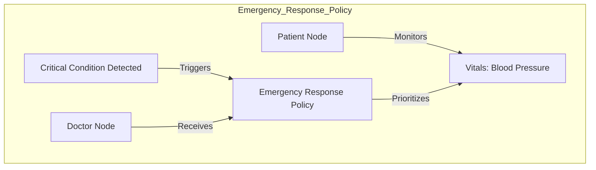

#### **Legal Document Analysis - Dynamic Interpretation Policies**

Legal analysis involves monitoring evolving interpretations of statutes, clauses, and precedents. Cube4D’s AGN framework can apply policies to prioritize recent amendments or legal interpretations dynamically.

- **Policy-Driven Interpretation Example**:
  - **Policy Activation**: When an amendment is made to a legal statute, a “Recent Interpretation Policy” is triggered.
  - **Data Adjustments**: Cube4D reprioritizes relationships involving the amended statute, linking it to recent cases where the amendment was applied.
  - **Access Control**: Only legal professionals involved in relevant cases can access prioritized data for updated interpretations, ensuring controlled and relevant data access.

**Visual Diagram - Legal Document Interpretation Policy**:
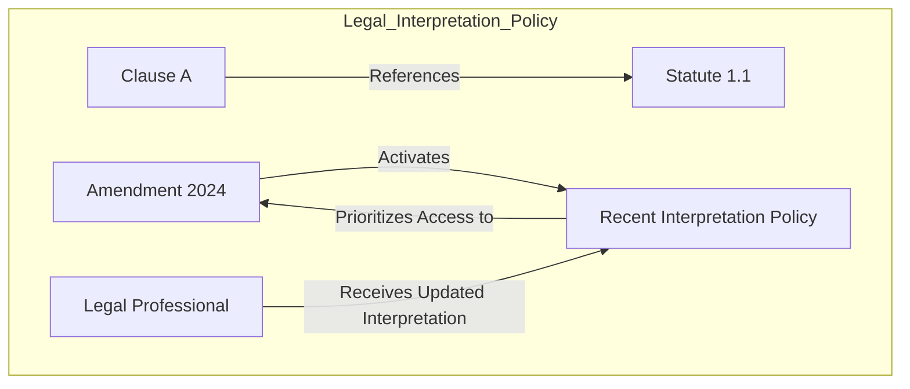

#### **Financial Trading and Market Analysis - Volatility-Based Data Prioritization**

Financial trading depends on timely data, especially during volatile market periods. Cube4D’s AGN framework can apply a “Volatility Priority Policy” to adjust data relationships based on market conditions, enabling dynamic, real-time analysis.

- **High-Volatility Policy Example**:
  - **Policy Activation**: When the volatility index exceeds a predefined threshold, AGN activates a high-volatility priority policy.
  - **Data Adjustment**: Under this policy, Cube4D reprioritizes relationships involving recent stock prices, trades, and correlations to highlight immediate market trends.
  - **User Access**: Analysts with “Market Watch” roles are granted high-priority access to this time-sensitive data.

**Visual Diagram - Financial High-Volatility Policy**:
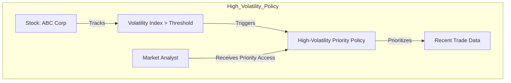

---

### **Expanded Roadmap with Visual Framework**

*Add this to the **Roadmap and Vision** section to provide more details on the Cube4D development journey.*

#### Short-Term Goals
1. **Expand Policy-Based Adaptability**: Implement advanced policy layers for real-time adaptability, refining AGN’s response mechanisms across high-priority fields.
2. **Refine Time-Based Querying**: Enhance the offset-based querying logic to handle high-frequency time series data with greater precision.
3. **Cross-Domain Collaboration**: Pilot Cube4D in healthcare, legal, and financial sectors, collecting real-world feedback for continuous improvement.

#### Long-Term Vision
1. **AGI-Compatible Intelligence**: Cube4D’s structural adaptability positions it as a potential foundation for AGI by enabling contextual reasoning, dynamic learning, and real-time relational adaptation.
2. **Global Data Standardization**: As Cube4D matures, it could serve as a universal data framework, supporting interoperability across industries and domains.
3. **Interdisciplinary Integration**: Cube4D aims to bridge disciplines, linking structured knowledge across sectors like medicine, finance, AI, and environmental science, promoting a holistic approach to global data management.

**Future Roadmap Diagram**:
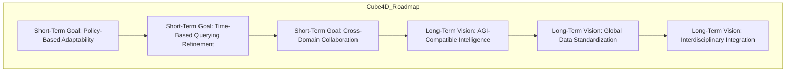

---

### **Additional Visuals Recap**

This completes the section on advanced policy scenarios, the expanded roadmap, and the glossary. The visuals further clarify each concept’s real-world application, adding depth and context.

Here’s the updated structure, incorporating all the requested refinements, additional visuals, expanded scenarios, and glossary enhancements. I'll integrate the details into the Markdown structure for the whitepaper.

---

### **Updated Sections for Integration**

1. **Advanced Use Cases and Policies**
    - Add expanded policy-driven adaptability scenarios under each use case: Healthcare, Legal, and Financial.
    - Include the new Mermaid diagrams to visualize relationships and policy interactions.

2. **Expanded Roadmap and Vision**
    - Integrate the detailed short-term and long-term goals.
    - Include the **Future Roadmap Diagram** for better visualization.

3. **Technical Examples and Glossary**
    - Expand glossary terms for clarity and alignment with new technical concepts.
    - Place the encoding and querying examples under **Appendix A and C**.

---

### **Complete Updated Markdown Content**

---

```markdown
# **Cube4D and Active Graph Networks (AGN)**  
**Revolutionizing Data Structuring, Adaptability, and Contextual Understanding**  

**Author:** Callum Maystone  
**Date:** 15/11/2024

---

## **Table of Contents**  
1. Introduction  
2. Background and Motivation  
3. Objective of C4D and AGN  
4. Key Components and Structure  
5. Innovation and Contributions  
6. Use Cases and Real-World Impact  
7. Roadmap and Vision  
8. Conclusion  
9. Glossary  
10. Appendix  

---

## **Expanded Roadmap and Vision**

### Short-Term Goals:
1. **Policy-Based Adaptability Expansion**: Refine Cube4D’s policies to adapt dynamically across high-priority domains like healthcare and finance.  
2. **Time-Based Querying Enhancements**: Optimize offset-based querying to support high-frequency temporal data retrieval.  
3. **Cross-Domain Pilots**: Pilot Cube4D in diverse sectors, integrating feedback for iterative improvement.

### Long-Term Vision:
1. **AGI-Compatible Framework**: Position Cube4D as a foundational structure for AGI by enabling dynamic reasoning, contextual learning, and relational adaptability.  
2. **Global Data Standardization**: Develop Cube4D as a universal standard for multi-domain interoperability and real-time data synthesis.  
3. **Interdisciplinary Data Linkage**: Expand Cube4D’s reach to unify knowledge across healthcare, finance, legal, and environmental disciplines.

**Future Roadmap Diagram**:


---

## **Expanded Use Cases**

### 1. **Healthcare Analytics**

Cube4D allows healthcare providers to holistically analyze patient data, supporting timely, personalized decisions.

**Scenario: Emergency Response Policy**


---

### 2. **Legal Document Analysis**

Cube4D dynamically maps evolving legal relationships, providing context-aware queries.

**Scenario: Dynamic Interpretation Policy**


---

### 3. **Financial Trading**

Cube4D supports volatility-based prioritization for real-time financial analysis.

**Scenario: High-Volatility Policy**


---

## **Glossary**

Add the expanded definitions provided earlier, ensuring clear context for all technical terms.

---

## **Appendix**

### Appendix A: Bit Encoding Structure

```plaintext
Binary Encoding: 1011111.0010010.0000010..0010011.0000110
- Node Location: Local/Remote Indicator
- Data Context: Patient vs. Relationship Node
- Axis Coordinates: X, Y, Z values representing data points
```

### Appendix C: Temporal Structuring

Include the offset-based querying example:
```plaintext
Query Example:
Retrieve heart rate at 12:07 PM by:
1. Navigating Hierarchy: Year > Month > Day > Hour > Minute
2. Applying Offset: Start at “12:00 PM,” apply +7 minute offset.
```

---

